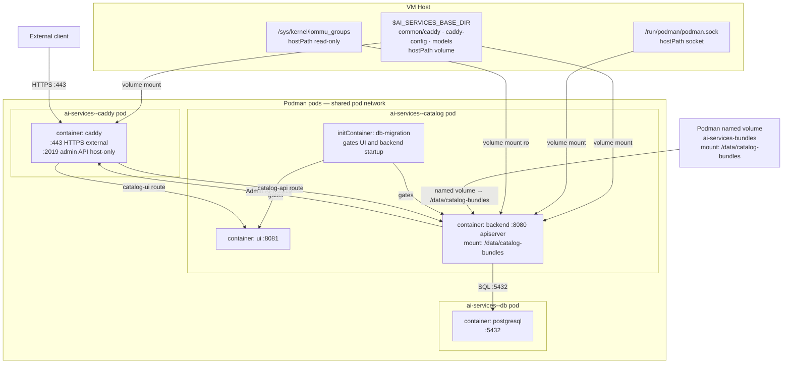
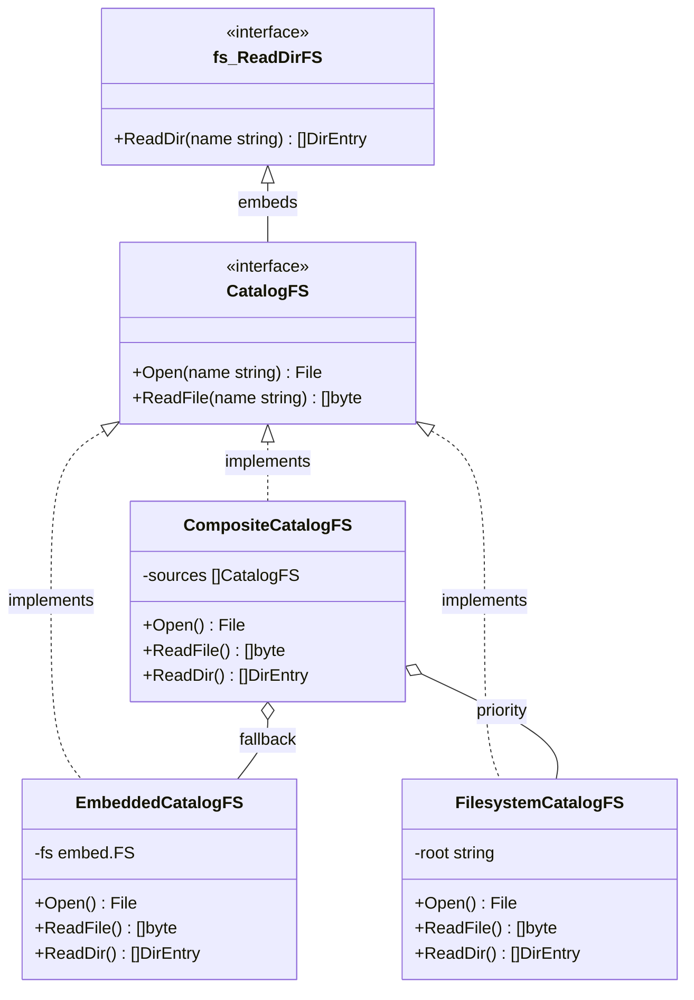
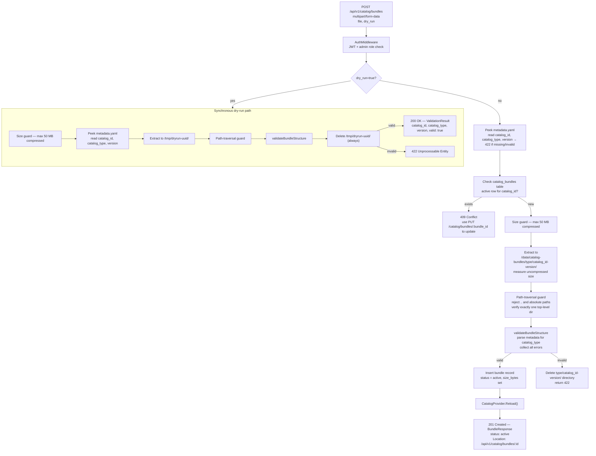
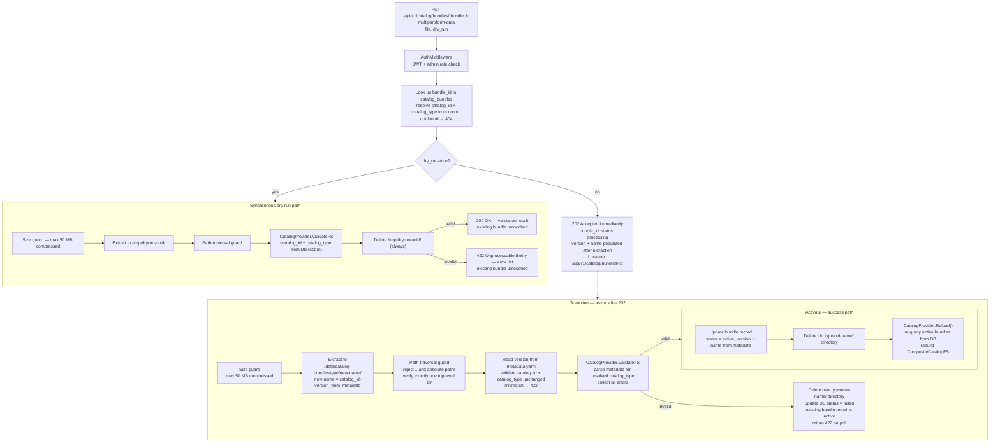
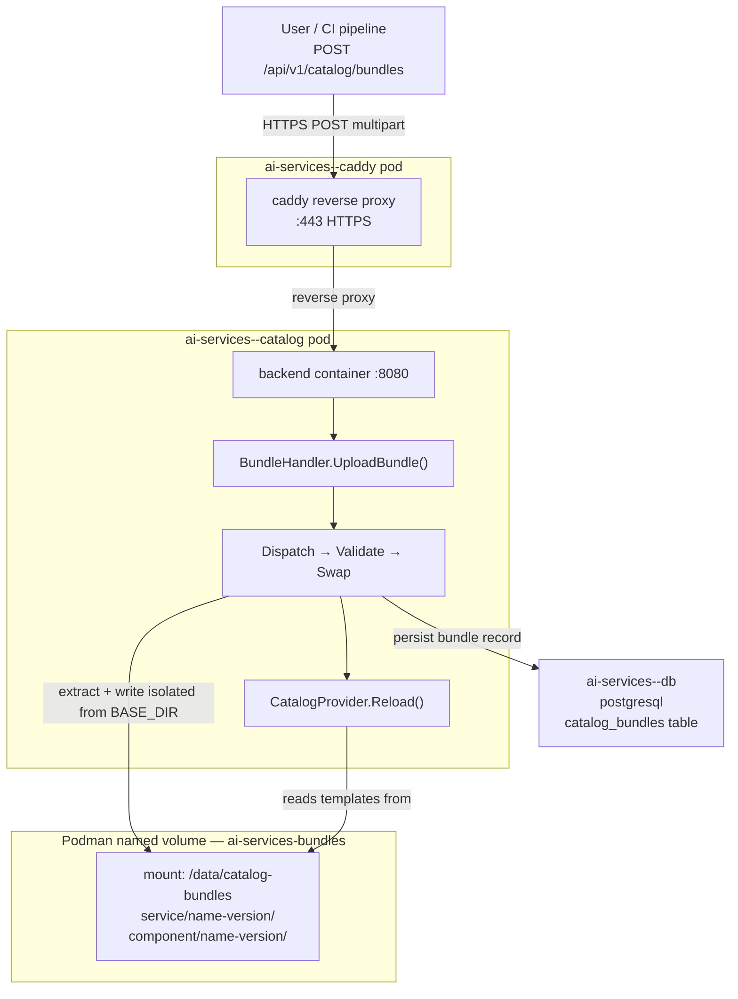
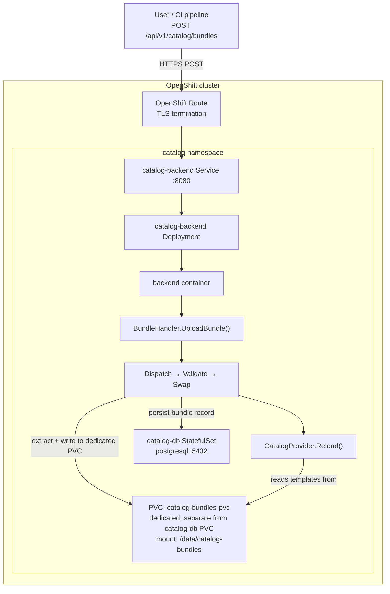

# Custom Service Templates for Customer Asset Onboarding

**Version:** 1.0
**Date:** Aug 2026
**Status:** Draft

---

## Table of Contents

1. [Executive Summary](#1-executive-summary)
2. [Background and Motivation](#2-background-and-motivation)
3. [Catalog Pod Architecture](#3-catalog-pod-architecture)
4. [New Asset Structure](#4-new-asset-structure)
5. [Template Provider Design](#5-template-provider-design)
6. [CatalogProvider Integration](#6-catalogprovider-integration)
7. [API Upload](#7-api-upload)
8. [Custom Template Directory Structure](#8-custom-template-directory-structure)
9. [Remote Deployment](#9-remote-deployment)
10. [Template Values Reference](#10-template-values-reference)
    - 10.1 [Shared (services and components)](#101-shared-services-and-components)
    - 10.2 [Services](#102-services)
    - 10.3 [Components](#103-components)
11. [Usage Examples](#11-usage-examples)
12. [Backward Compatibility](#12-backward-compatibility)
13. [Future Enhancements](#13-future-enhancements)

---

## 1. Executive Summary

Enterprise customers deploying AI Services on their own infrastructure often bring proprietary workloads, domain-specific models, and internal service patterns that are not represented in the platform's built-in catalog. Today there is no supported path for customers to introduce their own services into a running deployment without modifying the platform binary itself — a process that is impractical at scale and incompatible with air-gapped or regulated environments.

This proposal introduces **Custom Service Templates** — a first-class mechanism for customers to onboard their own AI service assets into the catalog at runtime. A customer packages their service definition as a `.tar.gz` bundle and uploads it to the running catalog backend over HTTPS. The platform validates, registers, and hot-reloads the new service immediately — with no pod restart, no host filesystem access, and no changes to the platform binary required. The mechanism is identical on Podman single-VM deployments and OpenShift clusters.

Built-in platform services are protected: a bundle whose `catalog_id` conflicts with an embedded service is rejected at validation time, ensuring the integrity of the core catalog is never compromised.

| Property | Detail |
|---|---|
| **Use case** | Onboard customer-authored service assets into a live catalog deployment |
| **Delivery** | `POST /api/v1/catalog/bundles` — `.tar.gz` archive uploaded over HTTPS to the running catalog |
| **Podman** | ✅ — bundle stored in dedicated named volume `ai-services-bundles` |
| **OpenShift** | ✅ — bundle stored in dedicated PVC `catalog-bundles-pvc` |
| **Live reload** | Automatic — `CatalogProvider` hot-reloads after successful extraction, no pod restart |
| **Audit trail** | `catalog_bundles` table in PostgreSQL — every upload is recorded with uploader identity and timestamp |
| **Best for** | Enterprise customers, air-gapped deployments, regulated environments, CI/CD-driven asset promotion |

---

## 2. Background and Motivation

### 2.1 Current Asset Architecture

The catalog uses a **service-oriented** decomposition. All platform assets are compiled into the binary at build time via `go:embed`, living under three roots in `assets.CatalogFS` (declared in [`ai-services/assets/fs.go`](ai-services/assets/fs.go:11)):

| Root | Purpose |
|---|---|
| `ai-services/assets/architectures/` | Architecture metadata (e.g. `rag`) declaring which services compose it |
| `ai-services/assets/services/` | Per-service assets: `chat`, `digitize`, `similarity`, `summarize` |
| `ai-services/assets/components/` | Reusable component providers: `llm`, `embedding`, `vector_store`, `reranker` |

All loading flows through [`CatalogProvider`](ai-services/internal/pkg/catalog/catalog.go:32), which walks `CatalogFS` at startup and caches every `metadata.yaml` it finds. Deployment is driven by the catalog **apiserver** running inside a pod — not by the CLI host process. Because the catalog is embedded in the binary, adding a new service today requires a full platform build and redeployment.

### 2.2 Problem Statement

Enterprise customers operate AI Services in environments where the built-in service catalog does not fully represent their workloads. Key pain points include:

- **Proprietary services** — customers have internal AI workloads (custom RAG pipelines, domain-specific inference services, internal tooling) that need to be deployable through the same catalog-driven workflow as built-in services.
- **Operational constraints** — air-gapped environments, regulated industries, and on-premises VM deployments make it impractical to request a platform rebuild each time a customer needs to register a new service.
- **CI/CD asset promotion** — teams need to promote service definitions through staging and production deployments programmatically, without manual intervention on each host.
- **Partner and ISV onboarding** — system integrators and technology partners need a supported path to register their own service assets alongside IBM-certified ones.

Currently, there is no supported mechanism to extend the catalog at runtime. Custom assets are delivered by uploading a `.tar.gz` bundle to the running catalog API over HTTPS. The apiserver extracts it to isolated storage, validates it, and hot-reloads `CatalogProvider` — no pod restart, no CLI host access required, and no changes to the platform binary needed.

### 2.3 Goals

1. Provide a secure, authenticated API endpoint (`POST /api/v1/catalog/bundles`) through which customers can register new service assets into a live deployment without platform downtime.
2. At apiserver startup, compose customer-uploaded bundles with the embedded `CatalogFS` via a `CompositeCatalogFS`, presenting a unified catalog that includes both platform and customer services.
3. Protect the integrity of built-in platform services — bundles that attempt to use a reserved `catalog_id` are rejected; the embedded catalog is immutable at runtime.
4. Maintain full backward compatibility — in the absence of any uploaded bundles, behaviour is identical to the current release.

---

## 3. Catalog Pod Architecture

Understanding how the catalog runs as pods is essential context for where custom templates plug in.

### 3.1 Catalog pod topology



### 3.2 Why this matters for custom templates

The catalog backend's `CatalogProvider` runs **inside the `ai-services--catalog` container**, not on the CLI host. `assets.CatalogFS` is baked into the binary at build time (via `go:embed`). For custom templates to be visible at runtime they must reach the container and be overlaid onto the embedded FS.

Custom assets are delivered via the running catalog API: the client POSTs a `.tar.gz` bundle over HTTPS, and the apiserver writes the extracted contents to a dedicated named volume (`ai-services-bundles` on Podman, `catalog-bundles-pvc` on OpenShift) that it already owns. Both runtimes mount the volume at the well-known path `/data/catalog-bundles` inside the container. Bundles are stored under `<catalog_type>/<name>/` where `name = <catalog_id>-<version>` (e.g. `service/chat-2.0.0/`). **At most one bundle per `catalog_id` is active at any time** — uploading a new version via `PUT` replaces the existing one. At startup, `CatalogProvider` queries the DB for all `status = 'active'` rows, resolves each to its named directory, and builds a `CompositeCatalogFS`. Hot-reload happens in-process after every successful upload; no pod restart is needed.

### 3.3 OpenShift path

For OpenShift, `catalog configure` runs [`openshift.DeployCatalog`](ai-services/internal/pkg/catalog/cli/configure/openshift/configure.go:24), which uses Helm to install/upgrade the catalog chart from `assets/catalog/openshift/`. No chart change is required for bundle support: once the catalog is deployed, users POST bundles to the Route-exposed API endpoint. The backend writes to the `catalog-bundles-pvc` PVC it already mounts (see §7.6).

---

## 4. New Asset Structure

### 4.1 Built-in service assets (existing)

Each service under `ai-services/assets/services/` has the following layout, shown for `chat`:

```
ai-services/assets/services/chat/
├── metadata.yaml              # Service identity & dependencies (id: chat)
├── podman/
│   ├── metadata.yaml          # Runtime metadata: version, resources, podTemplateExecutions
│   ├── values.yaml            # Default parameter values
│   ├── values.schema.json     # JSON Schema for parameter validation
│   ├── templates/
│   │   └── chat-bot.yaml.tmpl # Pod spec template
│   └── steps/
│       ├── info.md
│       └── vars_file.yaml
└── openshift/
    ├── Chart.yaml
    ├── metadata.yaml
    ├── values.yaml
    └── templates/
        ├── chat-bot-backend-deployment.yaml
        └── ...
```

Key fields from [`assets/services/chat/metadata.yaml`](ai-services/assets/services/chat/metadata.yaml:1):

```yaml
id: chat
name: "Question and answer"
type: service
certified_by: "IBM"
architectures:
  - rag
dependencies:
  - id: vector_store
  - id: embedding
  - id: llm
standalone: false
```

### 4.2 Architecture assets (existing)

`assets/architectures/rag/metadata.yaml` declares which services compose the `rag` architecture and which components are shared globally across all services:

```yaml
id: rag
name: "Digital Assistant"
type: architecture
global_components:
  - type: vector_store
  - type: embedding
services:
  - id: chat
  - id: digitize
  - id: similarity
```

### 4.3 Custom service assets (proposed)

A user-supplied bundle mirrors the same `services/` root. Only the entries present in the bundle are overlaid; everything else falls through to the embedded assets.

```
my-bundle.tar.gz
└── services/
    └── my-service/
        ├── metadata.yaml           # required
        └── podman/
            ├── metadata.yaml       # required (version, resources, podTemplateExecutions)
            ├── values.yaml         # required
            ├── values.schema.json  # optional
            └── templates/
                └── my-service.yaml.tmpl
```

Only `services/` is a valid top-level directory in a bundle; any other roots are silently skipped (forward-compatible for future `components/` support). The `catalog_id` inside the bundle must **not** match any built-in service — if it does, validation rejects the bundle with a `422` error.

---

## 5. Template Provider Design

### 5.1 Provider hierarchy



### 5.2 Interface

```go
// CatalogFS abstracts the filesystem used by CatalogProvider.
type CatalogFS interface {
    fs.ReadDirFS
    Open(name string) (fs.File, error)
    ReadFile(name string) ([]byte, error)
}
```

### 5.3 FilesystemCatalogFS

```go
// FilesystemCatalogFS reads catalog assets from a local directory.
// Inside the container this is the active bundle directory written by BundleService.
type FilesystemCatalogFS struct {
    root string // e.g. "/data/catalog-bundles/service/chat-2.0.0"
}
```

Validates at construction that `services/` exists under `root`, providing an actionable early error. Entries other than `services/` are ignored.

### 5.4 CompositeCatalogFS

```go
// CompositeCatalogFS merges multiple CatalogFS instances.
// Lookup checks each source in order; the first hit wins.
// WalkDir visits all sources and deduplicates paths.
type CompositeCatalogFS struct {
    sources []CatalogFS // [bundleFS, embeddedFS]
}
```

When `WalkDir` encounters the same relative path (e.g. `services/chat/metadata.yaml`) in both sources, the first source (bundle) wins and the embedded version is silently skipped.

### 5.5 Factory function

At startup the apiserver builds one `FilesystemCatalogFS` per active bundle (see §6.3). The factory below is the helper used when there is exactly one bundle path to overlay — for example in tests or single-bundle tooling:

```go
// NewCatalogFS returns the CatalogFS to use.
// bundlePath="" → returns the embedded FS only (no active bundle).
// bundlePath set → returns a composite that overlays that single bundle directory.
// For multiple active bundles use NewCompositeCatalogFS directly (see §6.3).
func NewCatalogFS(bundlePath string) (CatalogFS, error) {
    embedded := &EmbeddedCatalogFS{fs: &assets.CatalogFS}
    if bundlePath == "" {
        return embedded, nil
    }
    bundle, err := NewFilesystemCatalogFS(bundlePath)
    if err != nil {
        logger.Warningf("bundle path '%s' invalid, using built-in only: %v", bundlePath, err)
        return embedded, nil
    }
    return NewCompositeCatalogFS(bundle, embedded), nil
}
```

### 5.6 Resolution priority

At startup, `CatalogProvider` reads active bundle versions from the DB and constructs one `FilesystemCatalogFS` per active item, all layered before the embedded FS:

| Priority | Source | Condition |
|---|---|---|
| 1..N | `FilesystemCatalogFS` (one per active bundle) | DB has `status = 'active'` rows; paths are `/data/catalog-bundles/<catalog_type>/<name>/` |
| N+1 | `EmbeddedCatalogFS` (built-in) | Always present as fallback |

---

## 6. CatalogProvider Integration

### 6.1 Current loading (single embedded FS)

[`loadCatalogItems`](ai-services/internal/pkg/catalog/catalog.go:56) today walks `assets.CatalogFS` directly, dispatching on the first path segment (`"architectures"`, `"services"`, `"components"`) and storing results in `sharedItems`:

```go
err := fs.WalkDir(&assets.CatalogFS, ".", func(path string, d fs.DirEntry, err error) error {
    return processMetadataFile(ctx, path, items)
})
```

### 6.2 Proposed: inject CatalogFS

`NewCatalogProvider` gains an optional functional option:

```go
func NewCatalogProvider(opts ...Option) (*CatalogProvider, error)

// WithBundlePath overlays the active bundle directory on top of the embedded catalog.
func WithBundlePath(dir string) Option
```

When provided, `loadCatalogItems` receives the `CompositeCatalogFS` instead of `&assets.CatalogFS`. The `processMetadataFile`, `parseService`, `parseArchitecture`, `parseComponent` functions are unchanged — they work against any `CatalogFS`.

### 6.3 Apiserver startup loads active bundle paths from the DB

The bundle volume is always mounted at `/data/catalog-bundles`. No env var is needed. At startup, the apiserver queries the `catalog_bundles` table for all `status = 'active'` rows, resolves each one to its versioned directory on disk, and builds a `CompositeCatalogFS` with one `FilesystemCatalogFS` per active item:

```go
// catalogBundlesDir is the well-known container mount path for the bundles volume.
// It is fixed by the pod spec (Podman named volume / OpenShift PVC).
const catalogBundlesDir = "/data/catalog-bundles"

// In the apiserver main/start path:
activeBundles, err := bundleRepo.ListActive(ctx) // SELECT WHERE status='active'
var fsList []CatalogFS
for _, b := range activeBundles {
    // path: /data/catalog-bundles/<catalog_type>/<name>/
    // name is derived server-side as <catalog_id>-<version>
    p := filepath.Join(catalogBundlesDir, b.CatalogType, b.Name)
    if fs, err := NewFilesystemCatalogFS(p); err == nil {
        fsList = append(fsList, fs)
    }
}
fsList = append(fsList, &EmbeddedCatalogFS{fs: &assets.CatalogFS})
provider, err := catalog.NewCatalogProvider(catalog.WithCompositeCatalogFS(fsList...))
```

If there are no active bundles, only `EmbeddedCatalogFS` is used — behaviour is identical to today.

---

## 7. API Upload

Custom catalog assets are delivered by uploading a `.tar.gz` bundle to the running catalog backend over its existing HTTPS endpoint. A bundle is a generic container — it can carry any mix of catalog root types (`services/`, `components/`, and others in future). The archive is extracted, validated per root type, and hot-reloaded into `CatalogProvider` — with no pod restart required for either Podman or OpenShift.

> **Scope for this release:** only `services/` is processed. `components/` and other roots are accepted in the archive but skipped by the dispatcher — they will be activated in a future release without any change to the bundle format or API contract.

### 7.1 Design goals

| Goal | Detail |
|---|---|
| No restart required | `CatalogProvider` reloads the custom layer in-process after a successful upload |
| Conflict-safe POST | `POST` raises `409 Conflict` if a bundle with the same `catalog_id` is already registered — use `PUT` to update |
| Explicit update via PUT | `PUT /api/v1/catalog/bundles/:bundle_id` replaces the existing bundle; `catalog_id`, `catalog_type`, and `version` are all resolved from the archive and the existing DB record — not form fields |
| Independent bundles | Each uploaded bundle exists separately; multiple bundles for different `catalog_id` values are all active simultaneously |
| Authenticated | Uses the existing JWT `BearerAuth` middleware; only admin-role tokens are accepted |
| Consistent across runtimes | Same API endpoint works for Podman and OpenShift; only the storage backend differs |
| Bounded size | Configurable `MAX_BUNDLE_SIZE` (default 50 MB); enforced at the HTTP layer before extraction |

---

### 7.2 New API endpoints

Six bundle endpoints are added to the existing router in [`apiserver/router.go`](ai-services/internal/pkg/catalog/apiserver/router.go:20) under the authenticated `catalog/bundles` group:

| Method | Path | Description |
|---|---|---|
| `POST` | `/api/v1/catalog/bundles` | Upload a **new** bundle (`.tar.gz`). Returns `409 Conflict` if a bundle with the same `catalog_id` already exists. |
| `PUT` | `/api/v1/catalog/bundles/:bundle_id` | Replace an existing bundle identified by its internal record ID. Returns `404` if no bundle with that ID exists. `catalog_id` and `catalog_type` are resolved from the DB record. |
| `DELETE` | `/api/v1/catalog/bundles/:bundle_id` | Delete a bundle by its internal record ID. Removes the on-disk directory and the DB record. Returns `404` if no bundle with that ID exists. |
| `GET` | `/api/v1/catalog/bundles` | List all uploaded bundles (id, status, uploaded_at, size). |
| `GET` | `/api/v1/catalog/bundles/:id` | Get the status and metadata for a specific bundle by ID. Used to poll after a `202 Accepted` PUT response. |
| `GET` | `/api/v1/catalog/bundles/:id/download` | Download a bundle's extracted directory as a `.tar.gz` archive. Only available for `active` bundles. |

Five additional catalog-read endpoints are added under the authenticated `v1` catalog group for CLI and client use:

| Method | Path | Description |
|---|---|---|
| `GET` | `/api/v1/services/:id/images` | Return image metadata for a service. |
| `GET` | `/api/v1/services/:id/models` | Return model metadata for a service. |
| `GET` | `/api/v1/services/:id/md` | Return the service's Markdown description. |
| `GET` | `/api/v1/architectures/:id/images` | Return image metadata for an architecture. |
| `GET` | `/api/v1/architectures/:id/models` | Return model metadata for an architecture. |

#### 7.2.1 Upload bundle — `POST /api/v1/catalog/bundles`

The request uses `multipart/form-data` with only two fields: `file` (required) and `dry_run` (optional). **`catalog_id`, `catalog_type`, and `version` are not form fields** — they are all read from `metadata.yaml` inside the archive. This removes the possibility of a mismatch between declared metadata and archive contents.

The upload is **fully synchronous**: the handler reads the archive, peeks `metadata.yaml`, checks for a conflict, extracts to the permanent directory, validates structure, inserts a DB row as `active`, and reloads `CatalogProvider` — all before returning. On success the response is `201 Created` (not `202 Accepted`); no polling is needed.

When `dry_run=true` the archive is extracted to a temporary directory, validated, then immediately cleaned up. No DB record is written, `CatalogProvider` is not reloaded, and the conflict check is skipped. The response is `200 OK` (valid) or `422` (invalid), returned inline without polling.

```
POST /api/v1/catalog/bundles
Content-Type: multipart/form-data
Authorization: Bearer <admin-jwt>

Form fields:
  file     (required)  — .tar.gz archive containing the catalog item assets;
                         max 50 MB compressed.
                         catalog_id, catalog_type, and version are read from
                         metadata.yaml inside the archive.
  dry_run  (optional)  — "true" runs a synchronous validate-only pass;
                         no DB record is written and nothing is activated
```

**Example (curl):**
```bash
curl -X POST https://catalog-api.<domain>/api/v1/catalog/bundles \
  -H "Authorization: Bearer $TOKEN" \
  -F "file=@my-bundle.tar.gz"
```

**Responses:**

| Status | Meaning |
|---|---|
| `200 OK` | **`dry_run=true` only.** Validation passed; archive is safe to upload for real. No record was written. |
| `201 Created` | Bundle validated, extracted, inserted into the DB as `active`, and catalog reloaded — all synchronously. A `Location` header points to the new record. |
| `400 Bad Request` | Missing or unreadable `file` field; wrong content-type; archive exceeds size limit; or `metadata.yaml` is missing/malformed. |
| `401 Unauthorized` | Missing or invalid JWT. |
| `403 Forbidden` | Token does not carry admin role. |
| `409 Conflict` | A bundle with the same `catalog_id` (from the archive's `metadata.yaml`) is already registered. Use `PUT /api/v1/catalog/bundles/:bundle_id` to update it. |
| `422 Unprocessable Entity` | Validation failed (bad metadata structure, reserved `catalog_id`, etc.). |

The `201` response includes a `Location` header and a body matching the `BundleResponse` shape:

```
HTTP/1.1 201 Created
Location: /api/v1/catalog/bundles/bnd_01JW4X9K2M8VQRP3T5YZ
```

```json
// 201 response body — bundle is already active; size_bytes reflects on-disk size
{
  "id":           "bnd_01JW4X9K2M8VQRP3T5YZ",
  "name":         "my-service-1.0.0",
  "status":       "active",
  "uploaded_at":  "2026-05-12T09:14:02Z",
  "size_bytes":   286720,
  "catalog_type": "service",
  "catalog_id":   "my-service",
  "version":      "1.0.0",
  "uploaded_by":  "admin"
}
```

#### 7.2.2 Update bundle — `PUT /api/v1/catalog/bundles/:bundle_id`

Use `PUT` to replace an existing bundle identified by its internal record ID (`bundle_id`). The server looks up the record by `bundle_id` and derives `catalog_id` and `catalog_type` from it — neither is a form field. The only form fields are `file` and optionally `dry_run`.

**Version is not a form field.** The version of the replacement bundle is read from the `metadata.yaml` inside the archive after extraction. If the metadata carries a new version the on-disk directory is named accordingly (`<catalog_id>-<new_version>/`). The `catalog_id` and `catalog_type` values inside the archive metadata must match the existing DB record — attempts to change them are rejected with `422`.

Returns `404` if no bundle with that `bundle_id` exists.

When `dry_run=true` the request is handled **synchronously**: the archive is extracted to a temporary directory and validated, then immediately cleaned up. The `404` check **still runs** — a dry-run with an unknown `bundle_id` returns `404` just as a real PUT would. No DB record is updated, the old bundle directory is untouched, and `CatalogProvider` is not reloaded. The response is `200 OK` (valid) or `422` (invalid), returned inline without polling.

```
PUT /api/v1/catalog/bundles/:bundle_id
Content-Type: multipart/form-data
Authorization: Bearer <admin-jwt>

Path parameter:
  :bundle_id   (required)  — internal record ID of the bundle to replace,
                             e.g. bnd_01JW4X9K2M8VQRP3T5YZ

Form fields:
  file         (required)  — .tar.gz archive containing the replacement assets
  dry_run      (optional)  — "true" runs a synchronous validate-only pass;
                             existing bundle is untouched, nothing is activated
```

> `catalog_id`, `catalog_type`, and `version` are **not** form fields for `PUT`. `catalog_id` and `catalog_type` are resolved from the DB record and validated against the archive metadata — mismatches are rejected with `422`. `version` is read from the archive's `metadata.yaml` and used to derive the on-disk bundle name (`<catalog_id>-<version>/`).

**Example (curl):**
```bash
curl -X PUT https://catalog-api.<domain>/api/v1/catalog/bundles/bnd_01JW4X9K2M8VQRP3T5YZ \
  -H "Authorization: Bearer $TOKEN" \
  -F "file=@my-bundle-v2.tar.gz"
```

**Responses:**

| Status | Meaning |
|---|---|
| `200 OK` | **`dry_run=true` only.** Validation passed; replacement archive is safe to apply for real. Existing bundle unchanged. |
| `202 Accepted` | Replacement bundle accepted; processing asynchronously. Poll `Location` header to get status. `version` and `name` in the response body are populated once the archive is extracted. |
| `400 Bad Request` | Missing `file` field; archive top-level directory does not match the resolved `catalog_id`; wrong content-type; or archive exceeds size limit. |
| `401 Unauthorized` | Missing or invalid JWT. |
| `403 Forbidden` | Token does not carry admin role. |
| `404 Not Found` | No bundle with the given `bundle_id` exists. Use `POST` to create a new bundle first. (Returned for both normal and `dry_run=true` requests.) |
| `422 Unprocessable Entity` | Validation failed, or the archive's `catalog_id`/`catalog_type` metadata differs from the existing record. Returned synchronously for `dry_run=true`, or via poll for normal updates. The existing bundle remains active in both cases. |

The `202` body has the same shape as `POST` but `version` and `name` are initially empty strings (populated on the polled response once extraction completes). The old bundle directory (`<type>/<catalog_id>-<old_version>/`) is deleted from the volume only after the replacement is marked `active` in the DB — the existing bundle continues to serve templates throughout the async processing window.

---

#### 7.2.3 Delete bundle — `DELETE /api/v1/catalog/bundles/:bundle_id`

Permanently removes a bundle: deletes the on-disk directory (`<catalog_type>/<catalog_id>-<version>/`) from the bundle volume, removes the DB row, and triggers a `CatalogProvider.Reload()` so the item is no longer served. Any application that was deployed using this bundle's `catalog_id` is **not** affected — existing deployed resources are independent of the catalog once launched.

```
DELETE /api/v1/catalog/bundles/:bundle_id
Authorization: Bearer <admin-jwt>

Path parameter:
  :bundle_id   (required)  — internal record ID of the bundle to delete,
                             e.g. bnd_01JW4X9K2M8VQRP3T5YZ
```

**Example (curl):**
```bash
curl -X DELETE https://catalog-api.<domain>/api/v1/catalog/bundles/bnd_01JW4X9K2M8VQRP3T5YZ \
  -H "Authorization: Bearer $TOKEN"
```

**Responses:**

| Status | Meaning |
|---|---|
| `204 No Content` | Bundle deleted; on-disk directory removed and `CatalogProvider` reloaded. |
| `401 Unauthorized` | Missing or invalid JWT. |
| `403 Forbidden` | Token does not carry admin role. |
| `404 Not Found` | No bundle with the given `bundle_id` exists. |

> Deletion is **synchronous** — the directory removal and `CatalogProvider.Reload()` happen in-process before the `204` is returned. There is no async processing step and no polling needed.

---

#### 7.2.4 List bundles — `GET /api/v1/catalog/bundles`

Each bundle record carries `catalog_type` (the type declared by the uploader — `"service"` or `"component"`) and `catalog_id` (the item id within that type). Multiple bundles for different catalog items are all active simultaneously and each is listed independently.

```json
{
  "bundles": [
    {
      "id":           "bnd_01JW4X9K2M8VQRP3T5YZ",
      "status":       "active",
      "uploaded_at":  "2026-05-12T09:14:02Z",
      "size_bytes":   286720,
      "name":         "my-service-1.0.0",
      "catalog_type": "service",
      "catalog_id":   "my-service",
      "version":      "1.0.0",
      "uploaded_by":  "admin"
    },
    {
      "id":           "bnd_02CD8Y3NF1P9WQS4U6VA",
      "name":         "my-llm-provider-1.0.0",
      "status":       "active",
      "uploaded_at":  "2026-05-13T11:30:00Z",
      "size_bytes":   196608,
      "catalog_type": "component",
      "catalog_id":   "my-llm-provider",
      "version":      "1.0.0",
      "uploaded_by":  "admin"
    }
  ]
}
```

---

### 7.3 Bundle format

A bundle is scoped to **one catalog item**. The archive must be a gzip-compressed tar (`.tar.gz`). The `catalog_id` and `version` together form the unique on-disk directory name (`<catalog_id>-<version>`).

For **both POST and PUT**, `catalog_id`, `catalog_type`, and `version` are read from `metadata.yaml` inside the archive — they are not form fields. For **PUT**, `catalog_id` and `catalog_type` must also match the existing DB record (immutable); a mismatch is rejected with `422`.

The top-level `metadata.yaml` inside the archive declares the three identity fields:

```yaml
# metadata.yaml (at the root of the archive, inside the top-level dir)
catalog_id:   my-service
catalog_type: service
version:      1.0.0
```

```
my-bundle.tar.gz
└── my-service/                     ← directory name must match catalog_id in metadata.yaml
    ├── metadata.yaml               ← declares catalog_id, catalog_type, version
    └── podman/
        ├── metadata.yaml
        ├── values.yaml
        └── templates/
            └── my-service.yaml.tmpl
```

`catalog_id` and `version` from `metadata.yaml` are combined to determine the on-disk bundle name (`my-service-1.0.0/`).

**Rules:**
- Paths containing `..` or absolute paths are rejected immediately (path-traversal guard, same principle as [`SanitizeFilePath`](ai-services/internal/pkg/catalog/utils/common.go:90)).
- The archive must contain exactly one top-level directory; multiple items per archive are not supported.
- The top-level directory name inside the archive must exactly equal `catalog_id` from `metadata.yaml` — a mismatch is rejected with `422`.
- Total uncompressed size must not exceed `MAX_BUNDLE_SIZE_UNCOMPRESSED` (default 200 MB).
- The `catalog_id` must not match any built-in service already present in `assets.CatalogFS` — if it does, validation returns `422` and the extracted directory is deleted.
- All `metadata.yaml` files must pass validation for the declared `catalog_type` before the bundle is marked `active`.

---

### 7.4 Server-side processing pipeline

#### POST — new bundle



#### PUT — replace existing bundle



**Key implementation notes:**

- **POST is synchronous.** The HTTP handler returns `201 Created` only after extraction, validation, DB insert, and `CatalogProvider.Reload()` all succeed. There is no polling step for POST.
- **PUT is async.** The HTTP handler returns `202 Accepted` immediately; extraction and validation run in a goroutine. The client polls `GET /api/v1/catalog/bundles/:id` until `status` is `active` or `failed`.
- `catalog_id`, `catalog_type`, and `version` are **never form fields**. All three are read from `metadata.yaml` inside the archive by `peekMetadata()` before any extraction begins.
- Each bundle gets its own named directory on the volume (`<type>/<catalog_id>-<version>/`) — uploading `service/my-service-1.0.0` and `service/chat-1.0.0` are entirely independent; neither touches the other.
- **POST** extraction goes directly into `<type>/<catalog_id>-<version>/` — no staging directory needed. Since the named directory is new and unique, there is nothing live to corrupt.
- **PUT** extraction writes the new versioned directory alongside the old one. The old directory is removed only after the new bundle is marked `active` in the DB — the existing bundle continues to serve templates throughout the async window.
- **PUT** metadata check: after peeking `metadata.yaml`, `catalog_id` and `catalog_type` are asserted to match the existing DB record (immutable). `version` may differ and is used to name the new directory. A mismatch returns `422` and the extracted directory is deleted.
- If validation fails, the newly written `<type>/<catalog_id>-<version>/` directory is deleted. All other active bundles remain unaffected.
- The DB never marks a bundle `active` until validation passes — so even a partial extraction (e.g. process killed mid-way) is safe: `CatalogProvider` will not load a directory that has no `active` DB row.
- `CatalogProvider.Reload()` re-queries the DB for all `status = 'active'` rows and rebuilds the in-memory catalog under `sync.RWMutex`.
- Bundle files are stored in a **dedicated named Podman volume** (`ai-services-bundles`) or **separate PVC** (`catalog-bundles-pvc`) — isolated from `$BASE_DIR` so that a `catalog delete --skip-cleanup` affecting application data never touches bundle storage.
- The `catalog_bundles` table is added via a new Goose migration following the same pattern as [`20260430094502_create_applications_table.sql`](ai-services/internal/pkg/catalog/db/migrations/assets/20260430094502_create_applications_table.sql).

---

### 7.5 New database migration

Each row in `catalog_bundles` represents one uploaded bundle. The `name` column is derived server-side as `<catalog_id>-<version>` (e.g. `chat-2.0.0`) — it identifies the specific versioned bundle and is used as the directory name on the volume. The `status` column tracks lifecycle: for **POST** the row is inserted directly as `active`; for **PUT** the row starts as `processing` and moves to `active` or `failed` when the goroutine completes. **Only one `active` row per `catalog_id` is permitted** — enforced by a partial unique index. Bundles for different `catalog_id` values are all `active` simultaneously; each exists independently.

```sql
-- +goose Up
-- +goose StatementBegin
CREATE TYPE bundle_status AS ENUM (
    'processing',
    'active',
    'failed'
);

CREATE TABLE catalog_bundles (
    id               VARCHAR(30)    PRIMARY KEY,
    -- e.g. bnd_01JW4X9K2M8VQRP3T5YZ

    -- Human-readable versioned name: <catalog_id>-<version>, e.g. "chat-2.0.0"
    -- Used as the directory name on the bundle volume.
    name             VARCHAR(200)   NOT NULL,

    status           bundle_status  NOT NULL DEFAULT 'processing',
    -- Uncompressed on-disk size in bytes, populated after extraction completes.
    -- NULL on the immediate 202 response; set once the bundle reaches 'active' or 'failed'.
    size_bytes       BIGINT,

    -- The catalog item type declared by the uploader: "service", "component", …
    catalog_type     VARCHAR(50)    NOT NULL,
    -- The id of the catalog item: e.g. "my-service", "my-llm-provider"
    catalog_id       VARCHAR(100)   NOT NULL,
    -- Semantic version of this bundle: e.g. "1.0.0", "2.1.0"
    version          VARCHAR(50)    NOT NULL,

    error            TEXT,
    uploaded_by      VARCHAR(100),
    uploaded_at      TIMESTAMPTZ    NOT NULL DEFAULT NOW()
);

-- Enforce one active bundle per catalog_id at the DB level.
-- 'processing' and 'failed' rows are exempt so that a replacement upload
-- in flight does not block itself.
CREATE UNIQUE INDEX uq_catalog_bundles_active_catalog_id
    ON catalog_bundles (catalog_id)
    WHERE status = 'active';
-- +goose StatementEnd

-- +goose Down
-- +goose StatementBegin
DROP INDEX  IF EXISTS uq_catalog_bundles_active_catalog_id;
DROP TABLE  IF EXISTS catalog_bundles;
DROP TYPE   IF EXISTS bundle_status;
-- +goose StatementEnd
```

---

### 7.6 Storage per runtime

Bundle storage is **intentionally isolated** from `$AI_SERVICES_BASE_DIR`. This prevents a `catalog delete` or application-data wipe from destroying uploaded bundles, and makes the storage unit independently snapshotable.

#### Volume directory layout

The volume is organised as `<catalog_type>/<name>/` where `name` is `<catalog_id>-<version>` (e.g. `chat-2.0.0`). At most **one versioned directory per `catalog_id`** exists on disk at any time — a `PUT` replaces the old directory with the new one once the replacement is marked `active`. Bundles for different `catalog_id` values coexist independently. Extraction writes directly into the new named directory; the old directory is removed only after the DB row is updated to `active`.

```
/data/catalog-bundles/
├── service/
│   ├── chat-2.0.0/              ← active (one version of "chat" at a time)
│   │   ├── metadata.yaml
│   │   └── podman/...
│   └── my-service-1.0.0/        ← active (independent catalog_id)
│       ├── metadata.yaml
│       └── podman/...
└── component/
    └── my-llm-provider-1.0.0/   ← active (independent catalog_id)
        └── metadata.yaml
```

The `CatalogProvider` resolves each active item's path as:
```
/data/catalog-bundles/<catalog_type>/<name>/
```
where `name = <catalog_id>-<version>`.

#### Podman — named volume `ai-services-bundles`

A dedicated Podman named volume is created by `catalog configure` and mounted into the catalog backend container at `/data/catalog-bundles`. Because Podman named volumes are managed independently of `hostPath` directories, they survive `catalog delete --skip-cleanup` and do not depend on any host filesystem path.

```
Volume name:  ai-services-bundles
Mount point (inside container):  /data/catalog-bundles/
```

**`catalog.yaml.tmpl` addition** (new volume entry alongside the existing `ai-services-data` mount):

```yaml
# new volume declaration
- name: catalog-bundles
  persistentVolumeClaim:
    claimName: "ai-services-bundles"   # Podman named volume, treated as PVC in pod spec
```

```yaml
# new container volumeMount on backend container
- mountPath: /data/catalog-bundles
  name: catalog-bundles
```

#### OpenShift — dedicated PVC `catalog-bundles-pvc`

A separate `PersistentVolumeClaim` is added to the catalog Helm chart (`assets/catalog/openshift/`) rather than reusing the existing `catalog-db` PVC. This keeps bundle lifecycle independent of the database and allows different storage classes (e.g. `ReadWriteMany` for multi-replica deployments in future).

```yaml
# new PVC in catalog Helm chart
apiVersion: v1
kind: PersistentVolumeClaim
metadata:
  name: catalog-bundles-pvc
spec:
  accessModes: [ReadWriteOnce]
  resources:
    requests:
      storage: 1Gi     # tunable via chart values: catalog.bundleStorage
```

```yaml
# volumeMount on catalog-backend Deployment
- mountPath: /data/catalog-bundles
  name: catalog-bundles

# corresponding volume
- name: catalog-bundles
  persistentVolumeClaim:
    claimName: catalog-bundles-pvc
```

**Layout inside the PVC** is identical to the Podman volume layout above, so `BundleService` needs no runtime-specific code paths. Both runtimes mount at `/data/catalog-bundles` — the same well-known constant the apiserver uses.

---

### 7.7 Flow diagrams

#### Podman — upload flow



#### OpenShift — upload flow



---

### 7.8 Handler and service (Go) — as implemented

The actual handler lives at [`apiserver/handlers/bundle_handler.go`](ai-services/internal/pkg/catalog/apiserver/handlers/bundle_handler.go) and the service at [`apiserver/services/bundle/`](ai-services/internal/pkg/catalog/apiserver/services/bundle/).

**`BundleHandler`** follows the same pattern as `ApplicationHandler` and `CatalogHandler`:

```go
// BundleHandler handles catalog bundle upload, replacement, deletion, and listing.
type BundleHandler struct {
    bundleService bundlesvc.BundleServiceInterface
}

func NewBundleHandler(svc bundlesvc.BundleServiceInterface) *BundleHandler {
    return &BundleHandler{bundleService: svc}
}
```

**`UploadBundle` (POST → 201)** — only two form fields: `file` and optional `dry_run`.
`catalog_id`, `catalog_type`, and `version` are read entirely from the archive:

```go
func (h *BundleHandler) UploadBundle(c *gin.Context) {
    c.Request.Body = http.MaxBytesReader(c.Writer, c.Request.Body, maxBundleSizeBytes)

    file, header, err := c.Request.FormFile("file")
    // ... 400 if missing or not .tar.gz ...

    userID := c.GetString(middleware.CtxUserIDKey)

    if c.PostForm("dry_run") == "true" {
        // ValidateBundle reads metadata.yaml, extracts to /tmp, validates, cleans up.
        result, err := h.bundleService.ValidateBundle(c.Request.Context(), file)
        // ... 200 OK or 422 ...
        return
    }

    // ProcessBundle: peek metadata → conflict check → extract → validate →
    //                insert DB row as active → reload → return 201.
    resp, err := h.bundleService.ProcessBundle(c.Request.Context(), file, userID)
    // ... 409 / 422 / 500 handled by ValidationError.Code ...
    c.Header("Location", fmt.Sprintf("/api/v1/catalog/bundles/%s", resp.ID))
    c.JSON(http.StatusCreated, resp)
}
```

**`UpdateBundle` (PUT → 202)** — resolves existing record from `bundle_id` path param; only `file` and optional `dry_run` are form fields:

```go
func (h *BundleHandler) UpdateBundle(c *gin.Context) {
    bundleID := c.Param("bundle_id")
    existing, err := h.bundleService.GetByBundleID(c.Request.Context(), bundleID)
    // ... 404 if nil ...

    // version is NOT a form field — read from metadata.yaml inside the archive.

    if dryRun {
        result, err := h.bundleService.ValidateBundle(c.Request.Context(), file)
        // ... 200 OK or 422 ...
        return
    }

    // ReplaceBundle: peek metadata → validate catalog_id/catalog_type immutable →
    //                insert new DB row as processing → goroutine: extract, validate,
    //                mark active, delete old dir, reload → return 202.
    resp, err := h.bundleService.ReplaceBundle(c.Request.Context(), existing, file, userID)
    c.Header("Location", fmt.Sprintf("/api/v1/catalog/bundles/%s", resp.ID))
    c.JSON(http.StatusAccepted, resp)
}
```

**`BundleServiceInterface`** — as defined in [`services/bundle/types.go`](ai-services/internal/pkg/catalog/apiserver/services/bundle/types.go):

```go
type BundleServiceInterface interface {
    // ValidateBundle — shared dry-run path for POST and PUT.
    // Reads catalog_id, catalog_type, version from metadata.yaml inside the archive,
    // extracts to a temp directory, validates structure, then cleans up.
    // No DB row is written and no reload is triggered.
    ValidateBundle(ctx context.Context, file io.Reader) (*ValidationResult, error)

    // ProcessBundle — synchronous POST upload.
    // Reads metadata from archive, checks conflict, extracts to permanent dir,
    // validates structure, inserts DB row as active, reloads catalog.
    // Returns *BundleResponse with status "active" (201).
    ProcessBundle(ctx context.Context, file io.Reader, userID string) (*BundleResponse, error)

    // ReplaceBundle — async PUT update.
    // existing carries CatalogID, CatalogType (immutable), and old Name.
    // Version is read from the archive's metadata.yaml.
    // Inserts new DB row as processing, spawns goroutine, returns *BundleResponse
    // with status "processing" (202).
    ReplaceBundle(ctx context.Context, existing *BundleRecord, file io.Reader, userID string) (*BundleResponse, error)

    GetByBundleID(ctx context.Context, bundleID string) (*BundleRecord, error)
    GetBundleByID(ctx context.Context, bundleID string) (*BundleResponse, error)
    DeleteBundle(ctx context.Context, existing *BundleRecord) error
    ListBundles(ctx context.Context) (*BundleListResponse, error)

    // DownloadBundleArchive re-creates the .tar.gz for the bundle from its
    // extracted on-disk directory and streams it to w.
    DownloadBundleArchive(ctx context.Context, bundleID string, w io.Writer) error
}
```

**Key types** (defined in [`services/bundle/types.go`](ai-services/internal/pkg/catalog/apiserver/services/bundle/types.go)):

```go
// BundleRecord is the service-layer view of a DB row.
type BundleRecord struct {
    ID, Name, Status, CatalogType, CatalogID, Version, UploadedBy string
    SizeBytes  *int64
    UploadedAt time.Time
}

// BundleMetadata holds the fields read from metadata.yaml inside an archive.
type BundleMetadata struct {
    CatalogID, CatalogType, Version string
}

// ValidationResult is the 200 OK body for a dry-run.
type ValidationResult struct {
    Valid       bool     `json:"valid"`
    CatalogID   string   `json:"catalog_id"`
    CatalogType string   `json:"catalog_type"`
    Version     string   `json:"version"`
    Warnings    []string `json:"warnings,omitempty"`
}

// ValidationError carries an HTTP status code alongside its message.
type ValidationError struct {
    Code    int
    Message string
}
```

---

## 8. Custom Template Directory Structure

### 8.1 Minimum layout for a new service

```
services/
└── <service-id>/
    ├── metadata.yaml                    # required
    └── podman/                          # for podman runtime
        ├── metadata.yaml                # required (version, resources, podTemplateExecutions)
        ├── values.yaml                  # required
        ├── values.schema.json           # optional – enables param validation
        └── templates/
            └── <service>.yaml.tmpl      # at least one required
```

Package as a `.tar.gz` with `services/` at the top level:

```bash
tar -czf my-bundle.tar.gz services/
```

### 8.2 Service top-level `metadata.yaml`

```yaml
id: my-service                   # unique across built-in + custom services
name: "My Custom Service"
description: "..."
type: service                    # must be "service"
certified_by: "Custom"
architectures:
  - rag                          # reference an existing built-in architecture
dependencies:
  - id: llm                      # component types this service requires
standalone: true
```

### 8.3 Runtime `metadata.yaml` (Podman)

```yaml
name: my-service
version: "1.0.0"
podTemplateExecutions:
  - [dependency-secret.yaml.tmpl] # layer 1 – runs first
  - [my-service.yaml.tmpl]        # layer 2 – runs after layer 1 is ready
resources:
  cpu: 4
  memory: 8589934592              # bytes
  storage: 10737418240            # bytes
```

### 8.4 Built-in service IDs are reserved

A bundle whose top-level directory name matches an existing built-in service (`chat`, `digitize`, `similarity`, `summarize`) will be rejected by the validation step with a `422` error. Custom bundles must use a unique `catalog_id` that does not conflict with any embedded service or architecture.

Built-in IDs reserved at this time: `chat`, `digitize`, `similarity`, `summarize`, `rag`.

---

## 9. Remote Deployment

The control-plane catalog server acts as the authoritative bundle registry. Custom service assets are uploaded once to the control plane and stored there. Remote agents do not need to read assets directly — the control-plane catalog backend orchestrates all template resolution and service rendering on their behalf. No `.tar.gz` retention is required; only the extracted asset files are kept on the control-plane volume.

---

## 10. Template Values Reference

> **Scope: Podman only.**  The template values, `@generate` directives, and `ai-services.io/` labels/annotations described in this section apply to the **Podman** runtime, which uses Go-template `.yaml.tmpl` files.  OpenShift custom service templates use Helm charts and a different rendering pipeline; a full reference for that runtime is deferred.
>
> **TODO:** document the equivalent Helm-based template values, labels, and annotations for the OpenShift runtime.

This section is split into three parts:

- **§9.1 Shared** — context variables and lifecycle labels available in every `.yaml.tmpl` file, regardless of whether it belongs to a service or a component.
- **§9.2 Services** — values, annotations, injected dependency keys, and schema extensions specific to service templates.
- **§9.3 Components** — values, annotations, and env-override patterns specific to component templates.

---

### 9.1 Shared (services and components)

#### 9.1.1 Built-in template context variables

These variables are injected directly by the template engine into every `.yaml.tmpl` file. They are **not** defined in `values.yaml` and cannot be overridden by the user.

| Variable | Type | Description |
|---|---|---|
| `{{ .InstanceSlug }}` | string | Unique slug for the deployed instance (e.g. `chat-abc123`). Used to name pods, secrets, volumes, and services so multiple instances can co-exist. |
| `{{ .TemplateID }}` | string | Fully qualified template identifier (e.g. `services/chat`). Stamped onto every resource as the `ai-services.io/template` label. |
| `{{ .BaseDir }}` | string | Host filesystem base directory for the deployment (e.g. `/opt/ai-services`). Used to resolve host-path mounts such as the shared `models/` directory. |
| `{{ .Values }}` | object | Root object for all values sourced from `values.yaml` and any user-supplied overrides. Access fields with `{{ .Values.<key> }}`. |

#### 9.1.2 Lifecycle labels

These labels are placed on Pod `metadata.labels` and read by the runtime to manage lifecycle, secrets, and volumes. They apply equally to service and component pods.

| Label | Required | Value | Description |
|---|---|---|---|
| `ai-services.io/template` | **yes** | `"{{ .TemplateID }}"` | Identifies which template produced this pod or secret. Must be present on every resource emitted by a template — used for ownership tracking and cleanup. |
| `ai-services.io/secret` | no | Secret name(s), comma-separated | Marks the listed secrets as owned by this pod. The runtime creates and deletes them alongside the pod. |
| `ai-services.io/secret-skip-cleanup` | no | `"true"` | Prevents the named secrets from being deleted on teardown. Set alongside `ai-services.io/secret` for credentials that must survive restarts (e.g. database passwords). |
| `ai-services.io/volume` | no | PVC / secret-volume name(s), comma-separated | Declares persistent volumes or secret-backed volumes that the runtime provisions before starting the pod and deprovisions on teardown. |

#### 9.1.3 `@generate` directive

A `# @generate` comment immediately before a `values.yaml` field instructs the engine to produce a value at deploy time.

| Directive | Behaviour |
|---|---|
| `# @generate:password` | Generates a cryptographically random password before template rendering. The value is persisted so restarts reuse the same credential. |

#### 9.1.4 `podTemplateExecutions` execution order

The `podTemplateExecutions` list in a runtime `metadata.yaml` controls template application order. Each inner list is a batch applied in parallel; batches run sequentially.

```yaml
# General pattern — sequential layers
podTemplateExecutions:
  - [secret.yaml.tmpl]       # layer 1: credential secret created first
  - [dependency.yaml.tmpl]   # layer 2: dependency pod waits for secret
  - [service.yaml.tmpl]      # layer 3: service pod waits for dependency
```

Templates in the same inner list run concurrently:

```yaml
podTemplateExecutions:
  - [opensearch-secret.yaml.tmpl, vllm-secret.yaml.tmpl]  # both secrets in parallel
  - [opensearch.yaml.tmpl, vllm-server.yaml.tmpl]          # both pods in parallel
```

---

### 9.2 Services

#### 9.2.1 `values.yaml` — service-owned values

Each service defines its own `values.yaml` with the configuration defaults for its containers. Fields that require a generated credential use the shared `@generate` directive (§9.1.3):

```yaml
# services/digitize/podman/values.yaml
digitize:
  image: icr.io/ai-services-cicd/digitize-service:v0.0.34
  log_level: "INFO"
  database: "digitize_metadata"

postgres:
  image: icr.io/ai-services-cicd/postgres:18-4
  username: "postgres"
  # @generate:password
  password: ""
```

```yaml
# services/chat/podman/values.yaml
ui:
  port: ""
  image: icr.io/ai-services-cicd/chatbot-ui:v0.0.48
backend:
  port: ""
  image: icr.io/ai-services-cicd/chatbot-service:v0.0.25
  log_level: "INFO"
  chatbot:
    searchMode: "hybrid"
    numChunksPostReranker: 3
    rerank: true
    systemPrompt: ""
```

#### 9.2.2 Labels

Service pods use the shared lifecycle labels from §9.1.2. The `ai-services.io/secret` and `ai-services.io/volume` labels appear on the sub-pods (e.g. the postgres pod) that own a credential secret or a PVC, not on the main service pod itself.

```yaml
# digitize postgres sub-pod — credential secret survives teardown, PVC owned by runtime
labels:
  ai-services.io/template: "{{ .TemplateID }}"
  ai-services.io/secret: "digitize-db-secret-{{ .InstanceSlug }}"
  ai-services.io/secret-skip-cleanup: "true"
  ai-services.io/volume: "postgres-digitize-{{ .InstanceSlug }},digitize-db-secret-{{ .InstanceSlug }}"

# summarize postgres sub-pod — same pattern
labels:
  ai-services.io/template: "{{ .TemplateID }}"
  ai-services.io/secret: "summarize-db-secret-{{ .InstanceSlug }}"
  ai-services.io/secret-skip-cleanup: "true"
  ai-services.io/volume: "postgres-summarize-{{ .InstanceSlug }},summarize-db-secret-{{ .InstanceSlug }}"

# chat / similarity / summarize main pods — no secrets or volumes owned at pod level
labels:
  ai-services.io/template: "{{ .TemplateID }}"
```

#### 9.2.3 Routing annotations

Components run headlessly and are not directly reachable by users. Only service pods carry routing annotations — the Caddy reverse-proxy reads these to wire up UI and API endpoints for each deployed service instance.

| Annotation | Description |
|---|---|
| `ai-services.io/routes` | Comma-separated `<containerPort>:<caddy-upstream-name>:<role>` tuples. `role` is `ui` (browser-facing) or `api` (machine-facing). |
| `ai-services.io/ports` | Comma-separated `<hostPort>:<containerPort>` tuples. Exposes the port directly on the host, bypassing Caddy. Commented out by default — remove the comment to activate. |

```yaml
# chat — UI on 3000, API on 5000
annotations:
  ai-services.io/routes: "3000:chat-bot-ui-{{ .InstanceSlug }}:ui,5000:chat-bot-backend-{{ .InstanceSlug }}:api"
  # ai-services.io/ports: "{{ .Values.ui.port }}:3000,{{ .Values.backend.port }}:5000"

# digitize — UI on 4001, API on 4000
annotations:
  ai-services.io/routes: "4001:digitize-ui-{{ .InstanceSlug }}:ui,4000:digitize-backend-{{ .InstanceSlug }}:api"
  # ai-services.io/ports: "{{ .Values.digitizeUi.port }}:4001,{{ .Values.digitize.port }}:4000"

# similarity — API only on 7000
annotations:
  ai-services.io/routes: "7000:similarity-api-{{ .InstanceSlug }}:api"
  # ai-services.io/ports: "{{ or .Values.similarity.port }}:7000"

# summarize — API only on 6000
annotations:
  ai-services.io/routes: "6000:summarize-api-{{ .InstanceSlug }}:api"
  # ai-services.io/ports: "{{ or .Values.summarize.port }}:6000"
```

#### 9.2.4 Injected dependency values (`.Values.<component>`)

When a service declares dependencies in its top-level `metadata.yaml`, the engine injects connection details for each resolved component under well-known keys inside `.Values`. These keys are **read-only** and absent in component templates — they are populated by the runtime from the component's own running deployment.

**LLM** (`dependencies: [{id: llm}]`)

| Value path | Type | Description |
|---|---|---|
| `.Values.llm.host` | string | Hostname of the running LLM pod. |
| `.Values.llm.port` | string | Container port (default `8000`). |
| `.Values.llm.model` | string | Served model name as passed to vLLM / LiteLLM. |
| `.Values.llm.maxModelLen` | int | Maximum token context length. |
| `.Values.llm.maxBatchSize` | int | Maximum concurrent batch size. |
| `.Values.llm.apiKey` | string | Optional API key; empty string when not configured. When non-empty, the secret is mounted at `/etc/secret/vllm-secret/apiKey`. |
| `.Values.llm.instanceSlug` | string | Instance slug of the resolved LLM component (e.g. for referencing `vllm-secret-{{ .Values.llm.instanceSlug }}`). |

**Embedding** (`dependencies: [{id: embedding}]`)

| Value path | Type | Description |
|---|---|---|
| `.Values.embedding.host` | string | Hostname of the running embedding pod. |
| `.Values.embedding.port` | string | Container port (default `8001`). |
| `.Values.embedding.model` | string | Served embedding model name. |
| `.Values.embedding.maxModelLen` | int | Maximum sequence length for the embedding model. |

**Reranker** (`dependencies: [{id: reranker}]`)

| Value path | Type | Description |
|---|---|---|
| `.Values.reranker.host` | string | Hostname of the running reranker pod. |
| `.Values.reranker.port` | string | Container port (default `8002`). |
| `.Values.reranker.model` | string | Served reranker model name. |

**Vector store** (`dependencies: [{id: vector_store}]`)

| Value path | Type | Description |
|---|---|---|
| `.Values.vector_store.host` | string | Hostname of the running vector-store pod (e.g. `opensearch-<slug>`). |
| `.Values.vector_store.port` | string | Container port (default `9200` for OpenSearch). |
| `.Values.vector_store.instanceSlug` | string | Instance slug of the resolved vector-store component (e.g. for referencing `opensearch-secret-{{ .Values.vector_store.instanceSlug }}`). |

#### 9.2.5 `values.schema.json` — user-configurable parameters

An optional `values.schema.json` (JSON Schema draft-07) alongside a service's `values.yaml` declares which fields the user can configure through the catalog UI. Fields absent from the schema are treated as internal defaults and not surfaced in the UI.

Three custom `x-ui-*` extensions control form rendering:

| Extension keyword | Description |
|---|---|
| `x-ui-only` | Field is rendered in the UI form but **not** passed into templates. Used for toggle controls that gate visibility of other fields. |
| `x-ui-controls` | Names the field whose UI visibility this field controls. The named field is only shown when this field is `true`. |
| `x-ui-controlled-by` | This field is hidden in the UI unless the field named here is `true`. |

```json
// services/chat/podman/values.schema.json
{
  "$schema": "https://json-schema.org/draft-07/schema#",
  "type": "object",
  "additionalProperties": false,
  "properties": {
    "backend": {
      "type": "object",
      "properties": {
        "editSystemPrompt": {
          "type": "boolean",
          "title": "Edit system prompt for queries",
          "x-ui-only": true,
          "x-ui-controls": "systemPrompt"
        },
        "systemPrompt": {
          "type": "string",
          "title": "Prompt text",
          "default": "You are a helpful, conversational AI assistant...",
          "minLength": 10,
          "maxLength": 5000,
          "x-ui-controlled-by": "editSystemPrompt"
        }
      }
    }
  }
}
```

| Built-in service | Configurable parameters |
|---|---|
| `chat` | `backend.systemPrompt` (gated by `backend.editSystemPrompt` toggle) |
| `digitize` | _(empty schema — no user-configurable parameters)_ |
| `similarity` | _(empty schema — no user-configurable parameters)_ |
| `summarize` | _(empty schema — no user-configurable parameters)_ |

#### 9.2.6 `podTemplateExecutions` — service examples

Services with a bundled database follow a three-layer pattern:

```yaml
# services/digitize/podman/metadata.yaml
podTemplateExecutions:
  - [postgres-secret.yaml.tmpl]   # layer 1: credential secret
  - [postgres.yaml.tmpl]          # layer 2: postgres pod
  - [digitize.yaml.tmpl]          # layer 3: digitize service pod

# services/summarize/podman/metadata.yaml
podTemplateExecutions:
  - [postgres-secret.yaml.tmpl]
  - [postgres.yaml.tmpl]
  - [summarize-api.yaml.tmpl]
```

Services without a bundled database (chat, similarity) have no `podTemplateExecutions` — a single template is applied directly.

---

### 9.3 Components

#### 9.3.1 Built-in component catalog

The following components are shipped with ai-services and can be referenced as dependencies in a service's `metadata.yaml`. Values listed apply to the **Podman** runtime; OpenShift Helm values differ and are covered by the TODO above.

**LLM providers** (`component_type: llm`)

| ID | Default port | `values.yaml` keys | Spyre label |
|---|---|---|---|
| `vllm-cpu` | `8000` | `image`, `model`, `apiKey`, `maxNumBatchedTokens`, `maxModelLen`, `maxBatchSize` | — |
| `vllm-spyre` | `8000` | `image`, `model`, `apiKey`, `maxModelLen`, `maxBatchSize` | `ai-services.io/llm--spyre-cards: "4"` |
| `watsonx` | `8000` | `image`, `model`, `watsonxApiKey`, `watsonxProjectId`, `watsonxUrl`, `maxModelLen`, `maxBatchSize` | — |

**Embedding providers** (`component_type: embedding`)

| ID | Default port | `values.yaml` keys | Spyre label |
|---|---|---|---|
| `vllm-cpu` | `8001` | `image`, `model`, `maxModelLen` | — |

**Reranker providers** (`component_type: reranker`)

| ID | Default port | `values.yaml` keys | Spyre label |
|---|---|---|---|
| `vllm-cpu` | `8002` | `image`, `model` | — |
| `vllm-spyre` | `8002` | `image`, `model` | `ai-services.io/reranker--spyre-cards: "1"` |

**Vector-store providers** (`component_type: vector_db`)

| ID | Default port | `values.yaml` keys | Credential handling |
|---|---|---|---|
| `opensearch` | `9200` | `image`, `memoryLimit`, `auth.username`, `auth.password` | `@generate:password` on `auth.password`; secret persists across restarts (`secret-skip-cleanup`) |

#### 9.3.2 `values.yaml` — component-owned values

Each component defines its own `values.yaml`. Fields that need auto-generated credentials use the `@generate` directive (§9.1.3):

```yaml
# components/vector_db/opensearch/podman/values.yaml
image: icr.io/ppc64le-oss/opensearch-ppc64le:3.5.0
memoryLimit: 8Gi
auth:
  username: "admin"
  # @generate:password
  password: ""
```

```yaml
# components/llm/vllm-cpu/podman/values.yaml
image: icr.io/ppc64le-oss/vllm-ppc64le:0.19.1
model: ""
apiKey: ""
maxNumBatchedTokens: 26208
maxModelLen: 26208
maxBatchSize: 32
```

```yaml
# components/llm/watsonx/podman/values.yaml
image: "icr.io/ai-services-cicd/litellm:v1.89.3-1"
model: "ibm/granite-4-h-small"
watsonxApiKey: ""
watsonxProjectId: ""
watsonxUrl: ""
maxModelLen: 26208
maxBatchSize: 32
```

#### 9.3.3 Labels

Component pods use the shared lifecycle labels from §9.1.2. In addition, Spyre-based component pods carry accelerator labels that the runtime uses for resource scheduling.

| Label | Required | Value | Used by |
|---|---|---|---|
| `ai-services.io/llm--spyre-cards` | no | Quoted integer (e.g. `"4"`) | `vllm-spyre` LLM component only |
| `ai-services.io/reranker--spyre-cards` | no | Quoted integer (e.g. `"1"`) | `vllm-spyre` reranker component only |

```yaml
# opensearch — secret and volume owned by runtime, credential persists on teardown
labels:
  ai-services.io/template: "{{ .TemplateID }}"
  ai-services.io/secret: "opensearch-secret-{{ .InstanceSlug }}"
  ai-services.io/secret-skip-cleanup: "true"
  ai-services.io/volume: "opensearch-{{ .InstanceSlug }},opensearch-secret-{{ .InstanceSlug }}"

# vllm-cpu LLM — secret and volume only when an API key is set
labels:
  ai-services.io/template: "{{ .TemplateID }}"
  {{- if .Values.apiKey }}
  ai-services.io/secret: "vllm-secret-{{ .InstanceSlug }}"
  ai-services.io/volume: "vllm-secret-{{ .InstanceSlug }}"
  {{- end }}

# watsonx LLM — secret always present (API key is required)
labels:
  ai-services.io/template: "{{ .TemplateID }}"
  ai-services.io/secret: "watsonx-secret-{{ .InstanceSlug }}"
  ai-services.io/volume: "watsonx-secret-{{ .InstanceSlug }}"

# vllm-spyre LLM — four Spyre cards required
labels:
  ai-services.io/template: "{{ .TemplateID }}"
  ai-services.io/llm--spyre-cards: "4"

# vllm-spyre reranker — one Spyre card required
labels:
  ai-services.io/template: "{{ .TemplateID }}"
  ai-services.io/reranker--spyre-cards: "1"

# vllm-cpu embedding / reranker-cpu — no secrets or volumes
labels:
  ai-services.io/template: "{{ .TemplateID }}"
```

#### 9.3.4 `io.podman.*` and OCI annotations

These annotations tune low-level container behaviour and are passed straight through to the Podman runtime. They appear on component pods only — service pods do not use them.

| Annotation | Used by | Value | Description |
|---|---|---|---|
| `io.podman.annotations.ulimit` | `vllm-cpu` LLM, `vllm-spyre` LLM, `vllm-cpu` embedding, `vllm-cpu` reranker, `vllm-spyre` reranker | `"nofile=134217728:134217728,memlock=-1:-1"` | Raises the open-file-descriptor and locked-memory ulimits required by vLLM. |
| `io.podman.annotations.pids-limit/<container>` | `opensearch`, PostgreSQL (note: postgres pods are defined in service templates but the annotation applies to the postgres container within) | `"4096"` | Sets the PID limit for the named container within the pod. |
| `io.podman.annotations.userns` | `vllm-spyre` LLM, `vllm-spyre` reranker | `"keep-id"` | Preserves the host user namespace mapping; required for Spyre device access. |
| `run.oci.keep_original_groups` | `vllm-spyre` LLM, `vllm-spyre` reranker | `"1"` | Preserves host supplemental groups, enabling `/dev/vfio` access. |

```yaml
# vllm-cpu LLM / embedding / reranker-cpu — ulimit only
annotations:
  io.podman.annotations.ulimit: "nofile=134217728:134217728,memlock=-1:-1"

# opensearch component — PID limit on the opensearch container
annotations:
  io.podman.annotations.pids-limit/opensearch: "4096"

# vllm-spyre LLM / reranker — full Spyre set
annotations:
  io.podman.annotations.ulimit: "nofile=134217728:134217728,memlock=-1:-1"
  io.podman.annotations.userns: "keep-id"
  run.oci.keep_original_groups: "1"
```

#### 9.3.5 `podTemplateExecutions` — component examples

Components that manage a credential secret run a two-layer pattern. Components without a secret apply a single template directly.

```yaml
# components/vector_db/opensearch/podman/metadata.yaml — two layers
podTemplateExecutions:
  - [opensearch-secret.yaml.tmpl]   # layer 1: credential secret
  - [opensearch.yaml.tmpl]          # layer 2: opensearch pod

# components/llm/vllm-cpu/podman/metadata.yaml — optional secret (empty if apiKey unset)
podTemplateExecutions:
  - [vllm-secret.yaml.tmpl]
  - [vllm-server.yaml.tmpl]

# components/llm/vllm-spyre/podman/metadata.yaml
podTemplateExecutions:
  - [vllm-secret.yaml.tmpl]
  - [vllm-server.yaml.tmpl]

# components/llm/watsonx/podman/metadata.yaml
podTemplateExecutions:
  - [watsonx-secret.yaml.tmpl]
  - [watsonx-server.yaml.tmpl]

# components/embedding/vllm-cpu and components/reranker/vllm-cpu — no secret template
# podTemplateExecutions is omitted; the single pod template is applied directly
```

#### 9.3.6 `{{- with .env.<component> }}` — env injection override

Spyre-based component templates support an env-override mechanism that lets the deployment layer inject extra environment variables into a container without modifying `values.yaml`.

The Go template `with` action is scoped to a top-level `.env` map. If `.env.<component>` is absent or empty the block renders nothing; if it is a non-empty map every key–value pair is appended as an additional `env` entry.

```yaml
# vllm-spyre LLM template — env block with override hook
env:
  - name: MAX_MODEL_LEN
    value: "{{ .Values.maxModelLen }}"
  - name: MASTER_PORT
    value: "12355"
  {{- with .env.llm }}
    {{- range $k, $v := . }}
  - name: {{ $k }}
    value: "{{ $v }}"
    {{- end }}
  {{- end }}
```

| Template | `.env` key |
|---|---|
| `components/llm/vllm-spyre/podman/templates/vllm-server.yaml.tmpl` | `.env.llm` |
| `components/reranker/vllm-spyre/podman/templates/reranker-server.yaml.tmpl` | `.env.reranker` |
| `applications/rag/podman/templates/vllm-server.yaml.tmpl` | `.env.instruct`, `.env.reranker` |
| `applications/rag-dev/podman/templates/vllm-server.yaml.tmpl` | `.env.instruct` |

Custom component templates may adopt the same pattern for any key name. The `.env` object is always safe to query with `with` — if the key is absent the block is silently skipped.

---

## 11. Usage Examples

### 10.1 Upload a custom service bundle

```bash
# Authenticate
curl -X POST https://catalog-api.<domain>/api/v1/auth/login \
  -H "Content-Type: application/json" \
  -d '{"username":"admin","password":"<password>"}' \
  | jq -r .access_token > token.txt

# Package the custom service directory.
# The archive must contain a top-level dir whose name matches catalog_id in metadata.yaml.
tar -czf my-bundle.tar.gz my-service/

# Upload the bundle — POST is synchronous; returns 201 Created when the bundle is active.
# catalog_id, catalog_type, and version are read from metadata.yaml inside the archive.
curl -X POST https://catalog-api.<domain>/api/v1/catalog/bundles \
  -H "Authorization: Bearer $(cat token.txt)" \
  -F "file=@my-bundle.tar.gz"
# 201 Created — {"id":"bnd_01JW4X9K2M8VQRP3T5YZ","status":"active","catalog_id":"my-service",...}

# Update the bundle — PUT is async (202). catalog_id and catalog_type are resolved from
# the existing DB record and must match the archive metadata (immutable).
# version is read from the replacement archive's metadata.yaml.
tar -czf my-bundle-v2.tar.gz my-service/
curl -X PUT https://catalog-api.<domain>/api/v1/catalog/bundles/bnd_01JW4X9K2M8VQRP3T5YZ \
  -H "Authorization: Bearer $(cat token.txt)" \
  -F "file=@my-bundle-v2.tar.gz"
# 202 Accepted — {"id":"bnd_02EF9Z4PG2Q0XRS5V7WB","status":"processing",...}

# Poll for the replacement to go active
curl -s https://catalog-api.<domain>/api/v1/catalog/bundles/bnd_02EF9Z4PG2Q0XRS5V7WB \
  -H "Authorization: Bearer $(cat token.txt)" | jq .status
# "active"
```

### 10.2 Create an application from the custom service

The application creation endpoint (`POST /api/v1/applications/`) accepts a `CreateApplicationRequest` with `name`, `catalog_id`, `version`, and a `services` array. Each service entry requires its own `catalog_id`, `version`, and `components` list.

```bash
curl -X POST https://catalog-api.<domain>/api/v1/applications/ \
  -H "Authorization: Bearer $(cat token.txt)" \
  -H "Content-Type: application/json" \
  -d '{
    "name": "my-deployment",
    "catalog_id": "my-service",
    "version": "1.0.0",
    "services": [
      {
        "catalog_id": "my-service",
        "version": "1.0.0",
        "components": [
          {
            "component_type": "llm",
            "provider_id": "vllm-cpu",
            "version": "1.0.0",
            "params": { "model": "granite-3.3-8b-instruct" }
          }
        ]
      }
    ]
  }'
# Returns 202 Accepted with {"id": "<application-uuid>"}
```

### 10.3 Attempt to use a reserved built-in ID (rejected)

Uploading a bundle whose `catalog_id` (declared in `metadata.yaml`) matches a built-in service is rejected synchronously during POST — the extracted directory is cleaned up and a `422` is returned immediately:

```bash
# Attempting to upload a bundle with catalog_id "chat" (a built-in service)
tar -czf chat-bundle.tar.gz chat/

curl -X POST https://catalog-api.<domain>/api/v1/catalog/bundles \
  -H "Authorization: Bearer $(cat token.txt)" \
  -F "file=@chat-bundle.tar.gz"
# 422 Unprocessable Entity
# {"error":"catalog_id \"chat\" is reserved by a built-in service and cannot be overridden"}
```

### 10.4 List custom services via the catalog API

After uploading a bundle, custom services appear alongside built-in ones. The `GET /api/v1/services` endpoint returns an array of `ServiceSummary` objects (not a wrapped object), so the `jq` filter uses `.[].id`:

```bash
curl -s https://catalog-api.<domain>/api/v1/services \
  -H "Authorization: Bearer $(cat token.txt)" | jq '.[].id'

# "chat"
# "digitize"
# "similarity"
# "summarize"
# "my-service"   ← custom
```

### 10.5 Dry-run validation before applying

`dry_run=true` is **synchronous** for both POST and PUT — the server extracts the archive to a temporary directory, validates it, cleans up, and replies inline. No polling is involved; you get a direct `200 OK` or `422`.

```bash
# --- Validate a new bundle (POST dry-run) ---
# The conflict check is skipped, so this works even if my-service is already registered.
curl -X POST https://catalog-api.<domain>/api/v1/catalog/bundles \
  -H "Authorization: Bearer $(cat token.txt)" \
  -F "file=@my-bundle.tar.gz" \
  -F "dry_run=true"
# 200 OK
# {
#   "valid":        true,
#   "catalog_id":   "my-service",
#   "catalog_type": "service",
#   "version":      "1.0.0"
# }

# --- Validate a replacement bundle before applying (PUT dry-run) ---
# The 404 check still runs — bundle must be registered, otherwise 404.
curl -X PUT https://catalog-api.<domain>/api/v1/catalog/bundles/bnd_01JW4X9K2M8VQRP3T5YZ \
  -H "Authorization: Bearer $(cat token.txt)" \
  -F "file=@my-bundle-v2.tar.gz" \
  -F "dry_run=true"
# 200 OK — existing bundle is completely untouched
# {
#   "valid":        true,
#   "catalog_id":   "my-service",
#   "catalog_type": "service",
#   "version":      "2.0.0"
# }

# --- Validation failure example ---
curl -X POST https://catalog-api.<domain>/api/v1/catalog/bundles \
  -H "Authorization: Bearer $(cat token.txt)" \
  -F "file=@broken-bundle.tar.gz" \
  -F "dry_run=true"
# 422 Unprocessable Entity — nothing was written to disk or DB
```

---

## 12. Backward Compatibility

| Scenario | Behaviour |
|---|---|
| No bundle uploaded yet | Identical to current — `EmbeddedCatalogFS` only |
| Volume mounted but no `status='active'` rows in DB | Only `EmbeddedCatalogFS` is used; behaviour identical to today |
| Custom service has same `id` as built-in | Bundle is rejected with `422`; built-in is never shadowed |
| Multiple bundles for different `catalog_id` values | All are `active` simultaneously; each is fully independent. At most one bundle (one version) per `catalog_id` is active at any given time. |
| Existing applications in the database | Unaffected; records reference `catalog_id` strings which remain stable |
| `catalog_type` value not in the accepted list | Rejected with `422` when `metadata.yaml` inside the archive is parsed |
| New `catalog_type` value introduced in a future release | Existing clients that receive an unfamiliar `catalog_type` string are unaffected — they simply don't render that bundle type in their UI |
| `assets.ApplicationFS` and existing `application/` packages | Not touched; independent of `CatalogProvider` |
| OpenShift deployment | Same API endpoint and bundle format; only the storage backend differs (PVC vs named volume) |

---

## 13. Future Enhancements

1. **Scaffolding generator** — `ai-services catalog scaffold --service my-service --runtime podman` emits a minimal but correct directory skeleton ready to be tar'd and uploaded.
2. **Template validation command** — `dry_run=true` already supported in §7.2.1; a dedicated CLI command `ai-services catalog validate --bundle <file>` wraps this for local use.
3. **Remote catalog repositories** — fetch a bundle from an OCI registry or HTTPS URL; the server pulls and applies it directly, removing the need for a client upload.
4. **Schema enforcement on custom `metadata.yaml`** — reuse the existing [`validators.ApplicationValidator`](ai-services/internal/pkg/catalog/validators/validation.go) to reject malformed custom metadata at validation time.
5. **Version compatibility checks** — validate that a custom service's `version` satisfies any `>=x.y.z` constraint declared by the built-in architecture that references it.
6. **Role-based upload access** — introduce a `catalog-editor` JWT role that can upload bundles but cannot perform `DELETE /applications` or other destructive operations.
7. **Component support in bundles** — when `components/` is promoted from reserved to active in the bundle processor, users can ship custom component providers (e.g. a private LLM backend) alongside their services in the same archive.
