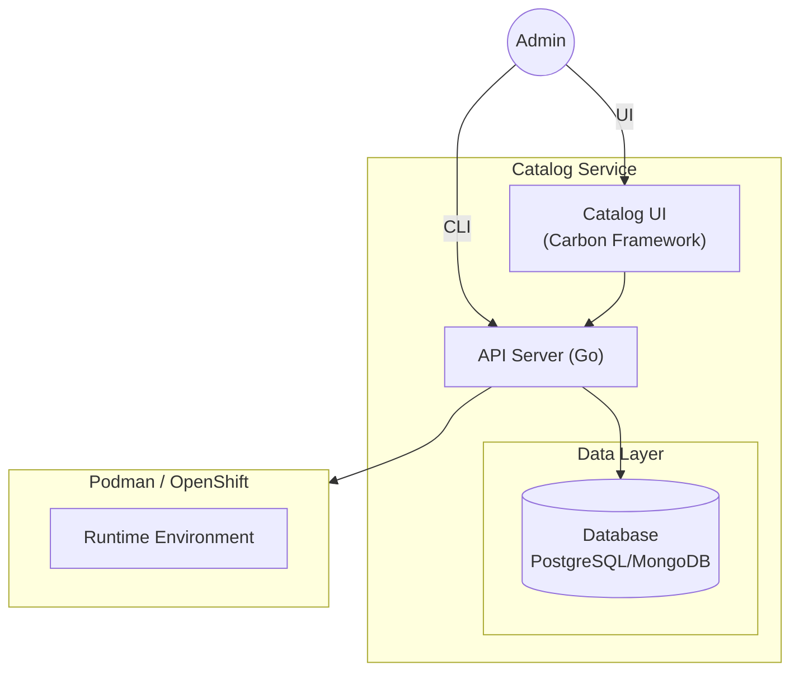
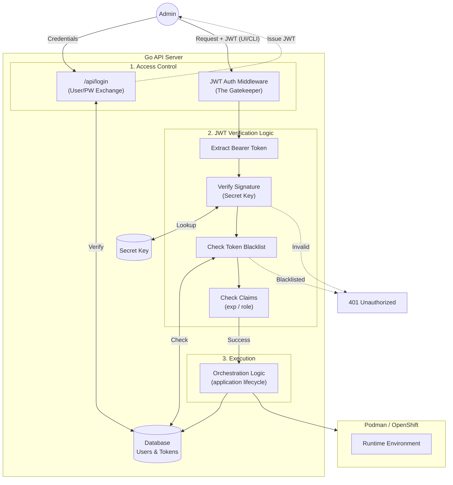
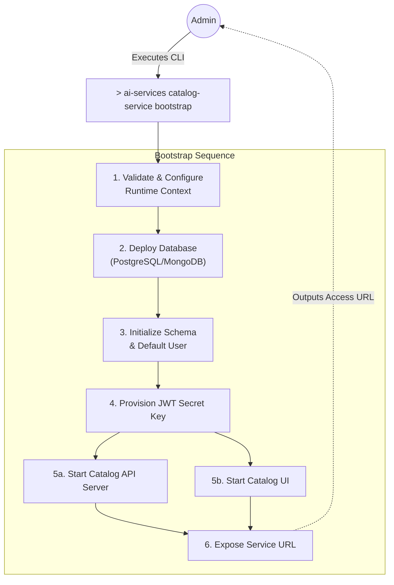

# Design Proposal: Catalog UI & Orchestration Service

**Subject:** Secure Enterprise Interface for IBM AI Services

**Target Platform:** RHEL LPAR (Standalone) / OpenShift (Clustered)

**Status:** Draft / Proposal

---

## 1. Executive Summary

The **Catalog UI Service** provides a centralized, authenticated web portal for managing the lifecycle of AI applications. By providing a high-fidelity interface, the service empowers users to discover application templates, **deploy AI services with one click**, and monitor real-time logs through a stable REST façade. This architecture eliminates the need for manual CLI interaction, providing a secure, single-origin experience for the enterprise.

## 2. Service Architecture

The architecture is centered on the **Catalog UI** as the entry point, utilizing a specialized Go API Server to handle orchestration and security, with persistent storage for deployment metadata and user management.

* **Catalog UI (Carbon Framework)**: A frontend built with IBM's Carbon Design System, providing a professional and accessible interface for template browsing and app management.
* **Go API Server (Orchestrator)**: A compiled, high-concurrency backend responsible for identity management, request validation, and the execution of orchestration logic.
* **Database Layer**: Persistent storage for user credentials, deployment metadata, application configurations, and audit logs.
* **AI Services Runtime**: The underlying infrastructure layer (Podman on LPAR or Kubernetes on OpenShift) that hosts vLLM inference servers and vector databases.



### 2.1 System Components

```
┌─────────────────────────────────────────────────────────────┐
│                        API Gateway                           │
│                   (http://localhost:8080)                    │
└─────────────────────────────────────────────────────────────┘
                              │
                              ▼
┌─────────────────────────────────────────────────────────────┐
│                    Authentication Layer                      │
│                  (JWT Bearer Token Auth)                     │
└─────────────────────────────────────────────────────────────┘
                              │
        ┌─────────────────────┼─────────────────────┐
        ▼                     ▼                     ▼
┌──────────────┐    ┌──────────────────┐    ┌──────────────┐
│ Application  │    │    Catalog       │    │     Auth     │
│ Management   │    │   Management     │    │  Management  │
└──────────────┘    └──────────────────┘    └──────────────┘
        │                     │                     │
        └─────────────────────┼─────────────────────┘
                              ▼
                    ┌──────────────────┐
                    │    Database      │
                    │ (PostgreSQL/     │
                    │   MongoDB)       │
                    └──────────────────┘
                              │
                              ▼
┌──────────────────────────────────────────┐
│         Runtime Orchestrators             │
│    ┌──────────┐      ┌──────────┐       │
│    │  Podman  │      │ OpenShift│       │
│    └──────────┘      └──────────┘       │
└──────────────────────────────────────────┘
```

### 2.2 Database Schema

The database stores critical information for the Catalog Service:

**Users Table:**
- User credentials (hashed passwords)
- User profiles and roles
- Authentication tokens (refresh token storage)

**Deployments Table:**
- `app_name` (Primary Key): Unique application identifier
- `deployment_name`: User-friendly display name
- `deployment_type`: "Architecture" or "Service"
- `type`: Application type (e.g., "Digital Assistant", "Summary")
- `status`: Current deployment status
- `configuration`: JSON field for deployment settings
- `created_at`, `updated_at`: Timestamps
- `user_id`: Foreign key to Users table

**Services Table:**
- Service metadata within deployments
- Service endpoints and health status
- Service-specific configurations

**Audit Logs Table:**
- User actions and API calls
- Deployment lifecycle events
- Security events (login attempts, token refresh)

## 3. Core Functional Capabilities

The Catalog UI transforms manual workflows into automated, repeatable processes:

* **Template Discovery**: A curated library of AI application templates, allowing users to browse pre-configured models and RAG (Retrieval-Augmented Generation) stacks.

* **Accelerated Deployment**: A "One-Click" deployment flow that automates container AI Services provisioning and service exposer.

* **Lifecycle Observability**: Integrated real-time log streaming and status monitoring, providing immediate feedback on AI services health and resource utilization.

* **Persistent State Management**: All deployment metadata, configurations, and user preferences are stored in the database for reliability and recovery.

## 4. Security Framework (JWT Authentication)

Security is managed at the Catalog UI Service level through a robust JWT-based authentication system with database-backed user management.

* **Authentication:** The UI captures user credentials and exchanges them with the Go API Server for a signed JWT.
* **User Store:** User credentials are securely stored in the database with bcrypt/argon2 hashed passwords.
* **JWT Middleware (The Gatekeeper):**
    1.  **Extraction:** Retrieves the Bearer token from the authorization header of every incoming request.
    2.  **Signature Verification:** The server utilizes a locally stored **Secret Key** to validate the token's integrity. If the signature does not match the payload, the request is immediately rejected.
    3.  **Claims Validation:** The middleware inspects expiration timestamps (`exp`) and RBAC roles (e.g., `admin` vs. `viewer`) before authorizing orchestration logic.
    4.  **Token Blacklisting:** Logout operations add tokens to a blacklist stored in the database to prevent reuse.

> Note: Initially we will start with the admin role implementation and extend it to other roles in the future.



To ensure strict feature and security parity, both the **Catalog UI** and the **CLI** operate as standard clients to the Go API Server, adhering to identical authentication and orchestration protocols.

### CLI Login and Session Management

1. **Authentication:** Users authenticate via the CLI:
    ```bash
    $ ai-services login --username <user> --password <pass>
    ```
2. **Token Retrieval:** The CLI routes the request to the `/api/login` endpoint of the Go API Server.
3. **Secure Storage:** Upon success, the JWT is stored in a local configuration file (e.g., `~/.config/ai-services/config.json`) with restricted file permissions.
4. **Session Persistence:** Subsequent commands automatically inject this token into the `Authorization` header. If the token expires, the CLI prompts the user for a fresh login.

## 5. Service Bootstrapping

To simplify Day 0 operations, administrators utilize a unified initialization command. This command uses a global flag to define the infrastructure context (Standalone vs. Clustered) before executing the bootstrap sequence.

### Management Plane Initialization

The CLI provides dedicated commands to separate the setup of the management plane (UI + Backend + Database) from the deployment of actual AI services (Day 1).

```bash
# Day 0: Initializes the Catalog Service infrastructure on the specified runtime.
$ ai-services catalog-service bootstrap --runtime <podman|openshift>
```

**Execution Flow:**
This command acts as the primary deployment mechanism, automating the orchestration of the management plane based on the provided configuration. When executed, it performs the following sequence:

1. **Runtime Validation:** Parses the `--runtime` flag to configure the orchestration context for either local execution (`podman` on RHEL LPAR) or clustered execution (`openshift`). If an invalid or missing flag is detected, the CLI halts and returns a usage error.
2. **Database Initialization:** 
   - Deploys the database container (PostgreSQL or MongoDB)
   - Runs database migrations to create schema
   - Creates default admin user
3. **Secret Generation:** Automatically generates, securely stores, and mounts the cryptographic Secret Key required for the Go API Server's JWT validation layer.
4. **Component Deployment:** Concurrently spins up the **Database**, **Catalog API Server**, and **Catalog UI** components within the targeted runtime environment.
5. **Network Binding & Routing:** Establishes the secure connection between the UI, API, and Database, exposes the frontend port, and returns the live access URL to the administrator.



## 6. Artifacts
The Catalog Service is delivered as a set of portable, enterprise-grade artifacts designed to run identically across standalone RHEL hosts and clustered OpenShift environments.

### 6.1 Container Images

The solution is packaged into three primary container images. These are hosted in an enterprise registry (e.g., ICR) and pulled during the bootstrap phase.

| Image Alias | Image Name | Base OS / Tech Stack | Role |
| --- | --- | --- | --- |
| **API Server** | `catalog-api:v1` | Red Hat UBI 9 (Minimal) / Go | Orchestration, Auth, & Infrastructure Interfacing |
| **Catalog UI** | `catalog-ui:v1` | Red Hat UBI 9 (Nginx or Equivalent) / React | Carbon-based Web Portal & Asset Hosting |
| **Database** | `postgresql:15` or `mongodb:7` | Official Images | Persistent data storage for users, deployments, and audit logs |

### 6.2 Deployment Specifications

The `ai-services` CLI abstracts the underlying infrastructure by generating the necessary configuration manifests dynamically during the bootstrap process:

**OpenShift:** Orchestration requires the deployment of standard Kubernetes manifests, including:
- Deployments for pod management (API, UI, Database)
- Services for internal networking
- PersistentVolumeClaims for database storage
- Routes for external UI exposure
- Secrets for database credentials and JWT keys

**Podman:** Orchestration utilizes a simplified Pod deployment model, grouping the API, UI, and Database containers into pods on the RHEL host with:
- Volume mounts for database persistence
- Network configuration for inter-container communication
- Port mappings for external access

### 6.3 Database Configuration

**PostgreSQL (Recommended for Production):**
- Version: 15+
- Storage: Persistent volume (minimum 10GB)
- Backup: Automated daily backups
- High Availability: Replication support for OpenShift deployments

**MongoDB (Alternative):**
- Version: 7+
- Storage: Persistent volume (minimum 10GB)
- Suitable for flexible schema requirements

## 7. API Endpoints

The Catalog Service exposes a comprehensive REST API for managing deployments:

### Authentication Endpoints
- `POST /api/v1/auth/login` - User login
- `POST /api/v1/auth/refresh` - Refresh access token
- `POST /api/v1/auth/logout` - User logout (adds token to blacklist)
- `GET /api/v1/auth/me` - Get current user info

### Application Management Endpoints
- `GET /api/v1/applications` - List all deployments (from database)
- `GET /api/v1/applications/{appName}` - Get deployment details
- `POST /api/v1/applications` - Create new deployment (stores in database)
- `PUT /api/v1/applications/{appName}` - Update deployment
- `DELETE /api/v1/applications/{appName}` - Delete deployment
- `GET /api/v1/applications/{appName}/ps` - Get pod/container health status

### Catalog Endpoints
- `GET /api/v1/architectures` - List available architectures
- `GET /api/v1/services` - List available services

## 8. Data Persistence and Recovery

### 8.1 Database Backup Strategy
- Automated daily backups of the database
- Point-in-time recovery capability
- Backup retention: 30 days

### 8.2 Disaster Recovery
- Database backups stored in separate storage
- Documented recovery procedures
- Regular backup restoration testing

### 8.3 High Availability (OpenShift)
- Database replication for fault tolerance
- API server horizontal scaling
- Load balancing across API instances

## 9. Monitoring and Observability

### 9.1 Application Metrics
- Deployment success/failure rates
- API response times
- Database query performance
- Active user sessions

### 9.2 Audit Logging
All critical operations are logged to the database:
- User authentication events
- Deployment lifecycle changes
- Configuration modifications
- API access patterns

### 9.3 Health Checks
- Database connectivity checks
- API server health endpoints
- Runtime environment status
- Service endpoint availability

## 10. Future Enhancements

### 10.1 Role-Based Access Control (RBAC)
- Multiple user roles (admin, developer, viewer)
- Fine-grained permissions per deployment
- Team-based access management

### 10.2 Multi-Tenancy
- Namespace isolation per user/team
- Resource quotas and limits
- Cost tracking per tenant

### 10.3 Advanced Features
- Deployment templates and blueprints
- Scheduled deployments
- Automated scaling policies
- Integration with external monitoring systems