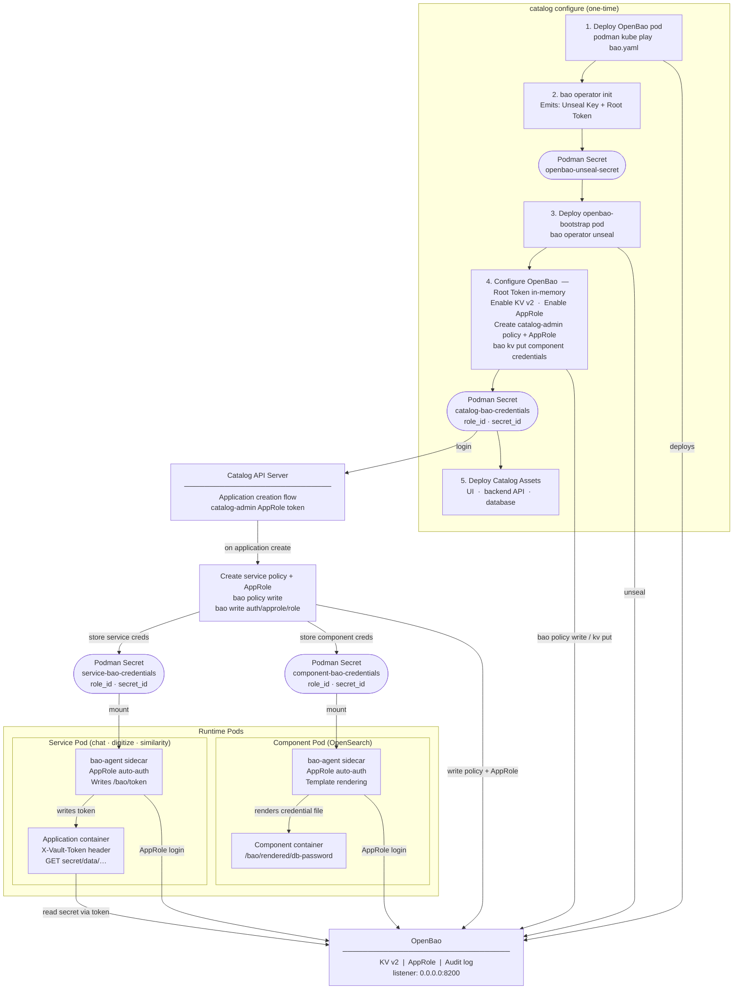

# Centralized Secret Management with OpenBao — Design Proposal

**Version:** 1.1  
**Date:** July 2026  
**Status:** Draft / Proposal

---

## Table of Contents

1. [Executive Summary](#1-executive-summary)
2. [Background and Motivation](#2-background-and-motivation)
   - [2.1 Current State](#21-current-state)
   - [2.2 Problems](#22-problems)
   - [2.3 Goals](#23-goals)
3. [Architecture Overview](#3-architecture-overview)
4. [Deployment Lifecycle](#4-deployment-lifecycle)
   - [4.1 Phase 1 — Configure (one-time setup)](#41-phase-1--configure-one-time-setup)
   - [4.2 Phase 2 — Runtime (steady state)](#42-phase-2--runtime-steady-state)
5. [OpenBao Server Deployment](#5-openbao-server-deployment)
   - [5.1 Pod Manifest](#51-pod-manifest)
   - [5.2 OpenBao Configuration (HCL)](#52-openbao-configuration-hcl)
6. [OpenBao Bootstrap Pod](#6-openbao-bootstrap-pod)
7. [OpenBao Configuration Steps](#7-openbao-configuration-steps)
   - [7.1 Enable KV v2](#71-enable-kv-v2)
   - [7.2 Enable AppRole Auth](#72-enable-approle-auth)
   - [7.3 Catalog Admin Policy](#73-catalog-admin-policy)
   - [7.4 Catalog AppRole Identity](#74-catalog-approle-identity)
8. [Service Credential Provisioning](#8-service-credential-provisioning)
   - [8.1 Component Deployment — PostgreSQL](#81-component-deployment--postgresql)
   - [8.2 Catalog Backend Pod (`catalog.yaml.tmpl`)](#82-catalog-backend-pod-catalogyamltmpl)
   - [8.3 OpenSearch Component](#83-opensearch-component)
9. [OpenBao Agent Sidecar Pattern](#9-openbao-agent-sidecar-pattern)
   - [9.1 Agent Configuration (HCL)](#91-agent-configuration-hcl)
   - [9.2 Service Pod Manifest](#92-service-pod-manifest)
   - [9.3 Secret Object](#93-secret-object)
10. [Unseal Architecture](#10-unseal-architecture)
11. [Key Design Decisions](#11-key-design-decisions)
12. [Security Considerations](#12-security-considerations)
13. [Disaster Recovery](#13-disaster-recovery)
14. [Remote Deployment Considerations](#14-remote-deployment-considerations)

---

## 1. Executive Summary

This proposal introduces **OpenBao** as the centralized secret management layer for the AI-Services Catalog platform. Today, every service manages its own credentials in an ad-hoc fashion — API keys and passwords live in container environment variables, config files, or Podman secrets without any consistent access-control, audit, or rotation policy.

The proposed architecture:

- Deploys OpenBao as a **long-lived Podman pod** alongside the existing Catalog stack.
- Authenticates every service to OpenBao via **AppRole** — each service gets its own role, its own policy, and access to only its own secrets.
- Injects tokens into service containers through an **OpenBao Agent sidecar** pattern so that service code never handles raw credentials.
- Handles automatic unsealing after a VM reboot through a **bootstrap pod** that reads the unseal key from a Podman secret — the key never leaves the OpenBao container.
- Stores all OpenBao data (policies, KV secrets, AppRoles, audit logs) in a file backend; only the unseal key requires separate offline backup.

---

## 2. Background and Motivation

### 2.1 Current State

The Catalog platform deploys application services (chatbot, digitize, similarity, summarize, LiteLLM gateway, etc.) as Podman pods. Credentials that those services need — database passwords, API keys, model provider tokens — are currently passed at deploy time through one or more of the following mechanisms:

- Hard-coded or templated environment variables in pod YAML manifests.
- Per-service Podman secrets created manually during installation.
- Plain-text values stored in on-disk configuration files.

There is no central store, no audit trail, no per-service access control, and no rotation capability.

### 2.2 Problems

- **No least-privilege model.** Any process that can read a Podman secret can read every other secret in the same namespace.
- **No audit trail.** It is impossible to know which service read which secret, or when.
- **No rotation.** Rotating a credential requires re-deploying the pod; there is no out-of-band rotation path.
- **Credential sprawl.** Secrets exist in multiple places (manifests, host filesystem, environment variables), making a full audit impractical.
- **Multi-VM secret synchronisation.** Podman secrets are local to a single host. In a remote or multi-VM deployment — where the same service must run on several nodes — each Podman secret (`role_id`, `secret_id`, API keys, database passwords) must be manually replicated to every host. There is no synchronisation mechanism: a rotation on one VM does not propagate to the others, leaving nodes with divergent credential state. Adding a new VM to the fleet requires a full, error-prone re-provisioning of every secret by hand.

### 2.3 Goals

1. Centralize all service credentials in a single, auditable secret store.
2. Enforce strict least-privilege: each service can only read its own secrets.
3. Remove credentials from pod manifests, environment variables, and on-disk config files.
4. Enable automated unseal after a VM reboot without operator intervention.
5. Provide a clear provisioning path when Catalog deploys a new service.
6. Keep the operational footprint minimal — one additional pod, no external dependencies.

---

## 3. Architecture Overview


**Component responsibilities:**

| Component | What it does |
|---|---|
| `openbao` pod | Stores and serves all secrets (KV v2); enforces policies; logs every access |
| `openbao-bootstrap` pod | Runs at boot; unseals OpenBao automatically using the Podman secret; loops indefinitely to handle reboots |
| `catalog configure` | Generates and writes all component credentials (DB password, admin password) into OpenBao KV at setup time |
| `bao-agent` sidecar (component) | Authenticates via AppRole; uses template rendering to write credential files into a shared volume for the component container |
| `bao-agent` sidecar (service) | Authenticates via AppRole; writes a short-lived token to a shared named volume for the application container |
| Application container | Reads the token and calls the OpenBao HTTP API directly to retrieve the secrets it needs |
| `catalog-admin` AppRole | Identity used by Catalog API server during provisioning to create per-service/component policies and AppRoles |
| Per-service AppRole | Unique identity per deployed service; scoped to its own KV path + read on component paths it consumes |
| Per-component AppRole | Unique identity per deployed component; scoped to its own KV path only |
| Podman secret `openbao-unseal-secret` | Holds the single unseal key; mounted read-only inside the bootstrap pod |
| Podman secret `<service>-bao-credentials` | Holds `role_id` + `secret_id` for a service; mounted into the service pod's bao-agent sidecar |
| Podman secret `<component>-bao-credentials` | Holds `role_id` + `secret_id` for a component; mounted into the component pod's bao-agent sidecar |

---

## 4. Deployment Lifecycle

### 4.1 Phase 1 — Configure (one-time setup)

`catalog configure` orchestrates the following steps in order:

```
1. Deploy bao.yaml (OpenBao server pod)
    ↓
Wait until OpenBao API is reachable
    ↓
bao operator init -key-shares=1 -key-threshold=1
    ↓ emits: Unseal Key + Initial Root Token
podman secret create openbao-unseal-secret <unseal-key> (Use kube play)
    ↓
2. Deploy bao-bootstrap.yaml (bootstrap pod)
    ↓  (reads openbao-unseal-secret Podman secret → bao operator unseal)
OpenBao is unsealed
    ↓
3. Use Initial Root Token to configure OpenBao for Catalog Service:
    a. Enable KV v2 (Global)
    b. Enable AppRole
    c. Create catalog-admin policy
    d. Create catalog AppRole → fetch RoleID + SecretID
    ↓
podman secret create catalog-bao-credentials (role_id + secret_id)
    ↓
4. Deploy Catalog assets (UI pod, backend API pod, database pod)
```

> **Note:** `bao operator init` is the only moment the Initial Root Token is ever issued. It is held in memory by `catalog configure` for the duration of the OpenBao configuration steps and is **never written to disk**. Once the catalog AppRole credentials are stored, all subsequent Catalog operations use the `catalog-admin` AppRole token instead.

See Sections 5–7 for the detailed manifests and commands for each step.

### 4.2 Phase 2 — Runtime (steady state)

When Catalog deploys a new service/component (e.g., `chat`):

```
catalog AppRole login  →  OpenBao token
    ↓
Create policy  chat-policy:
    - read + write + list  → secret/data/application/<app-id>/chat/*  (service's own secrets)
    - read access  → secret/data/component/<comp-id>/*        (shared component secrets,
                     e.g. OpenSearch password, PostgreSQL password,
                     only for components this service consumes)
    ↓
Create AppRole  chat
    ↓
Read  chat  RoleID
    ↓
Generate  chat  SecretID
    ↓
podman secret create chat-bao-credentials  (role_id + secret_id)
    ↓
Deploy service pod (bao-agent sidecar + chat container)
```

The policy grants each service **read, write, and list** access to its own secret path, and **read** access to the paths of the shared components it depends on. Component secrets (passwords, connection strings) are written into OpenBao once when the component is deployed and are never duplicated across service manifests.

Each service authenticates independently. The Catalog API server holds the `catalog-admin` token in memory (refreshed automatically); it never persists the token to disk.

---

## 5. OpenBao Server Deployment

### 5.1 Pod Manifest

`vendor/openbao/bao.yaml`:

```yaml
apiVersion: v1
kind: Pod
metadata:
  name: openbao
spec:
  restartPolicy: Always

  volumes:
    - name: bao-data
      hostPath:
        path: /root/mayuka/openbao/data
        type: DirectoryOrCreate

    - name: bao-config
      hostPath:
        path: /root/mayuka/openbao/config
        type: Directory

  containers:
    - name: openbao
      image: quay.io/openbao/openbao-ubi:latest
      env:
        - name: BAO_ADDR
          value: http://127.0.0.1:8200
      command:
        - bao
      args:
        - server
        - -config=/bao/config/bao.hcl
      ports:
        - containerPort: 8200
          hostPort: 8200
      volumeMounts:
        - mountPath: /bao/data:z
          name: bao-data
        - mountPath: /bao/config:z
          name: bao-config
```

**Key points:**

- `restartPolicy: Always` — Podman restarts the pod after a crash or reboot.
- `hostPort: 8200` — OpenBao is accessible from the host at `http://127.0.0.1:8200`. No external exposure is needed for single-VM deployments. For remote/multi-VM deployments where services on other hosts need to reach OpenBao, the port must be proxied through **Caddy** — OpenBao should not be exposed directly on a public or routable interface without TLS termination. See [Section 14](#14-remote-deployment-considerations) for details.
- Data and config are on host-path volumes so the OpenBao data survives container replacement.

After the configure phase completes, the manifest is updated to mount the Podman secret and redeployed:

```yaml
    - name: openbao
      ...
      secrets:
        - openbao-unseal-secret
```

```bash
podman kube play --replace bao.yaml
```

### 5.2 OpenBao Configuration (HCL)

`vendor/openbao/bao.hcl`:

```hcl
# Enable the built-in OpenBao web user interface
ui = false

# Use local filesystem storage inside the container
storage "file" {
  path = "/bao/data"
}

# Configure the HTTP API listener
listener "tcp" {
  address     = "0.0.0.0:8200"
  tls_disable = "true"
}
```

**Notes:**

- `ui = false` — the browser UI is disabled; all access is through the CLI or API.
- `storage "file"` — uses OpenBao's built-in file backend. All state (KV, policies, AppRoles, audit log) is stored under `/bao/data`.
- `tls_disable = "true"` — TLS is disabled for the initial implementation because all communication is intra-host (loopback or pod-to-pod). Enabling TLS is addressed in [Section 14](#14-future-considerations).

---

## 6. OpenBao Bootstrap Pod

`vendor/openbao/bao-bootstrap.yaml`:

```yaml
apiVersion: v1
kind: Pod
metadata:
  name: openbao-bootstrap
spec:
  restartPolicy: Always

  volumes:
    - name: openbao-unseal-secret
      secret:
        secretName: openbao-unseal-secret

  containers:
    - name: openbao-bootstrap
      image: quay.io/openbao/openbao-ubi:latest
      env:
        - name: BAO_ADDR
          value: "http://openbao:8200"
      command:
        - /bin/sh
        - -c
        - |
          echo "[+] OpenBao Unseal Watchdog Daemon Started..."

          # Wrap the entire logic in an infinite loop to monitor Day N reboots
          while true
          do
            # 1. Wait until OpenBao API responds (exit code 0 or 2 means server is up)
            until bao status -format=json > /dev/null 2>&1 || [ $? -eq 2 ]
            do
              sleep 5
            done

            # 2. Extract initialization and seal states natively
            INITIALIZED=$(bao status -format=json | grep '"initialized":' | awk '{print $2}' | tr -d ',')
            SEALED=$(bao status -format=json | grep '"sealed":' | awk '{print $2}' | tr -d ',')

            # 3. Evaluate states
            if [ "$INITIALIZED" != "true" ]; then
                echo "[!] OpenBao not initialized yet. Checking again soon..."

            elif [ "$SEALED" != "true" ]; then
                # Safe silence: OpenBao is healthy and open, nothing to do
                true

            else
                # OpenBao is initialized but sealed (This triggers on reboots!)
                echo "[!] OpenBao is SEALED. Executing unseal sequence..."
                bao operator unseal "$(cat /run/secrets/bao-unseal-key)"
                echo "[+] Unseal command executed successfully."
            fi

            # Rest for 10 seconds before verifying the next health-check cycle
            sleep 10
          done

      volumeMounts:
        - name: openbao-unseal-secret
          mountPath: /run/secrets
          readOnly: true
```

**Behaviour:**

| OpenBao state | Bootstrap action | Notes |
|---|---|---|
| Not yet initialized | Log and skip — first-time configure has not run yet | Loops and retries every 10 s |
| Initialized, unsealed | Silent no-op | Loops and verifies every 10 s |
| Initialized, sealed | Read key → `bao operator unseal` → continue loop | Triggers automatically on every reboot |

Unlike the original single-run bootstrap, this pod runs as a **persistent watchdog daemon** (`restartPolicy: Always`). It loops indefinitely, checking OpenBao's seal status every 10 seconds. This means it automatically handles Day-N reboots without any manual intervention or pod restart.

---

## 7. OpenBao Configuration Steps

All steps in this section are performed once during `catalog configure`, using the **initial root token**. The root token is revoked at the end of this phase.

### 7.1 Enable KV v2

```bash
bao secrets enable -path=secret kv-v2
```

All application secrets are stored under `secret/<service-name>/...`. The KV v2 backend provides versioning and a soft-delete capability at no additional cost.

### 7.2 Enable AppRole Auth

```bash
bao auth enable approle
```

AppRole is the only authentication method enabled. It is machine-to-machine — no human interactive login is needed in steady state.

### 7.3 Catalog Admin Policy

```hcl
# /tmp/catalog-admin.hcl
path "*" {
  capabilities = ["create", "read", "update", "delete", "list", "sudo", "patch"]
}
```

```bash
bao policy write catalog-admin /tmp/catalog-admin.hcl
```

This broad policy is intentional: the `catalog-admin` role is used exclusively by the Catalog API server during service provisioning (not during request serving). Its credentials are stored in a Podman secret, not in the database or environment variables.

Per-service policies are narrow (see [Section 8](#8-service-credential-provisioning)).

### 7.4 Catalog AppRole Identity

```bash
# Create the AppRole
bao write auth/approle/role/catalog \
    secret_id_ttl=0 \
    token_ttl=24h \
    token_max_ttl=24h \
    token_policies="catalog-admin"

# Fetch RoleID (static; never changes)
bao read auth/approle/role/catalog/role-id

# Generate SecretID (one-time; rotatable)
bao write -f auth/approle/role/catalog/secret-id
```

The `role_id` and `secret_id` are stored as a single Podman secret:

```yaml
# vendor/openbao/service1-bao-secret.yaml (pattern)
apiVersion: v1
kind: Secret
metadata:
  name: catalog-bao-credentials
type: Opaque
stringData:
  role_id:   "<role-id-value>"
  secret_id: "<secret-id-value>"
```

```bash
podman secret create catalog-bao-credentials catalog-credentials.yaml
```


---

## 8. Service Credential Provisioning

When Catalog deploys a new service (e.g., `chat` under application `app-123` that depends on an OpenSearch component `comp-456`), the following steps are performed by the Catalog API server using the `catalog-admin` token obtained by logging in with the `catalog` AppRole:

```bash
# Step 1 — Create a narrow policy for the service
#   - read/list own secrets under the application/service path
#   - read access to each component this service depends on
cat > /tmp/chat-policy.hcl <<'EOF'
# Service's own secrets
path "secret/data/application/<app-id>/chat/*" {
  capabilities = ["read", "list"]
}
path "secret/metadata/application/<app-id>/chat/*" {
  capabilities = ["list"]
}

# Shared component secrets (one block per component the service consumes)
path "secret/data/component/<comp-id>/*" {
  capabilities = ["read"]
}
path "secret/metadata/component/<comp-id>/*" {
  capabilities = ["list"]
}
EOF
bao policy write chat-policy /tmp/chat-policy.hcl

# Step 2 — Write the component's own secrets into KV
bao kv put secret/component/<comp-id>/config \
    api_key="<value>"

# Step 3 — Create a service-scoped AppRole
bao write auth/approle/role/chat \
    token_policies="chat-policy" \
    token_ttl="1h" \
    token_max_ttl="4h"

# Step 4 — Fetch credentials
ROLE_ID=$(bao read -field=role_id auth/approle/role/chat/role-id)
SECRET_ID=$(bao write -f -field=secret_id auth/approle/role/chat/secret-id)

# Step 5 — Store them as a Podman secret
printf '{"role_id":"%s","secret_id":"%s"}' "$ROLE_ID" "$SECRET_ID" \
    | podman secret create chat-bao-credentials -
```

The service pod is then deployed with this Podman secret mounted (see [Section 9](#9-openbao-agent-sidecar-pattern)).

**Secret path scheme:**

| Secret type | KV path pattern | Example |
|---|---|---|
| Service secrets | `secret/data/application/<app-id>/<service>/*` | `secret/data/application/app-123/chat/config` |
| Component secrets | `secret/data/component/<comp-id>/*` | `secret/data/component/comp-456/credentials` |

Component secrets (e.g. OpenSearch password, PostgreSQL password) are written once when the component is deployed. Services only receive `read` access to the specific component paths they depend on — they cannot read credentials of components they do not use.

### 8.1 Component Deployment — PostgreSQL

The existing `catalog-db.yaml.tmpl` reads the Postgres password from a Podman secret (`catalog-db-secret`) mounted at `/etc/secret/catalog-db-secret/db-password`. With OpenBao, **no Podman secret is created**. Instead, the OpenBao Agent sidecar renders the password directly into a shared volume file before Postgres starts — using OpenBao Agent's template rendering feature.

**At `catalog configure` time**, Catalog generates the Postgres password and writes it into OpenBao KV:

```bash
# Generate password and store in OpenBao — no Podman secret created
bao kv put secret/component/<comp-id>/credentials \
    db-password="<generated-password>"
```

**Updated `catalog-db.yaml.tmpl`** — the pod gains an OpenBao Agent sidecar and a shared volume; the `catalog-db-secret` secret volume and label are removed:

```yaml
apiVersion: v1
kind: Pod
metadata:
  name: "{{ .AppName }}--db"
  labels:
    ai-services.io/application: "{{ .AppName }}"
    ai-services.io/template: "{{ .AppTemplateName }}"
    ai-services.io/version: "{{ .Version }}"
    ai-services.io/volume: "postgres-catalog"
    ai-services.io/volume-skip-cleanup: "true"
  annotations:
    io.podman.annotations.pids-limit/postgresql: "4096"
spec:
  restartPolicy: always

  volumes:
    - name: postgres-data
      persistentVolumeClaim:
        claimName: "postgres-catalog"

    # Shared volume where bao-agent renders the password file
    - name: bao-rendered
      emptyDir: {}

    # Podman secret holding this component's OpenBao AppRole credentials
    - name: db-bao-secret
      secret:
        secretName: "{{ .AppName }}-db-bao-credentials"

    # OpenBao Agent config for template rendering
    - name: bao-agent-config
      hostPath:
        path: /root/mayuka/openbao/agent/db-agent.hcl
        type: File

  containers:

    # -----------------------------------------------------------------
    # CONTAINER 1: OpenBao Agent — renders db-password into shared volume
    # -----------------------------------------------------------------
    - name: bao-agent
      image: quay.io/openbao/openbao-ubi:latest
      command:
        - bao
        - agent
        - -config=/etc/bao/agent.hcl
      volumeMounts:
        - name: bao-rendered
          mountPath: /bao/rendered
        - name: bao-agent-config
          mountPath: /etc/bao/agent.hcl
        - name: db-bao-secret
          mountPath: /run/secrets/bao
          readOnly: true

    # -----------------------------------------------------------------
    # CONTAINER 2: PostgreSQL — reads password from rendered file
    # -----------------------------------------------------------------
    - name: postgresql
      image: "{{ .Values.db.image }}"
      command:
        - "/bin/sh"
        - "-c"
      args:
        - |
          # Wait for bao-agent to render the password file
          until [ -f /bao/rendered/db-password ]; do
            echo "[*] Waiting for db-password..."
            sleep 2
          done
          export POSTGRES_PASSWORD=$(cat /bao/rendered/db-password)
          exec docker-entrypoint.sh postgres
      ports:
        - containerPort: 5432
          hostPort: {{ .Values.db.port }}
      env:
        - name: POSTGRES_USER
          value: "{{ .Values.db.user }}"
        - name: POSTGRES_DB
          value: "{{ .Values.db.database }}"
        - name: PGDATA
          value: "/var/lib/pgsql/data"
      securityContext:
        runAsUser: 26
        fsGroup: 26
      volumeMounts:
        - name: postgres-data
          mountPath: /var/lib/pgsql:z
        - name: bao-rendered
          mountPath: /bao/rendered
          readOnly: true
      livenessProbe:
        exec:
          command:
            - /bin/sh
            - -c
            - pg_isready -U {{ .Values.db.user }} -d {{ .Values.db.database }}
        initialDelaySeconds: 30
        periodSeconds: 10
        timeoutSeconds: 5
        failureThreshold: 3
      readinessProbe:
        exec:
          command:
            - /bin/sh
            - -c
            - pg_isready -U {{ .Values.db.user }} -d {{ .Values.db.database }}
        initialDelaySeconds: 10
        periodSeconds: 5
        timeoutSeconds: 3
        failureThreshold: 3
      resources:
        requests:
          memory: "{{ .Values.db.resources.requests.memory }}"
        limits:
          memory: "{{ .Values.db.resources.limits.memory }}"
```

**OpenBao Agent HCL for template rendering (`db-agent.hcl`):**

```hcl
pid_file = "/tmp/bao-agent.pid"

vault {
  address = "http://openbao:8200"
}

auto_auth {
  method "approle" {
    mount_path = "auth/approle"

    config = {
      role_id_file_path   = "/run/secrets/bao/role_id"
      secret_id_file_path = "/run/secrets/bao/secret_id"
    }
  }
}

template {
  contents    = "{{ with secret "secret/data/component/<comp-id>/credentials" }}{{ .Data.data.db-password }}{{ end }}"
  destination = "/bao/rendered/db-password"
}
```

**How it fits together:**

| Step | What happens |
|---|---|
| `catalog configure` | Generates password → writes to `secret/component/<comp-id>/credentials` in OpenBao KV |
| Pod starts | `bao-agent` authenticates via AppRole, renders password to `/bao/rendered/db-password` |
| Postgres starts | Reads `/bao/rendered/db-password` via `$(cat ...)` — identical to before, different source |
| Service (`chat`) needs password | Reads `secret/data/component/<comp-id>/credentials` via its own token — never touches Postgres's pod |
| Password rotation | `bao kv put` updates the KV entry → OpenBao Agent re-renders the file → `POSTGRES_PASSWORD` picks it up on next Postgres restart |

**No Podman secret is created for the password.** OpenBao is the single source of truth. The `catalog-db-secret` secret volume, the `ai-services.io/secret` label, and the `ai-services.io/secret-skip-cleanup` label are all removed from the template.

---

### 8.2 Catalog Backend Pod (`catalog.yaml.tmpl`)

The Catalog backend pod (`catalog.yaml.tmpl`) currently reads two secrets from Podman secret mounts:

| Secret | Current mount path | Used by |
|---|---|---|
| `db-password` | `/etc/secret/catalog-db-secret/db-password` | `db-migration` init container + `backend` container |
| `admin-password` | `/etc/secret/catalog-secret/admin-password` | `backend` container |

With OpenBao, both secrets are stored in OpenBao KV and rendered into files by an OpenBao Agent sidecar — **no Podman secrets are created**.

**OpenBao KV paths:**

```bash
# DB password (same entry written by catalog configure for the DB component)
bao kv put secret/component/<db-comp-id>/credentials \
    db-password="<generated-password>"

# Admin password hash
bao kv put secret/application/<app-id>/catalog/config \
    admin-password="<password-hash>"
```

**Changes to `catalog.yaml.tmpl`:**

- Add a `bao-agent` sidecar container that authenticates via AppRole and renders both secrets into a shared `bao-rendered` volume using template blocks:

```hcl
# catalog-agent.hcl

template {
  contents    = "{{ with secret \"secret/data/component/<db-comp-id>/credentials\" }}{{ .Data.data.db-password }}{{ end }}"
  destination = "/bao/rendered/db-password"
}

template {
  contents    = "{{ with secret \"secret/data/application/<app-id>/catalog/config\" }}{{ .Data.data.admin-password }}{{ end }}"
  destination = "/bao/rendered/admin-password"
}
```

- Replace the two secret volume mounts in the `db-migration` init container and `backend` container with reads from the shared rendered volume:

```yaml
# db-migration init container — before
export DB_PASSWORD=$(cat /etc/secret/catalog-db-secret/db-password)

# db-migration init container — after
until [ -f /bao/rendered/db-password ]; do sleep 2; done
export DB_PASSWORD=$(cat /bao/rendered/db-password)
```

```yaml
# backend container — before
export ADMIN_PASSWORD=$(cat /etc/secret/catalog-secret/admin-password)
export DB_PASSWORD=$(cat /etc/secret/catalog-db-secret/db-password)

# backend container — after
until [ -f /bao/rendered/admin-password ] && [ -f /bao/rendered/db-password ]; do sleep 2; done
export ADMIN_PASSWORD=$(cat /bao/rendered/admin-password)
export DB_PASSWORD=$(cat /bao/rendered/db-password)
```

- Remove the `catalog-db-secret` and `catalog-secret` secret volumes and their `volumeMounts` from the pod spec.
- Remove `catalog-db-secret.yaml.tmpl` and `catalog-secret.yaml.tmpl` from the asset bundle — these secret manifests are no longer deployed.
- Remove the `ai-services.io/secret` label from the pod metadata.

---

### 8.3 OpenSearch Component

OpenSearch (where deployed as a catalog component) follows the same OpenBao Agent template rendering pattern as PostgreSQL. There is no dedicated secret manifest for OpenSearch credentials.

**At component deploy time**, Catalog generates the OpenSearch admin password and writes it into OpenBao KV:

```bash
bao kv put secret/component/<opensearch-comp-id>/credentials \
    admin-password="<generated-password>"
```

**OpenSearch pod changes:**

- Add an OpenBao Agent sidecar with a template block that renders the password to `/bao/rendered/admin-password`.
- Replace the existing secret volume mount (if any) with the shared rendered volume.
- The OpenSearch container reads the password from `/bao/rendered/admin-password` at startup.

**Services that need the OpenSearch password** (e.g., `similarity`, `digitize`) receive `read` access to `secret/data/component/<opensearch-comp-id>/*` in their policy — they call the OpenBao HTTP API directly using their own token. The OpenSearch pod itself never needs to authenticate to OpenBao beyond its own sidecar.

**Summary of all component credential changes:**

| Component | Secret removed | OpenBao KV path | Rendered file |
|---|---|---|---|
| PostgreSQL | `catalog-db-secret` | `secret/component/<db-comp-id>/credentials` → `db-password` | `/bao/rendered/db-password` |
| Catalog backend | `catalog-secret` | `secret/application/<app-id>/catalog/config` → `admin-password` | `/bao/rendered/admin-password` |
| OpenSearch | component secret | `secret/component/<opensearch-comp-id>/credentials` → `admin-password` | `/bao/rendered/admin-password` |

**Per-service isolation model:**

| Boundary | Mechanism |
|---|---|
| Policy scope | `chat-policy` grants `read` on its own `application/<app-id>/chat/*` path and `read` on each `component/<comp-id>/*` it consumes |
| Auth scope | `chat` AppRole is bound to `chat-policy` only |
| Secret mount | Only `chat-bao-credentials` is mounted into the chat pod |
| Token TTL | Tokens expire after 1 hour; OpenBao Agent renews them automatically |

---

## 9. OpenBao Agent Sidecar Pattern

Every service pod runs an **OpenBao Agent sidecar** container. The agent authenticates to OpenBao on behalf of the service, obtains a short-lived token, and writes it to a shared named volume (`PersistentVolumeClaim`). The service container reads the token from that volume and uses it directly against the OpenBao HTTP API; it never touches the raw AppRole credentials.

### 9.1 Agent Configuration (HCL)

`vendor/openbao/agent.hcl`:

```hcl
pid_file = "/tmp/bao-agent.pid"

vault {
  address = "http://openbao:8200"
}

auto_auth {
  method "approle" {
    mount_path = "auth/approle"

    config = {
      # Points to the individual files created by your single secret mount
      role_id_file_path   = "/run/secrets/bao/role_id"
      secret_id_file_path = "/run/secrets/bao/secret_id"
    }
  }

  sink "file" {
    config = {
      path = "/bao/token"
    }
  }
}
```

The agent reads `role_id` and `secret_id` from the paths where the Podman secret is mounted (one key per file). It authenticates to OpenBao via AppRole and writes the resulting short-lived token to `/bao/token` on the shared named volume, where the application container reads it directly via the OpenBao HTTP API.

### 9.2 Service Pod Manifest

The following is an **example** pod manifest (`vendor/openbao/service1.yaml`) illustrating the sidecar pattern. In practice, Container 2 is the actual application service being deployed — for example `chat`, `digitize`, `similarity`, or `summarize` — with its own image and secret path.

`vendor/openbao/service1.yaml`:

```yaml
apiVersion: v1
kind: PersistentVolumeClaim
metadata:
  name: shared-token-pvc
spec:
  accessModes:
    - ReadWriteOnce
  resources:
    requests:
      storage: 10Mi
---
apiVersion: v1
kind: Pod
metadata:
  name: service1
spec:
  restartPolicy: Always

  volumes:
    # Swapped out emptyDir for a shared Named Volume
    - name: shared-token-dir
      persistentVolumeClaim:
        claimName: shared-token-pvc

    - name: unified-bao-secret
      secret:
        secretName: service1-bao-secret

    - name: bao-agent-config
      hostPath:
        path: /root/mayuka/openbao/agent/agent.hcl
        type: File

  # Fix permissions on startup so UID 100 (bao-agent) can write to the shared volume
  initContainers:
    - name: init-volume-permissions
      image: quay.io/jitesoft/alpine:latest
      # Podman maps the host non-root user to root inside a rootless container,
      # but we open up permissions on the shared mount directory so UID 100 can write.
      command: ["sh", "-c", "chmod 777 /bao"]
      volumeMounts:
        - name: shared-token-dir
          mountPath: /bao:z

  containers:
    # -------------------------------------------------------------
    # CONTAINER 1: OpenBao Agent Sidecar
    # -------------------------------------------------------------
    - name: bao-agent
      image: quay.io/openbao/openbao-ubi:latest
      command:
        - bao
        - agent
        - -config=/etc/bao/agent.hcl
      volumeMounts:
        - name: shared-token-dir
          mountPath: /bao:z
        - name: bao-agent-config
          mountPath: /etc/bao/agent.hcl:z
        - name: unified-bao-secret
          mountPath: /run/secrets/bao
          readOnly: true

    # -------------------------------------------------------------
    # CONTAINER 2: Application Service (e.g. chat, digitize, similarity, summarize)
    # -------------------------------------------------------------
    - name: backend   # replaced with the actual service name at deploy time
      image: quay.io/jitesoft/alpine:latest   # replaced with the service image
      env:
        - name: BAO_ADDR
          value: "http://openbao:8200"
        - name: SECRET_PATH
          value: "v1/secret/data/service1/database"
      command:
        - /bin/sh
        - -c
        - |
          echo "[+] Starting service..."

          until [ -f /bao/token ]
          do
            echo "[*] Waiting for /bao/token file to appear..."
            sleep 2
          done

          echo "[+] Token found! Starting BAO API request loop..."

          while true
          do
            CURRENT_TOKEN=$(cat /bao/token)
            echo "[*] Sending raw HTTP GET request to: ${BAO_ADDR}/${SECRET_PATH}"

            # Uses native wget instead of curl
            # --header sends the token, -qO- prints the JSON response to stdout
            wget -qO- --header="X-Vault-Token: ${CURRENT_TOKEN}" "${BAO_ADDR}/${SECRET_PATH}"

            echo ""
            sleep 10
          done
      volumeMounts:
        - name: shared-token-dir
          mountPath: /bao
          readOnly: true
```

**Volume access matrix:**

| Volume | bao-agent | application |
|---|---|---|
| `shared-token-dir` (`/bao`) | read + write | read-only |
| `unified-bao-secret` (`/run/secrets/bao`) | read-only | ❌ not mounted |
| `bao-agent-config` | read-only | ❌ not mounted |

**Note on shared volume:** the token volume is a `PersistentVolumeClaim` rather than an `emptyDir`. The token file therefore survives individual container restarts within the pod — the agent re-authenticates and overwrites it on startup, but the `backend` container does not block on a cold re-auth on every restart.

**Note on init container:** a `init-volume-permissions` init container runs `chmod 777 /bao` before the main containers start. This ensures the `bao-agent` container (which runs as UID 100) can write the token file to the shared PVC mount.

The application container **cannot** see the `role_id` or `secret_id` at any point. It reads the token from `/bao/token` and passes it as the `X-Vault-Token` header when calling the OpenBao HTTP API directly.

### 9.3 Secret Object

`vendor/openbao/service1-bao-secret.yaml`:

```yaml
apiVersion: v1
kind: Secret
metadata:
  name: service1-bao-secret
type: Opaque
stringData:
  role_id:   "e6327835-5f7e-2043-7215-1c6e28bac79d"
  secret_id: "2eabf9d7-9504-ba5e-6520-1c70895e9e67"
```

This object is created by the Catalog configure step for each service. Podman stores it securely on the host; it is mounted into the pod at `/run/secrets/bao/role_id` and `/run/secrets/bao/secret_id` (one file per key).

---

## 10. Unseal Architecture

OpenBao's seal mechanism protects the encryption keys that guard all stored secrets. Every time the OpenBao process restarts — including after a **VM reboot** — it starts in a **sealed** state and cannot serve any requests until it is unsealed.

**This process is fully automatic.** The `openbao-bootstrap` pod is responsible for unsealing OpenBao without any operator intervention. It reads the unseal key from the `openbao-unseal-secret` Podman secret, which was stored during `catalog configure`, and calls `bao operator unseal` internally. No manual step is required after a reboot.

```
VM Reboot — automatic unseal sequence
──────────────────────────────────────

VM Boot
  └── podman.service
        └── podman-restart.service
              ├── openbao pod starts (sealed — data intact but inaccessible)
              └── openbao-bootstrap pod starts (restartPolicy: Always — watchdog)
                    ├── Wait: bao status (retries until OpenBao API responds)
                    ├── Check: initialized = true AND sealed = true
                    └── Execute: bao operator unseal $(cat /run/secrets/bao-unseal-key)
                          └── OpenBao unsealed — all service pods can authenticate
                    └── Loop every 10 s to detect future seal events
```

**Why the key never leaves the container:**

The bootstrap pod mounts the Podman secret at `/run/secrets/bao-unseal-key`. The `bao operator unseal` command is executed *inside* the bootstrap container. The unseal key is passed via command substitution (`$(cat ...)`) directly to the OpenBao CLI — it is never written to any host file, log, or environment variable outside the container.

**Bootstrap pod state machine:**

| OpenBao state on check cycle | Bootstrap action |
|---|---|
| Not yet initialized | Log and skip — `catalog configure` has not run yet |
| Initialized, already unsealed | Silent no-op |
| Initialized, sealed | Read key → `bao operator unseal` → continue loop |

The bootstrap pod runs continuously as a watchdog daemon. It handles both the initial post-boot unseal and any unexpected seal events during normal operation.

---

## 11. Key Design Decisions

### 1. Single-shard Unseal (`-key-shares=1 -key-threshold=1`)

For a single-node, single-operator environment this is the appropriate configuration. It means one key unlocks OpenBao, which simplifies the bootstrap flow. A multi-operator setup can use Shamir with `key-shares=5 -key-threshold=3`; the bootstrap pod pattern is unchanged.

### 2. Root Token is Revoked Immediately

The initial root token has no time limit; holding it is a risk. It is revoked after the configure phase completes. All ongoing Catalog operations are performed with the `catalog-admin` AppRole token, which has a TTL and is renewed by the agent.

### 3. One AppRole Per Service

Each deployed service gets its own AppRole and its own narrow policy. This enforces least-privilege at the OpenBao level, independently of any container-level isolation. Even if a service is compromised, it can only read its own secrets.

### 4. Credentials Never in Pod Environment Variables

No secret value appears in `env:` blocks of any pod manifest. Values flow exclusively through:
- Podman secrets → container `/run/secrets` mount (for `role_id`/`secret_id`).
- OpenBao token on shared memory volume (for the service's running credential access).

### 5. Per-Service AppRole Credentials Stored as Podman Secrets

For every service that Catalog provisions, the generated `role_id` and `secret_id` are stored together in a dedicated Podman secret named `<service>-bao-credentials`. The secret object holds both values as distinct keys:

```yaml
# Example: service1-bao-secret
apiVersion: v1
kind: Secret
metadata:
  name: service1-bao-secret
type: Opaque
stringData:
  role_id:   "e6327835-5f7e-2043-7215-1c6e28bac79d"
  secret_id: "2eabf9d7-9504-ba5e-6520-1c70895e9e67"
```

Podman mounts both keys as individual files under `/run/secrets/bao/` inside the OpenBao Agent sidecar:

| File path inside container | Content |
|---|---|
| `/run/secrets/bao/role_id` | The AppRole `role_id` (static; never changes per service) |
| `/run/secrets/bao/secret_id` | The AppRole `secret_id` (rotatable; bound to the role) |

The OpenBao Agent reads these two files via `role_id_file_path` and `secret_id_file_path` in `agent.hcl`. The application container does **not** mount this secret — it only receives the short-lived token written to the shared volume.

This means:
- Every service has exactly one Podman secret holding its OpenBao identity.
- Rotating credentials means updating the Podman secret and restarting the pod — no manifest change is required.
- The `role_id` (static) and `secret_id` (rotatable) are co-located to keep provisioning atomic: a single `podman secret create` call covers both.

### 6. PersistentVolumeClaim for Token Volume

The token file is written to a named PVC rather than an `emptyDir`. The token file survives individual container restarts within the pod — the agent re-authenticates and overwrites it on startup, but the `backend` container does not block on a cold re-auth on every restart. An `initContainer` sets the correct permissions on the shared mount so the agent (UID 100) can write to it.

### 7. Bootstrap Pod as Persistent Watchdog (`restartPolicy: Always`)

The bootstrap pod runs as an infinite-loop daemon rather than a one-shot job. This handles both Day-1 (initial boot) and Day-N (subsequent reboots or unexpected seal events) automatically, without relying on `podman-restart.service` to start a new pod instance.

### 8. File Backend (Not Consul or etcd)

The platform is a single-host deployment. A file storage backend is operationally simpler, has no external dependencies, and is fully supported by OpenBao for production use in single-node configurations.

---

## 12. Security Considerations

| Concern | Mitigation |
|---|---|
| Unseal key at rest | Stored exclusively as a Podman secret; never written to disk by the bootstrap pod |
| Root token exposure | Revoked immediately after configure; regeneration requires the unseal key |
| Secret sprawl | All secrets stored in one place (OpenBao KV); nothing in env vars or manifests |
| Service over-privilege | Each service policy is scoped to `secret/data/<service>/*` only |
| Token TTL | Per-service tokens expire in 1 hour; OpenBao Agent renews silently |
| Audit logging | Enable OpenBao audit log to capture every read/write operation: `bao audit enable file file_path=/bao/logs/audit.log` |
| Network exposure | OpenBao listens on `127.0.0.1:8200`; not exposed outside the host |
| TLS | Disabled for initial implementation; see [Section 14](#14-future-considerations) |

### Podman Secret Lifecycle

Podman secrets are stored encrypted by the container engine on the host filesystem. They are:

- **Not** exported by `podman pod inspect` or `podman ps`.
- Only accessible to pods that explicitly mount them via the `secrets:` volume stanza.
- Created with `podman secret create` and managed via `podman secret ls / rm`.

### What to Rotate

| Credential | Rotation command | Impact |
|---|---|---|
| Service `secret_id` | `bao write -f auth/approle/role/<service>/secret-id` + update Podman secret | Restart service pod |
| Catalog `secret_id` | Same as above for `catalog` role | Restart Catalog API server |
| Unseal key | `bao operator rekey` | Update Podman secret; no pod restart needed |
| Root token | `bao operator generate-root` (requires unseal key) | Used only for break-glass recovery |

---

## 13. Disaster Recovery

### What to Back Up

| Artifact | Location | Notes |
|---|---|---|
| OpenBao data directory | `/root/mayuka/openbao/data` | Contains all secrets, policies, AppRoles. Back up regularly. |
| Unseal key | Offline secure storage (e.g., printed, encrypted file in a separate location) | **Critical.** Without this, the OpenBao data is unrecoverable. |

### What Does NOT Need Separate Backup

| Artifact | Why |
|---|---|
| Root token | Revoked; regenerate via `bao operator generate-root` if needed |
| Policies | Stored inside the OpenBao data directory |
| KV secrets | Stored inside the OpenBao data directory |
| AppRole definitions | Stored inside the OpenBao data directory |

### Recovery Procedure

```bash
# 1. Restore the data directory from backup onto the host
rsync -a /backup/openbao/data/ /root/mayuka/openbao/data/

# 2. Start the OpenBao pod
podman kube play bao.yaml

# 3. Run the bootstrap pod (reads from the Podman secret as usual)
podman kube play bao-bootstrap.yaml

# 4. Verify
bao status
bao kv list secret/
```

If the Podman secret `openbao-unseal-secret` was also lost (e.g., complete host rebuild):

```bash
# Re-create the Podman secret from the offline backup copy of the key
echo "$UNSEAL_KEY" | podman secret create openbao-unseal-secret -

# Then follow steps 2–4 above
```

---

## 14. Remote Deployment Considerations

This section applies when the Catalog platform is deployed across **multiple VMs** — for example, when OpenBao runs on one host and services or components run on separate nodes. The default single-VM configuration does not require any of these changes.

### TLS on the OpenBao Listener

TLS is disabled in the default single-VM configuration because all traffic is intra-host. TLS is only required when a service running on a **different node** needs to connect to OpenBao — i.e., when OpenBao traffic crosses a network boundary.

If that is the case, enable TLS in `bao.hcl`:

```hcl
listener "tcp" {
  address       = "0.0.0.0:8200"
  tls_cert_file = "/bao/tls/bao.crt"
  tls_key_file  = "/bao/tls/bao.key"
}
```

OpenBao's built-in PKI secrets engine can issue and auto-rotate the certificates for both the server and all OpenBao Agent clients, eliminating manual certificate management. Without a cross-node connection requirement, this change is not needed.

### Caddy as the OpenBao Proxy

For remote deployments, OpenBao's `hostPort: 8200` must not be exposed directly on a public or routable interface. Instead, **Caddy** (already part of the Catalog stack) acts as the TLS-terminating reverse proxy in front of OpenBao:

```
Remote service pod
    └── bao-agent (BAO_ADDR = https://openbao.catalog.example.com)
          └── Caddy (TLS termination, :443)
                └── OpenBao pod (:8200, loopback only)
```

Caddy configuration addition:

```
openbao.{$DOMAIN_SUFFIX} {
    reverse_proxy localhost:8200
}
```

All remote OpenBao Agent configs must point `address` at the Caddy-fronted HTTPS URL instead of `http://openbao:8200`.

### OpenBao Agent `BAO_ADDR` for Remote Nodes

On remote VMs, the `agent.hcl` `address` field must be updated from the pod-local DNS name to the routable Caddy endpoint:

```hcl
vault {
  address = "https://openbao.{$DOMAIN_SUFFIX}"
}
```

### Podman Secret Synchronisation

Podman secrets (`<service>-bao-credentials`, `<component>-bao-credentials`) are local to each host. For remote deployments, the `role_id` and `secret_id` for services running on remote nodes must be provisioned onto those hosts using the same `podman secret create` command during `catalog configure`. OpenBao itself remains the single source of truth — the Podman secrets are merely the delivery mechanism for the AppRole credentials to the agent sidecar.

### High Availability (HA) OpenBao

For deployments where OpenBao availability is critical, OpenBao can be run in an HA configuration using the integrated Raft storage backend across three nodes:

```hcl
storage "raft" {
  path    = "/bao/data"
  node_id = "node1"
}

cluster_addr = "http://node1:8201"
api_addr     = "https://openbao.catalog.example.com"
```

Each node runs its own `bao.yaml` pod. The bootstrap pod pattern is unchanged — each node unseals independently using its own copy of the `openbao-unseal-secret` Podman secret.
