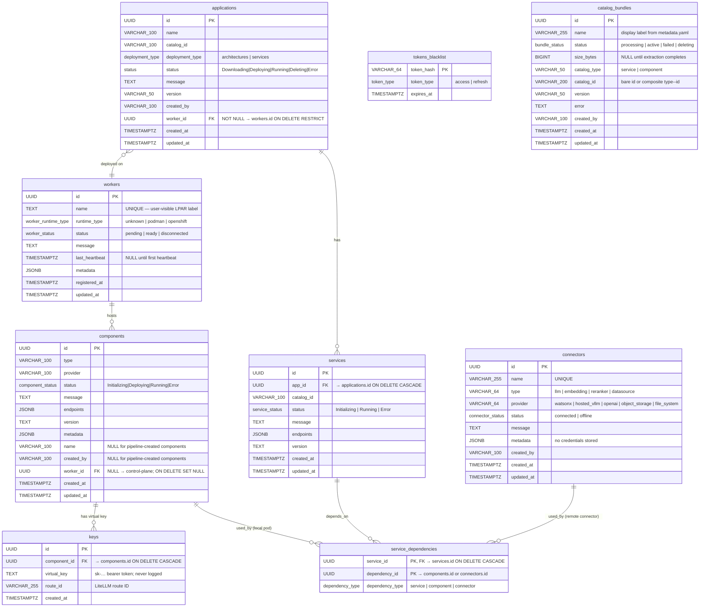

# Model Management & Connectors — Low-Level Design

**Version:** 1.1
**Date:** October 2026
**Status:** Draft / Proposal
**See also:** [`model-management-architecture.md`](model-management-architecture.md) — High-Level Architecture and UX Designs

---

## Table of Contents

1. [Executive Summary](#1-executive-summary)
2. [Background and Motivation](#2-background-and-motivation)
3. [LiteLLM Gateway Integration](#3-litellm-gateway-integration)
   - [LiteLLM as a Catalog Asset](#litellm-as-a-catalog-asset)
   - [Route Registration](#route-registration)
   - [Virtual Key Provisioning](#virtual-key-provisioning)
   - [WatsonX via Connector](#watsonx-via-connector)
4. [New Concepts](#4-new-concepts)
   - [4.1 Models](#41-models)
   - [4.2 Connectors](#42-connectors)
   - [4.3 Supported Provider Params](#43-supported-provider-params)
5. [Database Schema](#5-database-schema)
   - [5.1 Guiding Principle](#51-guiding-principle)
   - [5.2 Additions to Existing `components` Table](#52-additions-to-existing-components-table)
   - [5.3 Reuse of Shared `connectors` Table](#53-reuse-of-shared-connectors-table-for-remote-model-connectors)
   - [5.4 Reuse of `service_dependencies`](#54-reuse-of-service_dependencies-for-model-connector-links)
   - [5.5 Connector Status Values](#55-connector-status-values)
   - [5.6 New `workers` Table](#56-new-workers-table)
   - [5.7 New `keys` Table](#57-new-keys-table)
   - [5.8 Migration Plan](#58-migration-plan)
   - [5.9 Full Entity Relationship Diagram](#59-full-entity-relationship-diagram)
6. [API Specification](#6-api-specification)
   - [6.1 Model Endpoints](#61-model-endpoints-local-pods--components-table)
   - [6.2 Connector Endpoints](#62-connector-endpoints-remote-endpoints--connectors-table)
   - [6.3 Provider Schema Endpoints](#63-provider-schema-endpoints-shared-with-datasource-connectors)
   - [6.4 Worker Endpoints](#64-worker-endpoints)
   - [6.5 Virtual Key Endpoint](#65-virtual-key-endpoint)
   - [6.6 Extensions to Existing Endpoints](#66-extensions-to-existing-endpoints)
7. [API Endpoint Details](#7-api-endpoint-details)
   - [7.1 Deploy a Local Model](#71-deploy-a-local-model)
   - [7.2 List Local Models](#72-list-local-models)
   - [7.3 Get Model Details](#73-get-model-details)
   - [7.4 Delete / Undeploy a Local Model](#74-delete--undeploy-a-local-model)
   - [7.5 Create a Connector](#75-create-a-connector)
   - [7.6 List Connectors](#76-list-connectors)
   - [7.7 Update a Connector](#77-update-a-connector)
   - [7.8 Get Connector Details](#78-get-connector-details)
   - [7.9 Delete a Connector](#79-delete-a-connector)
   - [7.10 List Workers](#710-list-workers)
   - [7.11 Get Virtual Key](#711-get-virtual-key)
8. [Pre-flight Resource Check](#8-pre-flight-resource-check)
9. [Deployment Flow](#9-deployment-flow)
   - [Flow: Application Create with Managed Model (model already deployed)](#flow-application-create--model-already-deployed-pre-deployed-path)
   - [Flow: Application Create with Managed Model (new deploy)](#flow-application-create--new-model-deploy)
   - [Flow: Application Create with Model Connector](#flow-application-create--model-connector-remote)
10. [Key Design Decisions](#10-key-design-decisions)
11. [Common Queries](#11-common-queries)
12. [Error Handling](#12-error-handling)
13. [Future Considerations](#13-future-considerations)
14. [CLI Commands](#14-cli-commands)
    - [14.1 Model Commands](#141-model-commands)
    - [14.2 Connector Commands](#142-connector-commands)
    - [14.3 LiteLLM Gateway Commands](#143-litellm-gateway-commands)
    - [14.4 Command Summary](#144-command-summary)

---

## 1. Executive Summary

This proposal extends the existing Catalog Service with two new capabilities:

1. **Model Management** — dynamic deploy, undeploy, list, and status of model inference backends (`llm`, `embedding`, `reranker`) across all supported runtimes (Podman, OpenShift, Docker Compose). Models are no longer bundled statically inside application pods; they are standalone deployable components managed independently and exposed to consumer services through a **LiteLLM Gateway** — a universal model proxy that sits between applications and any backend provider.

2. **Connectors** — a way to register external model endpoints (WatsonX, hosted vLLM, OpenAI) without deploying any local pod. Credentials are passed directly to the **LiteLLM Gateway** at route-registration time and stored there — they never enter the Catalog database or a Podman secret.

> **`modelmanager` is a Go package inside the Catalog API server process** — not a separate service or sidecar. The HTTP handlers call into it directly; there is no inter-process communication. It owns the full lifecycle (deploy, update, undeploy, status) of all three component types: `llm`, `embedding`, and `reranker` — for both local pods and remote connectors.

**Core design principle: two tables, cleanly separated.**

| Kind | Table | Pod? | Credentials stored in | Examples |
|---|---|---|---|---|
| Local pod | `components` | ✅ | `keys` table (virtual key served via API) | vLLM (cpu, spyre) |
| Remote connector | `connectors` | ❌ | LiteLLM Gateway DB | WatsonX, hosted vLLM, OpenAI |

Three new columns on `components` (`name`, `created_by`, `worker_id`), a new `workers` table, and a new `keys` table are the complete schema delta. Remote model connectors reuse the shared `connectors` table (same as datasource connectors). Credentials never touch the Catalog database directly.

---

## 2. Background and Motivation

### Current State

The current catalog deploys vLLM or WatsonX as `components` that are tightly coupled to an application at creation time. Changing the model requires deleting and recreating the entire application. There is no concept of reusing a running model backend across applications, no support for dynamically switching providers at runtime, and no way to register an externally-hosted model endpoint without forking a template.

### Problems

- Model lifecycle is locked to application lifecycle; a model upgrade forces full application re-deployment.
- No mechanism to connect to an already-running WatsonX, OpenAI, or vLLM endpoint outside of the platform.
- Consumer services (`chatbot`, `digitize`, `similarity`, `summarize`) hold direct references to provider-specific endpoints — swapping providers requires re-deploying those services.
- No pre-flight validation of available resources (CPU, memory, Spyre cards) before attempting deployment, leading to silent pod failures.
- `component_status` enum only has `Initializing`, `Running`, `Error` — insufficient to express the `Deploying` lifecycle state needed for async model deployment.

### Goals

1. Decouple model lifecycle from application lifecycle.
2. Introduce a universal gateway (LiteLLM) so consumer services are provider-agnostic.
3. Enable connection to external model endpoints via Connectors without deploying local pods.
4. Gate all model deployments behind a pre-flight resource check.
5. Persist all model state in the Catalog DB — local models in `components`, remote connectors in the shared `connectors` table, virtual keys in the `keys` table.

---

## 3. LiteLLM Gateway Integration

### LiteLLM as a Catalog Asset

The LiteLLM Gateway is promoted from a static WatsonX-only component to the **universal model proxy** for all providers. It is deployed **once, as part of `catalog configure`** — the same command that starts PostgreSQL, Caddy, and the Catalog API server. It is not deployed per-application.

The gateway lives inside the Catalog asset (`assets/catalog/podman/templates/`) alongside the existing Catalog templates. Two new files are added: `litellm-master-key-secret.yaml.tmpl` (generates the `LITELLM_MASTER_KEY` Podman secret) and `litellm.yaml.tmpl` (starts the gateway pod). These are rendered as part of the existing `podTemplateExecutions` sequence in [`assets/catalog/podman/metadata.yaml`](ai-services/assets/catalog/podman/metadata.yaml).

All applications share the single LiteLLM gateway instance. Consumer services point to it at creation time and never need reconfiguring when the backing model provider changes — only the gateway route table changes.

### LiteLLM PostgreSQL Instance

LiteLLM is configured with its **own dedicated PostgreSQL instance**, separate from the Catalog API database. This is deployed as part of `catalog configure` alongside the gateway pod itself.

**Why a separate Postgres instance for LiteLLM:**

| Reason | Detail |
|---|---|
| **Credential persistence** | LiteLLM stores the full `litellm_params` for every registered route — including secret fields (`api_key`, `token`, etc.) that the Catalog DB deliberately never holds. Without a DB these secrets are lost on gateway restart, breaking all connector routes. |
| **Route table durability** | On gateway restart, LiteLLM rehydrates its in-memory route table from the DB. Without it, every registered model (local and remote alike) would need to be re-registered by the Catalog API, introducing a complex reconciliation loop at startup. |
| **Separation of concerns** | Connector credentials must never enter the Catalog DB (design decision §11.2). Routing them through a LiteLLM-owned DB keeps the secret boundary clean — LiteLLM owns and manages what it stores; the Catalog API never reads it back. |
| **Spend / audit tracking** | LiteLLM uses its DB to persist request logs and spend data per virtual key. This enables per-model usage reporting without coupling it to the Catalog schema. |

**Configuration:**

```
DATABASE_URL=postgresql://litellm:<password>@localhost:5433/litellm
```

The LiteLLM DB runs on port **5433** to avoid conflict with the Catalog API's PostgreSQL instance on port **5432**. Both are started by `catalog configure`; both are backed by Podman secrets for their passwords.

`litellm.yaml.tmpl` passes `DATABASE_URL` as an environment variable to the LiteLLM pod. LiteLLM runs its own schema migrations on first start (`litellm --run_gunicorn` applies them automatically).

### Route Registration

When a model reaches `Running` status (pod healthy / connector validated), the platform registers a route via the LiteLLM Admin API.

**Register (on deploy):**
```
POST http://litellm:4000/model/new
Authorization: Bearer <LITELLM_MASTER_KEY>

{
  "model_name": "granite-3.3-8b-instruct--vllm-spyre",
  "litellm_params": {
    "model": "hosted_vllm/ibm-granite/granite-3.3-8b-instruct",
    "api_base": "http://my-rag-app--llm-granite:8000/v1"
  }
}
```

> **Note:** `model` uses the `hosted_vllm/<upstream-model-name>` prefix — LiteLLM infers the provider from the prefix. No separate `custom_llm_provider` field and no `api_key` are needed for local vLLM endpoints.

**Deregister (on undeploy):**
```
DELETE http://litellm:4000/model/delete
Authorization: Bearer <LITELLM_MASTER_KEY>

{ "id": "granite-3.3-8b-instruct--vllm-spyre" }
```

**Route ID convention:** The route ID registered in LiteLLM is `{model_name}--{provider}` (double-dash separator) — e.g. `granite-3.3-8b-instruct--vllm-spyre`. The double dash unambiguously separates the model name segment (which may itself contain single hyphens) from the provider segment. This is unique per deployed model and allows multiple models to coexist in the gateway simultaneously. Consumer services reference models by this ID.

### Virtual Key Provisioning

Each time a new model route is registered in LiteLLM (on every successful deploy or connector creation), the platform generates a **per-model virtual key** scoped exclusively to that route. Virtual keys are bearer tokens that consumer services and external callers use to authenticate model inference requests. They are distinct from the `LITELLM_MASTER_KEY` — an internal admin credential that is never exposed outside the platform.

**Generate virtual key (after route registration, per model):**
```
POST http://litellm:4000/key/generate
Authorization: Bearer <LITELLM_MASTER_KEY>

{
  "key_name": "granite-3.3-8b-instruct--vllm-spyre",
  "models": ["granite-3.3-8b-instruct--vllm-spyre"],
  "duration": null
}
```

`"key_name"` matches the route ID (`{model_name}--{provider}`). `"models"` scopes the key to that single route — attempts to call any other route with this key return `401`. `"duration": null` makes the key non-expiring. LiteLLM returns a `key` value of the form `sk-...`.

**Storage — `keys` table in Catalog DB (local models only):**

The generated virtual key for a **local model** is inserted into the `keys` table immediately after generation. It is not written to a Podman secret. For **remote connectors**, no virtual key is generated and no `keys` row is created — the connector's upstream credentials (`api_key`, `token`, etc.) are stored inside LiteLLM's own DB as part of the registered route's `litellm_params` and are never exposed via the Catalog API.

```sql
-- After POST /key/generate succeeds for a local model:
INSERT INTO keys (component_id, virtual_key, route_id)
VALUES ('<components.id>', 'sk-...', 'granite-3.3-8b-instruct--vllm-spyre');
```

**Consumers of the virtual key:**

| Consumer | How it receives the key |
|---|---|
| **Internal consumer services** (chatbot, digitize, similarity, summarize) | Service pod calls `GET /api/v1/models/keys?instance_id=<component_id>` at startup via its worker Caddy → control-plane Caddy → Catalog API, and sets the returned value as `OPENAI_API_KEY` / `LITELLM_API_KEY` — no Podman secret mount required |
| **External callers** (developers, CI pipelines) | Retrieved via `ai-services component litellm key [model-name] --runtime podman` CLI command (see §14) — never printed to logs |

**Key revocation at undeploy:**

When a **local model** is deleted, `modelmanager` revokes the virtual key via the LiteLLM Admin API and removes the `keys` row. When a **remote connector** is deleted, only `DELETE /model/delete` is called (no virtual key to revoke — connectors never had one). In both cases the LiteLLM route is deregistered so the upstream credentials are purged from the LiteLLM DB.

```
POST http://litellm:4000/key/delete
Authorization: Bearer <LITELLM_MASTER_KEY>
Content-Type: application/json

{
  "keys": ["sk-WJIFUdKHNK8Jv9Iqa8Bn9w"]
}
```

**Response:**

```json
{ "deleted_keys": ["sk-WJIFUdKHNK8Jv9Iqa8Bn9w"] }
```

The `keys` array is the list of virtual key values (not key names) to revoke. On success LiteLLM echoes them back in `deleted_keys`. After this call the key is immediately invalid — any in-flight requests using it will receive `401`.

**Usage by consumer services:**

Consumer services call the LiteLLM gateway with the per-model virtual key as a standard bearer token:

```
POST http://litellm:4000/chat/completions
Authorization: Bearer <virtual-key>

{
  "model": "granite-3.3-8b-instruct--vllm-spyre",
  "messages": [{ "role": "user", "content": "Hello" }]
}
```

Each consumer service fetches only the key(s) for the model(s) it uses via `GET /api/v1/models/keys?instance_id=<component_id>`. A service using granite does not fetch the key for an embedding model — principle of least privilege. The virtual key is the **only credential** needed for model access, regardless of whether the backing provider is a local vLLM pod or an external WatsonX connector.

### Probe Check

After every route registration, `modelmanager` fires a health probe against the LiteLLM gateway to confirm the backend is reachable and responding.

- **Local models** (`components`): probe is **async** — `POST /api/v1/models` returns `202` immediately; the probe runs in the background and drives `components.status`.
- **Remote connectors** (`connectors`): probe is **synchronous** — if it fails, the LiteLLM route is deregistered and `422` is returned; `INSERT into connectors` only happens on success.

**Probe request:**

```
GET http://litellm:4000/health?model=<route-id>
Authorization: Bearer <LITELLM_MASTER_KEY>
```

The `model` query parameter is the route ID registered in the previous step (e.g. `granite-3.3-8b-instruct--vllm-spyre`).

**Healthy response — set `status = Running` (local) / `connected` (connector):**

```json
{
  "healthy_endpoints": [
    {
      "api_base": "http://llm-d295596cd0:8000/v1",
      "model": "hosted_vllm/ibm-granite/granite-3.3-8b-instruct",
      "max_tokens": 5,
      "model_id": "d3d7aa41-67b1-4785-a7ae-d0a7ee1e6211"
    }
  ],
  "unhealthy_endpoints": [],
  "healthy_count": 1,
  "unhealthy_count": 0
}
```

`healthy_count > 0` → set `Running`/`connected` (local: `components.status`; connector: `connectors.status`).

**Unhealthy response — set `status = Error` / `offline`:**

```json
{
  "healthy_endpoints": [],
  "unhealthy_endpoints": [
    {
      "api_base": "http://llm-d295596cd0:8000/v1",
      "model": "hosted_vllm/ibm-granite/granite-3.3-8b-instruct",
      "error": "litellm.InternalServerError: InternalServerError: Hosted_vllmException - Cannot connect to host llm-d295596cd0:8000 ssl:... [Name or service not known]",
      "model_id": "d3d7aa41-67b1-4785-a7ae-d0a7ee1e6211",
      "exception_status": 500
    }
  ],
  "healthy_count": 0,
  "unhealthy_count": 1
}
```

`unhealthy_count > 0` → local: `components.status = 'Error'`; connector: abort and return `422`.

**Probe logic summary:**

| `healthy_count` | `unhealthy_count` | Local model action | Connector action |
|---|---|---|---|
| `> 0` | `0` | `components.status = 'Running'`, clear `message` | `connectors.status = 'connected'`, persist row, return `201` |
| `0` | `> 0` | `components.status = 'Error'`, store error in `message` | DELETE LiteLLM route, return `422` with error |
| `0` | `0` | `components.status = 'Error'`, store `"No endpoints returned"` | DELETE LiteLLM route, return `422` |

> For local models the probe is fire-and-forget (`POST /api/v1/models` returns `202` immediately). Callers poll `GET /api/v1/models/:id` to observe `Deploying` → `Running` / `Error`. For connectors the probe is blocking — `POST /api/v1/connectors/models` only returns `201` after the probe passes.

### WatsonX via Connector

When deploying with `provider: watsonx`, no local pod is created. Credentials are passed directly to LiteLLM at route-registration time — they are never stored in the Catalog DB or a Podman secret. LiteLLM stores and manages them internally:

```
POST http://litellm:4000/model/new
Authorization: Bearer <LITELLM_MASTER_KEY>
Content-Type: application/json

{
  "model_name": "granite-4-h-small--watsonx",
  "litellm_params": {
    "model": "watsonx/ibm/granite-4-h-small",
    "api_base": "https://us-south.ml.cloud.ibm.com",
    "api_key": "<params.api_key>",
    "project_id": "<params.project_id>"
  }
}
```

| `litellm_params` field | Source |
|---|---|
| `model` | `"{provider_id}/{params.model_name}"` — e.g. `watsonx/ibm/granite-4-h-small`. LiteLLM infers the provider from the prefix; no `custom_llm_provider` field is needed |
| `api_base` | `params.endpoint_url` |
| `api_key` | `params.api_key` — passed to LiteLLM at registration; **never stored in Catalog DB** |
| `project_id` | `params.project_id` |

---

## 4. New Concepts

### 4.1 Models

A **Model** is an inference backend for a specific role (`llm`, `embedding`, `reranker`) deployed and managed independently of an application. There are two kinds, stored in different tables:

| Kind | Storage table | Example providers | Pod? | Credentials location |
|---|---|---|---|---|
| Local | `components` | `vllm-cpu`, `vllm-spyre` | ✅ Yes | `keys` table (virtual key served via `GET /api/v1/models/keys`) |
| Remote (connector) | `connectors` | `watsonx`, `hosted_vllm`, `openai` | ❌ No | LiteLLM Gateway DB |

Both kinds are registered as a route in the **LiteLLM Gateway** pod. Consumer services only ever talk to the LiteLLM gateway — they have no knowledge of which table is behind it.

The key differences from today's application-coupled components:

| | Today | New |
|---|---|---|
| Created by | Application deployment | Independent `POST /api/v1/models` or `POST /api/v1/connectors/models` |
| Lifecycle | Deleted with application | Explicit undeploy/delete required |
| Provider endpoint | Exposed directly to services | Always proxied via LiteLLM Gateway |
| Pre-flight resource check | None | Required for local models only |
| WatsonX | Deploys a per-app LiteLLM proxy pod | `connectors` row — credentials stored in LiteLLM, no pod |

### 4.2 Connectors

A **Connector** is a row in the shared `connectors` table with `type` set to the model role (`llm`, `embedding`, `reranker`). It has no pod and no Podman secret. Credentials are passed directly to the **LiteLLM Gateway** at route-registration time — LiteLLM stores and manages them. The Catalog DB stores only non-secret connection config (`metadata.model_name`, `metadata.endpoint_url`, `metadata.project_id`) — never the secret values themselves. Sensitive fields are identified from the provider's `schema.json` (properties with `"format": "password"`), the same mechanism used by datasource connectors.

**Connector types (by `type` + `provider` on `connectors`):**

| `type` | `provider` | Description | Sensitive `params` (`format: password`) |
|---|---|---|---|
| `llm` / `embedding` | `watsonx` | IBM watsonx.ai | `api_key` |
| `llm` / `embedding` / `reranker` | `hosted_vllm` | Externally hosted vLLM endpoint (OpenAI-compatible API) | `api_key` (optional) |
| `llm` / `embedding` | `openai` | OpenAI API | `api_key` |

Supported model connector providers are **`watsonx`**, **`hosted_vllm`** and **`openai`**. Provider IDs follow the LiteLLM provider prefix so the catalog `provider` value maps directly to `litellm_params.model` (e.g. `hosted_vllm/<model_name>`, `openai/<model_name>`, `watsonx/<model_name>`).

### 4.3 Supported Provider Params

The credential fields for each provider follow LiteLLM's provider credential definitions. Each field `key` is passed unchanged into `litellm_params` on `POST /model/new`. Each provider's fields are defined in `assets/connectors/<connector_type>/<provider_id>/schema.json`. A field with `field_type: password` gets `"format": "password"` in the schema, so it is passed to LiteLLM and stripped before `params` is saved to `connectors.metadata`. Every other field is saved as non-sensitive metadata.

#### `hosted_vllm` — vLLM

| Key | Label | Required | Field type | Sensitive | Placeholder / Tooltip |
|---|---|---|---|---|---|
| `api_base` | API Base | Yes | `text` | No | `https://...` |
| `api_key` | vLLM API Key | No | `password` | Yes | — |

#### `openai` — OpenAI-Compatible Endpoints (Together AI, etc.)

| Key | Label | Required | Field type | Sensitive | Placeholder / Tooltip |
|---|---|---|---|---|---|
| `api_base` | API Base | Yes | `text` | No | `https://...` |
| `api_key` | OpenAI API Key | Yes | `password` | Yes | — |

#### `watsonx` — Watsonx

| Key | Label | Required | Field type | Sensitive | Placeholder / Tooltip |
|---|---|---|---|---|---|
| `api_base` | API Base | No | `text` | No | Base URL of your WatsonX instance |
| `api_key` | API Key | No | `password` | Yes | IBM Cloud API key. Required if not using Token or Zen API Key |
| `project_id` | Project ID | No | `text` | No | Optional: Your Watsonx.ai Project ID |

> **Note:** For `watsonx`, at least one of `api_key`, `token` or `zen_api_key` must be supplied. All of them are marked `"ui:section": "Authentication"` in `schema.json`, so they are the only updatable fields on `PUT /api/v1/connectors/models/:id`.

---

## 5. Database Schema

### 5.1 Guiding Principle

> **Two tables, cleanly separated.** Locally deployed pods live in the existing `components` table. Remote model endpoint registrations (connectors) live in the shared `connectors` table — the same table used by datasource connectors, discriminated by `type`. Credential secrets never enter the Catalog DB — local virtual keys are stored in the `keys` table; remote credentials live in LiteLLM's own DB.

| Provider | Storage table | `type` value | Pod? | Credentials location |
|---|---|---|---|---|
| vLLM (cpu / spyre) | `components` | — | ✅ | `keys` table (virtual key) |
| WatsonX (`watsonx`) | `connectors` | `llm` / `embedding` | ❌ | LiteLLM Gateway |
| Hosted vLLM (`hosted_vllm`) | `connectors` | `llm` / `embedding` / `reranker` | ❌ | LiteLLM Gateway |
| OpenAI (`openai`) | `connectors` | `llm` / `embedding` | ❌ | LiteLLM Gateway |

`service_dependencies.dependency_id` points at `components.id` for local models and at `connectors.id` for remote model connectors — both already use `dependency_type = 'connector'` from §4.2 of the datasource proposal, so no new enum value is needed.

---

### 5.2 Additions to Existing `components` Table

No existing columns are changed or removed. **Three** new columns are added; `component_status` is extended with one new lifecycle value.

#### New columns

```sql
ALTER TABLE components
    ADD COLUMN name       VARCHAR(100),  -- human-readable label supplied by the user at deploy time
    ADD COLUMN created_by VARCHAR(100),  -- NULL for app-pipeline infra
    ADD COLUMN worker_id  UUID REFERENCES workers(id) ON DELETE SET NULL;  -- NULL = control-plane Podman deploy
```

| Column | Data Type | Nullable | Description |
|---|---|---|---|
| `name` | VARCHAR(100) | Yes | Human-readable label for this deployed instance (3–100 chars, slug-safe), e.g. `"granite-llm"`. NULL for components created by the application pipeline |
| `created_by` | VARCHAR(100) | Yes | User who triggered `POST /api/v1/models`. NULL for components created by the application pipeline |
| `worker_id` | UUID | Yes | FK to `workers.id`. NULL when the model is deployed on the control-plane Podman socket. Set to NULL automatically when the referenced worker row is deleted (`ON DELETE SET NULL`) |

> **No credentials column.** Local virtual keys (the `sk-...` bearer tokens used to call LiteLLM) are stored in the `keys` table and served via `GET /api/v1/models/keys?instance_id=<component_id>`. They are never stored in a Podman secret or in the `components` row itself.

#### Extended `component_status` enum

One new value is added for the local model pod lifecycle. Existing values are unchanged.

```sql
ALTER TYPE component_status ADD VALUE 'Deploying';  -- async pod creation in progress
```

Full `component_status` values relevant to local models after migration:

| Value | Meaning |
|---|---|
| `Initializing` | Infra container starting |
| `Deploying` | Async pod creation in progress |
| `Running` | Pod healthy |
| `Error` | Deployment failure |

#### `metadata` JSONB — local model fields

The `components` table already has a `metadata JSONB` column (no migration needed). Local model rows store their config there:

`local` model rows (`vllm-spyre`) — value stored in `components.metadata`:
```json
{
  "model": "ibm-granite/granite-3.3-8b-instruct"
}
```

> `name` is a separate top-level column on `components`, not a key inside `metadata`.

---

### 5.3 Reuse of Shared `connectors` Table for Remote Model Connectors

Remote model connectors (`watsonx`, `hosted_vllm`, `openai`) are stored in the **same `connectors` table** defined in the datasource connectors proposal (§4.1). No new table is required. The existing `type` column discriminates between datasource and model connector records.

A model connector record in the `connectors` table:

| Column | Example Value |
|---|---|
| `id` | `uuid` |
| `name` | `"prod-watsonx"` (unique, case-insensitive) |
| `type` | `"llm"` / `"embedding"` / `"reranker"` |
| `provider` | `"watsonx"` / `"hosted_vllm"` / `"openai"` |
| `status` | `"connected"` / `"offline"` (lowercase, reuses `connector_status` enum) |
| `message` | `null` / `"Endpoint reachable and credentials accepted"` |
| `metadata` | `{"model_name": "ibm/granite-3-8b-instruct", "endpoint_url": "https://...", "project_id": "..."}` |
| `created_by` | `"user@example.com"` |
| `created_at` | timestamp |
| `updated_at` | timestamp |

> **No credentials in `metadata`.** Sensitive `params` fields (those marked `"format": "password"` in the provider's `schema.json`, e.g. `api_key`) are passed directly to LiteLLM at route-registration time and are **stripped before** `params` is written to `connectors.metadata`. All other `params` fields are stored as-is (flat, same shape as datasource connectors).

`metadata` JSONB — value stored in `connectors.metadata` (WatsonX LLM example):
```json
{
  "model_name": "ibm/granite-3-8b-instruct",
  "endpoint_url": "https://us-south.ml.cloud.ibm.com",
  "project_id": "my-watsonx-project-id"
}
```

| `metadata` key | Required for |
|---|---|
| `model_name` | all providers |
| `endpoint_url` | `watsonx`, `hosted_vllm` (optional for `openai`; defaults to `https://api.openai.com/v1`) |
| `project_id` | `watsonx` |

The Go `Connector` DB model struct (already defined for datasources) is reused without modification. The `connected_services` count for list responses is fetched via `svcDepRepo.GetServiceCountByDependency` — not stored on the row.

---

### 5.4 Reuse of `service_dependencies` for Model Connector Links

No new join table or new enum value is required. Model connector links reuse the existing `dependency_type = 'connector'` value already added by the datasource migration. `dependency_id` points at `connectors.id`.

**Query: find all model connector links for a service:**

```sql
SELECT sd.dependency_id AS connector_id,
       sd.service_id
FROM service_dependencies sd
WHERE sd.service_id      = $1
  AND sd.dependency_type = 'connector';
```

To distinguish model connectors from datasource connectors in a query, join back to `connectors` and filter on `type`:

```sql
SELECT sd.dependency_id AS connector_id,
       sd.service_id
FROM service_dependencies sd
JOIN connectors c ON c.id = sd.dependency_id
WHERE sd.service_id      = $1
  AND sd.dependency_type = 'connector'
  AND c.type IN ('llm', 'embedding', 'reranker');
```

**Cascade behaviour** is already correct: `ON DELETE CASCADE` on `service_id` means deleting a service automatically removes its connector links.

---

### 5.5 Connector Status Values

Model connectors reuse the existing `connector_status` enum defined in the datasource migration (§4.3 of the datasource proposal):

| Value | Meaning |
|---|---|
| `connected` | The connectivity test successfully reached the endpoint — credentials valid, LiteLLM route active |
| `offline` | The connectivity test failed — invalid credentials, endpoint unreachable, or network error. `message` contains the specific error |

---

### 5.6 New `workers` Table

The `workers` table stores the registered Worker LPARs that the `modelmanager` package can target for remote pod deployment via the WorkerGateway gRPC stream. It is referenced by both `components.worker_id` (nullable) and `applications.worker_id` (NOT NULL).

```sql
CREATE TYPE worker_runtime_type AS ENUM ('unknown', 'podman', 'openshift');
CREATE TYPE worker_status       AS ENUM ('pending', 'ready', 'disconnected');

CREATE TABLE workers (
    id             UUID                PRIMARY KEY DEFAULT gen_random_uuid(),
    name           TEXT                NOT NULL UNIQUE,    -- user-visible LPAR label, e.g. 'lpar-1'
    runtime_type   worker_runtime_type NOT NULL DEFAULT 'unknown',
    status         worker_status       NOT NULL DEFAULT 'pending',
    message        TEXT,                                   -- human-readable reason for current status
    last_heartbeat TIMESTAMPTZ,                            -- NULL until first heartbeat arrives
    metadata       JSONB,
    registered_at  TIMESTAMPTZ         NOT NULL DEFAULT NOW(),
    updated_at     TIMESTAMPTZ         NOT NULL DEFAULT NOW()
);

CREATE INDEX ON workers(status);
CREATE INDEX ON workers(runtime_type);
```

| Column | Description |
|---|---|
| `name` | User-visible label shown in the UI and CLI (e.g. `"lpar-1"`). Unique |
| `runtime_type` | `'unknown'` until the worker connects and declares its runtime; then `'podman'` or `'openshift'` |
| `status` | `'pending'` — pre-registered, not yet connected; `'ready'` — daemon connected via gRPC; `'disconnected'` — stream no longer active |
| `message` | Human-readable reason for the current status, set by the catalog on status transitions |
| `last_heartbeat` | Timestamp of the most recent heartbeat received from the worker daemon; NULL until the first heartbeat arrives |
| `metadata` | Arbitrary JSON set by the worker daemon at registration time (e.g. capacity, labels) |
| `registered_at` | When the worker first registered with the system |

---

### 5.7 New `keys` Table

The `keys` table persists the **per-model** LiteLLM virtual key for every deployed local model. This is the shared, stable key scoped to the model's LiteLLM route — it is created once per model and reused across all applications that reference that model.

```sql
CREATE TABLE keys (
    id           UUID        PRIMARY KEY DEFAULT gen_random_uuid(),
    component_id UUID        NOT NULL REFERENCES components (id) ON DELETE CASCADE,
    virtual_key  TEXT        NOT NULL,   -- 'sk-...' value — treated as a secret; never logged
    route_id     VARCHAR(255) NOT NULL,  -- LiteLLM route ID, e.g. 'granite-3.3-8b-instruct--vllm-spyre'
    created_at   TIMESTAMPTZ NOT NULL DEFAULT NOW()
);

CREATE INDEX idx_keys_component_id ON keys (component_id);
```

> The `virtual_key` column stores the raw `sk-...` bearer token. It is never returned in list responses or logs. It is accessible via the authenticated `GET /api/v1/models/keys?instance_id=<component_id>` endpoint.

**Per-application virtual keys** are a separate concept from the per-model key above. Each application that deploys or reuses a managed model receives its own freshly generated LiteLLM virtual key scoped to the same route. This key is **not stored in the DB** — it is written into a Podman Secret (`litellm-secret-<instance-slug>`) that is mounted into the service pod at deploy time. The pod reads it from `/etc/secret/litellm-secret/LITELLM_VIRTUAL_KEY` and exports it as `LLM_API_KEY` (or `EMB_API_KEY` for embedding) before starting the server process.

---

### 5.8 Migration Plan

Model management adds the following goose migration files:

| File | Purpose |
|---|---|
| `20260430094510_alter_components_model_columns.sql` | Adds `name` and `created_by` columns to `components`; adds `'Deploying'` to `component_status` enum |
| `20260430094511_create_keys_table.sql` | Creates `keys` table with FK to `components` and `idx_keys_component_id` index |
| `20260801000002_create_workers_table.sql` | Creates `worker_runtime_type` enum (`unknown\|podman\|openshift`), `worker_status` enum (`pending\|ready\|disconnected`), and `workers` table (`name`, `runtime_type`, `status`, `message`, `last_heartbeat`, `metadata`, `registered_at`, `updated_at`) with status and runtime_type indexes |
| `20260801000003_add_worker_fk_to_applications.sql` | Adds `worker_id UUID NOT NULL` FK column to `applications` (ON DELETE RESTRICT) with index |
| `20260801000004_add_worker_fk_to_components.sql` | Adds `worker_id UUID` nullable FK column to `components` (ON DELETE SET NULL) |

> `connectors`, `connector_status`, and `dependency_type = 'connector'` are already present from the datasource migration — no re-creation needed.

> The `worker_id` FK on `components` is in a separate migration (`20260801000004`) from the column additions in `20260430094510` because the `workers` table must exist before the FK reference can be added.

> `applications.worker_id` is NOT NULL (every application is deployed through a worker; the local worker is used for local deployments). `components.worker_id` is nullable (NULL = control-plane Podman).

---

### 5.9 Full Entity Relationship Diagram



**Enum reference**

| Enum type | Values |
|---|---|
| `status` | `Downloading`, `Deploying`, `Running`, `Deleting`, `Error` |
| `service_status` | `Initializing`, `Running`, `Error` |
| `component_status` | `Initializing`, `Deploying`, `Running`, `Error` |
| `connector_status` | `connected`, `offline` |
| `worker_status` | `pending`, `ready`, `disconnected` |
| `worker_runtime_type` | `unknown`, `podman`, `openshift` |
| `dependency_type` | `service`, `component`, `connector` |
| `deployment_type` | `architectures`, `services` |
| `token_type` | `access`, `refresh` |
| `bundle_status` | `processing`, `active`, `failed`, `deleting` |

> **No credentials column.** `name` and `worker_id` are dedicated top-level columns on `components`. Per-model virtual keys are stored in the `keys` table. Per-application virtual keys are written to Podman Secrets at deploy time and are never stored in the DB. Remote credentials are passed directly to LiteLLM and never touch the Catalog DB. `catalog_bundles` has a partial unique index on `(catalog_type, catalog_id)` WHERE `status = 'active'`, enforcing at most one active bundle per item.

---

## 6. API Specification

All endpoints require `Authorization: Bearer <access_token>`. All routes are under `/api/v1` and protected by the existing `AuthMiddleware`.

> **Routing note:** The static-segment route `GET /api/v1/connectors/models` must be registered **before** the parameterised `GET /api/v1/connectors/models/:id` so the router resolves it correctly.

### 6.1 Model Endpoints (local pods — `components` table)

Write operations deploy and manage local pods stored in the `components` table. The shared instance endpoints (`GET :id`, `DELETE :id`) operate on any local model by UUID.

| Method | Path | Description | Response |
|---|---|---|---|
| `POST` | `/api/v1/models` | Deploy a local model (`type` in request body) | `202 Accepted` |
| `GET` | `/api/v1/models` | List deployed local models; filter with `?type=` | `200 OK` |
| `GET` | `/api/v1/models/:id` | Get full status and details of a local model | `200 OK` |
| `DELETE` | `/api/v1/models/:id` | Undeploy and delete a local model | `202 Accepted` |

### 6.2 Connector Endpoints (remote endpoints — `connectors` table)

Remote model connectors register external model endpoints. They are stored in the shared `connectors` table (same as datasource connectors, discriminated by `type`). No pod is created. Credentials go directly to LiteLLM; the Catalog DB stores only non-secret connection config.

| Method | Path | Description | Response |
|---|---|---|---|
| `POST` | `/api/v1/connectors/models` | Register a model connector (validates connectivity first) | `201 Created` |
| `GET` | `/api/v1/connectors/models` | List all model connectors; filter with `?type=` | `200 OK` |
| `GET` | `/api/v1/connectors/models/:id` | Get full details of a connector | `200 OK` |
| `PUT` | `/api/v1/connectors/models/:id` | Update a connector's credentials | `200 OK` |
| `DELETE` | `/api/v1/connectors/models/:id` | Delete a connector and deregister its LiteLLM route | `204 No Content` |

### 6.3 Provider Schema Endpoints (shared with datasource connectors)

Model connectors use the two provider endpoints that were already built for datasource connectors. They are §6.6 *Get Provider Input Schema* and §6.7 *List Providers for a Connector Type* in the [datasource connectors proposal](../data-source-connectors/catalog-datasource-connectors-proposal.md). No new routes or handlers are added. The `:connector_type` path segment, or the `type` query parameter, is the model role (`llm`, `embedding`, `reranker`), in the same way datasources use `datasource`.

| Method | Path | Datasource proposal | Description | Response |
|---|---|---|---|---|
| `GET` | `/api/v1/connectors/:connector_type/providers/:provider_id/params` | §6.6 | Returns the provider's `schema.json` unchanged. Examples: `/api/v1/connectors/llm/providers/watsonx/params`, `/api/v1/connectors/embedding/providers/hosted_vllm/params` | `200 OK` |
| `GET` | `/api/v1/connectors?type=llm` | §6.7 | Lists the registered providers for one connector type. Omit `type` to list every connector type, datasource and model | `200 OK` |

#### Reuse check against the current implementation

Both endpoints are already registered in [`router.go`](../../../ai-services/internal/pkg/catalog/apiserver/router.go). They are served by [`CatalogHandler.ListConnectorProviders`](../../../ai-services/internal/pkg/catalog/apiserver/handlers/catalog.go) and [`CatalogHandler.GetConnectorProviderParams`](../../../ai-services/internal/pkg/catalog/apiserver/handlers/catalog.go). Neither handler hard-codes `datasource`:

| Check | Result |
|---|---|
| Route and handler | ✅ Generic. `connector_type` and `provider_id` come straight from the path or query string |
| Asset discovery | ✅ The catalog loader picks up any `assets/connectors/<connector_type>/<provider_id>/metadata.yaml` (a 4-part path) and stores it under the key `<connector_type>/<provider_id>` |
| Schema serving | ✅ [`GetConnectorProviderParams`](../../../ai-services/internal/pkg/catalog/deploy_options.go) reads `schema.json` from the provider directory and returns it unchanged, so property order is kept |
| List response | ✅ [`ToConnectorResponse`](../../../ai-services/internal/pkg/catalog/types/types.go) builds `provider.schema` as `/api/v1/connectors/<connector_type>/providers/<id>/params` for any type |
| Sensitive / updatable fields | ✅ The same `schema.json` conventions apply. `"format": "password"` marks a sensitive field and `"ui:section": "Authentication"` marks an updatable one (see §4.3) |

**Result:** both endpoints work for model connectors with **no code change**. The only work is adding provider asset directories, with one blocker described next.

> **⚠️ Blocker: catalog key collision for `llm/watsonx`.** Components and connectors share one in-memory `items` map. The key is `<component_type>/<id>` for components and `<connector_type>/<id>` for connectors. A new `assets/connectors/llm/watsonx/` therefore gets the same key, `llm/watsonx`, as the existing `assets/components/llm/watsonx/`. The asset walk visits `components/` before `connectors/`, so the connector entry overwrites the component entry, and `LoadComponent("llm", "watsonx")` starts failing. That breaks the current application-pipeline WatsonX deploy and `deploy-options`. `hosted_vllm`, `openai` and `embedding/watsonx` are not affected, because no component uses those keys. Pick one fix before adding the asset:
> 1. Remove `assets/components/llm/watsonx/` as part of this change, since WatsonX moves from a per-app component to a connector (§4.1); **or**
> 2. Add a catalog-type prefix to connector keys (e.g. `connectors/<connector_type>/<id>`) in `parseConnector`, `LoadConnector` and `ListConnectors`. This is a small code change.

**Provider assets to add.** Each provider gets one directory per connector type it supports:

```
assets/connectors/
├── datasource/            (existing)
├── llm/
│   ├── watsonx/           metadata.yaml, schema.json
│   ├── hosted_vllm/       metadata.yaml, schema.json
│   └── openai/            metadata.yaml, schema.json
├── embedding/
│   ├── watsonx/           metadata.yaml, schema.json
│   ├── hosted_vllm/       metadata.yaml, schema.json
│   └── openai/            metadata.yaml, schema.json
└── reranker/
    └── hosted_vllm/       metadata.yaml, schema.json
```

`assets/connectors/llm/watsonx/metadata.yaml` follows the same format as the datasource provider files:

```yaml
type: connector
id: watsonx
name: "Watsonx"
description: "IBM watsonx.ai hosted models"
connector_type: llm
connector_name: "Large language model (LLM)"
```

**Example: `GET /api/v1/connectors?type=llm`** returns the same response shape as datasource §6.7:

```json
[
  {
    "type": "llm",
    "name": "Large language model (LLM)",
    "provider": {
      "id": "watsonx",
      "name": "Watsonx",
      "description": "IBM watsonx.ai hosted models",
      "schema": "/api/v1/connectors/llm/providers/watsonx/params"
    }
  },
  {
    "type": "llm",
    "name": "Large language model (LLM)",
    "provider": {
      "id": "hosted_vllm",
      "name": "vLLM",
      "description": "Externally hosted vLLM endpoint",
      "schema": "/api/v1/connectors/llm/providers/hosted_vllm/params"
    }
  },
  {
    "type": "llm",
    "name": "Large language model (LLM)",
    "provider": {
      "id": "openai",
      "name": "OpenAI-Compatible Endpoints (Together AI, etc.)",
      "description": "Any OpenAI-compatible endpoint",
      "schema": "/api/v1/connectors/llm/providers/openai/params"
    }
  }
]
```

**Example: `GET /api/v1/connectors/llm/providers/hosted_vllm/params`** returns `schema.json` built from the §4.3 field definitions:

```json
{
  "$schema": "http://json-schema.org/draft-07/schema#",
  "type": "object",
  "additionalProperties": false,
  "required": ["model_name", "api_base"],
  "properties": {
    "model_name": {
      "type": "string",
      "title": "Model name",
      "minLength": 1,
      "ui:section": "Model"
    },
    "api_base": {
      "type": "string",
      "title": "API Base",
      "format": "uri",
      "ui:placeholder": "https://...",
      "ui:section": "Connection"
    },
    "api_key": {
      "type": "string",
      "title": "vLLM API Key",
      "format": "password",
      "ui:section": "Authentication"
    }
  }
}
```

Error responses are the same as datasource §6.6 and §6.7: `404 {"error": "connector type \"<type>\" not found"}` for an unknown type, and `404` for an unknown provider.

### 6.4 Worker Endpoints

| Method | Path | Description | Response |
|---|---|---|---|
| `GET` | `/api/v1/workers` | List all registered Worker LPARs with current status | `200 OK` |
| `GET` | `/api/v1/workers/:worker_id/resources` | Get current system info / resource availability for a worker (used by pre-flight UI) | `200 OK` |

### 6.5 Virtual Key Endpoint

| Method | Path | Description | Response |
|---|---|---|---|
| `GET` | `/api/v1/models/keys?instance_id=<component_id>` | Retrieve the LiteLLM virtual key for a deployed local model (used by consumer service pods at startup) | `200 OK` |

### 6.6 Extensions to Existing Endpoints

| Existing Endpoint | Change |
|---|---|
| `POST /api/v1/applications` | `services[].connectors[]` accepts `{type, id}` entries with `type` = `llm` / `embedding` / `reranker`, the same `ConnectorRef` shape used for `datasource`. A given type can be set via `components` or `connectors`, not both. See [Flow: Application Create — Model Connector](#flow-application-create--model-connector-remote) |
| `GET /api/v1/applications/:id` | Response includes model connectors from `connectors` table alongside `services` and local `components` |
| `GET /api/v1/architectures/:id/deploy-options` | `providers` list under `llm`/`embedding`/`reranker` includes connector provider options (`watsonx`, `hosted_vllm`, `openai`) alongside `vllm-cpu`, `vllm-spyre`; worker list included for target-worker selection |

---

## 7. API Endpoint Details

### 7.1 Deploy a Local Model

**Endpoint:** `POST /api/v1/models`

**Description:** Deploys a new local model. Starts a pod and registers a LiteLLM route. Returns `202 Accepted` — creation is async.

**Request Headers:**
```
Authorization: Bearer <access_token>
Content-Type: application/json
```

**Request Body (example: vLLM-Spyre LLM on Worker LPAR):**

```json
{
  "type": "llm",
  "name": "granite-llm",
  "provider_id": "vllm-spyre",
  "worker_selector": "lpar-1",   // user-facing name; stored as worker_id UUID internally
  "params": {
    "model": "ibm-granite/granite-3.3-8b-instruct"
  }
}
```

**Request Schema:**

| Field | Type | Required | Description |
|---|---|---|---|
| `type` | string | Yes | Component type: `llm`, `embedding`, `reranker` |
| `name` | string | Yes | Human-readable label for this deployed instance (3–100 chars, slug-safe) |
| `provider_id` | string | Yes | Local backend: `vllm-cpu`, `vllm-spyre` |
| `worker_selector` | string | No | Target worker name (e.g. `"lpar-1"`). Resolved to `workers.id` UUID before storage. Omit to deploy on the control-plane Podman socket |
| `params` | object | Yes | Model and provider config — polymorphic on `provider_id` |

**Polymorphic `params` — required fields per `provider_id`:**

The `modelmanager` package validates `params` against the `params` block in `assets/components/<type>/<provider_id>/metadata.yaml`. Adding a new provider requires only a new asset file.

| `provider_id` | Required `params` fields |
|---|---|
| `vllm-cpu`, `vllm-spyre` | `model_name` |

**Response `202 Accepted` (async):**

```json
{ "id": "7f3a1c2d-8e4b-4f5a-9d6e-1a2b3c4d5e6f" }
```

> Use `GET /api/v1/models/:id` to poll status and full details.

**Error Responses:**

| Status | Condition |
|---|---|
| `400 Bad Request` | Missing required fields, unknown `type`, or unknown `provider_id` |
| `401 Unauthorized` | Invalid or missing access token |
| `404 Not Found` | `worker_selector` refers to an unknown worker name |
| `409 Conflict` | A component with the same `type` is already `Running` or `Deploying` |
| `422 Unprocessable Entity` | Pre-flight resource check failed |
| `500 Internal Server Error` | Pod start failure |

---

### 7.2 List Local Models

**Endpoint:** `GET /api/v1/models`

**Description:** Lists all deployed local models. Optionally filter by type.

**Query Parameters:**

| Parameter | Type | Required | Default | Description |
|---|---|---|---|---|
| `type` | string | No | — | Filter by component type: `llm`, `embedding`, `reranker`. Omit for all types |
| `page` | integer | No | 1 | Page number (1-indexed) |
| `page_size` | integer | No | 20 | Items per page (max 100) |

**Response `200 OK`:**

```json
{
  "data": [
    {
      "id": "7f3a1c2d-8e4b-4f5a-9d6e-1a2b3c4d5e6f",
      "name": "granite-llm",
      "type": "llm",
      "provider": { "id": "vllm-spyre", "name": "vLLM (Spyre)" },
      "worker": { "id": "lpar-1", "runtime_type": "spyre", "status": "ready" },
      "metadata": { "model": "ibm-granite/granite-3.3-8b-instruct" },
      "status": "Running",
      "created_at": "2026-07-01T10:00:00Z",
      "updated_at": "2026-07-01T10:05:00Z"
    }
  ],
  "pagination": {
    "page": 1,
    "page_size": 20,
    "total_items": 1,
    "total_pages": 1,
    "has_next": false,
    "has_prev": false
  }
}
```

> `worker` is `null` when the model was deployed on the control-plane Podman socket (`worker_id` is NULL).

---

### 7.3 Get Model Details

**Endpoint:** `GET /api/v1/models/:id`

**Description:** Returns the full record for a local model (`components` table).

**Response `200 OK`:**

```json
{
  "id": "7f3a1c2d-8e4b-4f5a-9d6e-1a2b3c4d5e6f",
  "name": "granite-llm",
  "type": "llm",
  "provider": { "id": "vllm-spyre", "name": "vLLM (Spyre)" },
  "worker": { "id": "lpar-1", "runtime_type": "spyre", "status": "ready" },
  "metadata": { "model": "ibm-granite/granite-3.3-8b-instruct" },
  "status": "Running",
  "message": "Model running",
  "endpoints": [
    { "type": "api", "url": "http://worker-caddy-lpar-1:443/v1" }
  ],
  "applications": [
    {
      "id": "a1b2c3d4-1234-5678-abcd-ef0123456789",
      "name": "my-rag-app"
    }
  ],
  "created_by": "user@example.com",
  "created_at": "2026-07-01T10:00:00Z",
  "updated_at": "2026-07-01T10:05:00Z"
}
```

> `worker` is `null` when the model was deployed on the control-plane Podman socket. The `endpoints[].url` for a worker-deployed model points to the worker Caddy (not the pod directly) — consumers always route through the worker Caddy → vLLM pod.

> `applications` lists all applications that have a `service_dependencies` row pointing at this component (`dependency_type = 'component'`).

**`applications` SQL (server-side):**

```sql
SELECT DISTINCT a.id, a.name
FROM service_dependencies sd
JOIN services s ON s.id = sd.service_id
JOIN applications a ON a.id = s.app_id
WHERE sd.dependency_id   = :id
  AND sd.dependency_type = 'component';
```

**Error Responses:** `401 Unauthorized`, `404 Not Found`

---

### 7.4 Delete / Undeploy a Local Model

**Endpoint:** `DELETE /api/v1/models/:id`

**Description:** Removes a local model (`components` table). Async — deregisters the LiteLLM route, revokes the virtual key, stops and removes the pod (on the control plane or via gRPC to the worker daemon), then deletes the `components` and `keys` rows.

**Teardown steps (async, in order):**

| Step | Call | Detail |
|---|---|---|
| 1 | `DELETE /model/delete` on LiteLLM | Removes route and credentials from gateway |
| 2 | `POST /key/delete` on LiteLLM | Body: `{ "keys": ["<virtual-key>"] }` — revokes the per-model key |
| 3 | Delete `keys` row | Removes virtual key from Catalog DB |
| 4 | `StopPod` / `DeletePod` | Control-plane: local Podman. Worker: `COMMAND_TYPE_DELETE_POD` via gRPC to worker daemon |
| 5 | Delete `components` row | Final cleanup |

**Query Parameters:**

| Parameter | Type | Required | Default | Description |
|---|---|---|---|---|
| `keep_data` | boolean | No | `false` | Preserve host volume / PVC; stop pod but keep weights |

**Response `202 Accepted`:**

```json
{
  "id": "7f3a1c2d-8e4b-4f5a-9d6e-1a2b3c4d5e6f",
  "message": "Undeploy initiated"
}
```

**Error Responses:**

| Status | Condition |
|---|---|
| `401 Unauthorized` | Invalid or missing access token |
| `403 Forbidden` | Authenticated user is not `created_by` |
| `404 Not Found` | Component not found |
| `409 Conflict` | Model is in use by one or more active applications; or is already being deleted |

---

### 7.5 Create a Connector

**Endpoint:** `POST /api/v1/connectors/models`

**Description:** Registers an external model endpoint as a connector. Stores the record in the shared `connectors` table. Credentials are passed directly to LiteLLM — no pod, no Podman secret. The catalog backend validates the connection before persisting — synchronous, returns `201 Created` on success.

**Request Headers:**
```
Authorization: Bearer <access_token>
Content-Type: application/json
```

**Request Body (example: WatsonX LLM connector):**

```json
{
  "name": "prod-watsonx",
  "type": "llm",
  "provider_id": "watsonx",
  "params": {
    "model_name": "ibm/granite-3-8b-instruct",
    "endpoint_url": "https://us-south.ml.cloud.ibm.com",
    "project_id": "my-watsonx-project-id",
    "api_key": "sk-xxxxxxxxxxxxxxxxxxxxxxxxxxxxxxxx"
  }
}
```

**Request Schema:**

| Field | Type | Required | Description |
|---|---|---|---|
| `name` | string | Yes | Human-readable label for this connector (3–100 chars, unique, case-insensitive) |
| `type` | string | Yes | Connector type: `llm`, `embedding`, `reranker` |
| `provider_id` | string | Yes | Provider identifier: `watsonx`, `hosted_vllm`, `openai` |
| `params` | object | Yes | Flat provider-specific config — validated against the provider's `schema.json` (same shape rules as datasource connectors) |
| `params.model_name` | string | Yes | Model identifier on the remote endpoint |
| `params.endpoint_url` | string | Conditional | Remote service base URL — required for `watsonx` and `hosted_vllm`; optional for `openai` |
| `params.project_id` | string | Conditional | Required for `watsonx` |
| `params.api_key` | string | Conditional | Marked `"format": "password"` in `schema.json`; passed to LiteLLM; **never stored in Catalog DB** |

**Validation rules:**
- `name` must be 3–100 characters and unique (case-insensitive). Stored in `connectors.name`.
- `provider_id` must be a registered provider identifier.
- All required fields for the given provider must be present (validated via the provider schema).
- A live connectivity check (LiteLLM route probe) must succeed before the record is persisted. If the check fails, return `422 Unprocessable Entity`.
- Sensitive fields (`"format": "password"` in `schema.json`) are passed to LiteLLM and **never written to `connectors.metadata`**.

**Polymorphic `params` — required fields per `provider_id`:**

| `provider_id` | Required `params` fields | Sensitive fields |
|---|---|---|
| `watsonx` | `model_name`, `endpoint_url`, `project_id`, `api_key` | `api_key` |
| `hosted_vllm` | `model_name`, `endpoint_url` | `api_key` (optional) |
| `openai` | `model_name`, `api_key` | `api_key` |

**Response `201 Created`:**

```json
{ "id": "c1d2e3f4-a5b6-7890-cdef-123456789abc" }
```

**Response `422 Unprocessable Entity`:**

```json
{ "error": "connection test failed: dial tcp us-south.ml.cloud.ibm.com:443: connection refused" }
```

**Error Responses:**

| Status | Condition |
|---|---|
| `400 Bad Request` | Missing required fields, unknown `type`, or unknown `provider_id` |
| `401 Unauthorized` | Invalid or missing access token |
| `409 Conflict` | A connector with the same `name` already exists |
| `422 Unprocessable Entity` | Connectivity check failed |
| `500 Internal Server Error` | LiteLLM route registration failure |

---

### 7.6 List Connectors

**Endpoint:** `GET /api/v1/connectors/models`

**Description:** Lists registered connectors. Optionally filter by type.

**Query Parameters:**

| Parameter | Type | Required | Default | Description |
|---|---|---|---|---|
| `type` | string | No | — | Filter by connector type: `llm`, `embedding`, `reranker`. Omit for all types |
| `status` | string | No | — | Filter by status: `connected`, `offline` |
| `page` | integer | No | 1 | Page number (1-indexed) |
| `page_size` | integer | No | 20 | Items per page (max 100) |

**Request Headers:**
```
Authorization: Bearer <access_token>
```

**Examples:**
```
# All model connectors
GET /api/v1/connectors/models

# LLM connectors only
GET /api/v1/connectors/models?type=llm

# Offline connectors only
GET /api/v1/connectors/models?status=offline
```

**Response `200 OK`:**

```json
{
  "data": [
    {
      "id": "c1d2e3f4-a5b6-7890-cdef-123456789abc",
      "name": "prod-watsonx",
      "type": "llm",
      "provider": { "id": "watsonx", "name": "WatsonX" },
      "status": "connected",
      "message": "",
      "connected_services": 1,
      "created_at": "2026-07-01T11:00:00Z",
      "updated_at": "2026-07-01T11:05:00Z"
    },
    {
      "id": "d2e3f4a5-b6c7-8901-defa-234567890bcd",
      "name": "prod-embeddings",
      "type": "embedding",
      "provider": { "id": "hosted_vllm", "name": "Hosted vLLM" },
      "status": "connected",
      "message": "",
      "connected_services": 2,
      "created_at": "2026-07-01T12:00:00Z",
      "updated_at": "2026-07-01T12:05:00Z"
    }
  ],
  "pagination": {
    "page": 1,
    "page_size": 20,
    "total_items": 2,
    "total_pages": 1,
    "has_next": false,
    "has_prev": false
  }
}
```

> **Note:** `metadata` (including `auth` fields) is **not** included in list items. The `provider` field is a JSON object with `id` and `name` resolved from the provider registry. The `connected_services` count is fetched via `svcDepRepo.GetServiceCountByDependency` — not a JOIN in the list query.

**Backing SQL:**

```sql
SELECT *
FROM connectors
WHERE type IN ('llm', 'embedding', 'reranker')
  AND (:type   IS NULL OR type   = :type)
  AND (:status IS NULL OR status = :status)
ORDER BY type, created_at DESC
LIMIT :page_size OFFSET (:page - 1) * :page_size;
```

**Error Responses:**

| Status | Condition |
|---|---|
| `400 Bad Request` | Unknown value in `type` or `status` query parameter |
| `401 Unauthorized` | Invalid or missing access token |

---

### 7.7 Update a Connector

**Endpoint:** `PUT /api/v1/connectors/models/:id`

**Path Parameters:**

| Parameter | Description |
|---|---|
| `:id` | Connector UUID |

**Description:** Updates a connector's credential fields. Only the credential (Authentication) fields for the connector's provider may be updated — updatable fields are those whose `ui:section` is `"Authentication"` in the provider's `schema.json`. Structural fields (`name`, `type`, `provider`, `endpoint_url`, `model_name`) are immutable after creation. Any non-updatable field in the request body is silently ignored. The connectivity check is always re-run with the merged credentials before saving. If the check fails, return `422 Unprocessable Entity` and leave the existing record unchanged.

| `provider` | Updatable `params` fields |
|---|---|
| `watsonx` | `api_key` |
| `hosted_vllm` | `api_key` |
| `openai` | `api_key` |

**Request Body:**

```json
{
  "params": {
    "api_key": "sk-new-key-here"
  }
}
```

**Processing steps:**

1. Re-register LiteLLM route (`DELETE /model/delete` then `POST /model/new`) with the updated credential fields.
2. Run connectivity check — if it fails, return `422` and revert LiteLLM registration; leave `connectors` row unchanged.
3. Merge supplied credential fields into `connectors.metadata` (omitted keys preserved); update `connectors.status = 'connected'` and `updated_at`.

**Response `200 OK`:** Updated connector object (without secret fields, without `metadata` blob):

```json
{
  "id": "c1d2e3f4-a5b6-7890-cdef-123456789abc",
  "name": "prod-watsonx",
  "type": "llm",
  "provider": { "id": "watsonx", "name": "WatsonX" },
  "status": "connected",
  "message": "",
  "created_by": "user@example.com",
  "created_at": "2026-07-01T11:00:00Z",
  "updated_at": "2026-07-01T12:00:00Z"
}
```

**Response `422 Unprocessable Entity`:**

```json
{ "error": "connection test failed: 401 Unauthorized" }
```

**Error Responses:**

| Status | Condition |
|---|---|
| `400 Bad Request` | Invalid field values |
| `401 Unauthorized` | Invalid or missing access token |
| `403 Forbidden` | Authenticated user is not `created_by` |
| `404 Not Found` | Connector not found |
| `422 Unprocessable Entity` | Connectivity check failed after credential update |
| `500 Internal Server Error` | LiteLLM route update failure |

---

### 7.8 Get Connector Details

**Endpoint:** `GET /api/v1/connectors/models/:id`

**Path Parameters:**

| Parameter | Description |
|---|---|
| `:id` | Connector UUID |

**Description:** Returns the full record for a model connector from the `connectors` table. Non-sensitive `metadata` fields are included. Secret fields (`api_key`, `token`, `password`) are **never returned**.

**Response `200 OK`:**

```json
{
  "id": "c1d2e3f4-a5b6-7890-cdef-123456789abc",
  "name": "prod-watsonx",
  "type": "llm",
  "provider": { "id": "watsonx", "name": "WatsonX" },
  "status": "connected",
  "message": "Endpoint reachable and credentials accepted",
  "metadata": {
    "model_name": "ibm/granite-3-8b-instruct",
    "endpoint_url": "https://us-south.ml.cloud.ibm.com",
    "project_id": "my-watsonx-project-id"
  },
  "applications": [
    {
      "id": "a1b2c3d4-1234-5678-abcd-ef0123456789",
      "name": "my-rag-app"
    }
  ],
  "created_by": "user@example.com",
  "created_at": "2026-07-01T11:00:00Z",
  "updated_at": "2026-07-01T11:05:00Z"
}
```

> `applications` lists all applications that have a `service_dependencies` row pointing at this connector (`dependency_type = 'connector'`). Secret fields are stripped using the provider's `schema.json` sensitive-field markers before serialisation.

**`applications` SQL (server-side):**

```sql
SELECT DISTINCT a.id, a.name
FROM service_dependencies sd
JOIN services s ON s.id = sd.service_id
JOIN applications a ON a.id = s.app_id
WHERE sd.dependency_id   = :id
  AND sd.dependency_type = 'connector';
```

**Response `404 Not Found`:**

```json
{ "error": "connector not found" }
```

**Error Responses:** `401 Unauthorized`, `404 Not Found`

---

### 7.9 Delete a Connector

**Endpoint:** `DELETE /api/v1/connectors/models/:id`

**Path Parameters:**

| Parameter | Description |
|---|---|
| `:id` | Connector UUID |

**Description:** Deletes a model connector. The connector must not be connected to any application at the time of deletion. Deregisters the LiteLLM route and removes the `connectors` row.

**Rules:**
- The connector must not be linked to any application (no rows in `service_dependencies` with this `dependency_id`). If it is, return `409 Conflict`.

| Step | Call | Detail |
|---|---|---|
| 1 | `DELETE /model/delete` on LiteLLM | Removes route and credentials from gateway |
| 2 | Delete `connectors` row | Final cleanup |

> **No `keys` row to delete.** Remote connectors have no entry in the `keys` table — LiteLLM manages its own credentials internally. Only local models (`components` table) have a `keys` row.

**Response `204 No Content`:** Connector deleted.

**Response `409 Conflict`:**

```json
{ "error": "connector is linked to 1 application(s) and cannot be deleted" }
```

**Error Responses:**

| Status | Condition |
|---|---|
| `401 Unauthorized` | Invalid or missing access token |
| `403 Forbidden` | Authenticated user is not `created_by` |
| `404 Not Found` | Connector not found |
| `409 Conflict` | Connector is linked to one or more applications |

---

### 7.10 List Workers

**Endpoint:** `GET /api/v1/workers`

**Description:** Returns all registered Worker LPARs with their current connection status. Used by the UI to populate the **Target Worker** dropdown in the deploy form.

**Response `200 OK`:**

```json
{
  "data": [
    {
      "id": "lpar-1",
      "runtime_type": "spyre",
      "status": "ready",
      "address": "https://worker-caddy-lpar-1:443",
      "last_seen_at": "2026-07-01T10:04:00Z"
    },
    {
      "id": "lpar-2",
      "runtime_type": "cpu",
      "status": "ready",
      "address": "https://worker-caddy-lpar-2:443",
      "last_seen_at": "2026-07-01T10:04:05Z"
    },
    {
      "id": "lpar-3",
      "runtime_type": "cpu",
      "status": "disconnected",
      "address": null,
      "last_seen_at": "2026-06-30T08:00:00Z"
    }
  ]
}
```

**Error Responses:** `401 Unauthorized`

---

### 7.11 Get Virtual Key

**Endpoint:** `GET /api/v1/models/keys`

**Description:** Returns the LiteLLM virtual key (`sk-...`) for the specified local model component. This endpoint is called by **consumer service pods at startup** to obtain the bearer token they need to call LiteLLM — they do not mount Podman secrets. The key is scoped exclusively to the model's LiteLLM route.

**Query Parameters:**

| Parameter | Description |
|---|---|
| `instance_id` | UUID of the local model `components` row |

**Response `200 OK`:**

```json
{
  "component_id": "7f3a1c2d-8e4b-4f5a-9d6e-1a2b3c4d5e6f",
  "route_id": "granite-3.3-8b-instruct--vllm-spyre",
  "virtual_key": "sk-WJIFUdKHNK8Jv9Iqa8Bn9w"
}
```

> The `virtual_key` value is the raw bearer token to be sent as `Authorization: Bearer <virtual_key>` when calling LiteLLM. It is never logged by the Catalog API server.

**Error Responses:**

| Status | Condition |
|---|---|
| `401 Unauthorized` | Invalid or missing access token |
| `404 Not Found` | Component not found or no key exists (model not yet `Running`) |

---

## 8. Pre-flight Resource Check

Before any model pod is created, the platform validates that the host or cluster has sufficient CPU, memory, and Spyre accelerator cards. All constraint violations are collected and returned together — not just the first failure.

**Triggered by:** `POST /api/v1/models` for `local` providers.

**Check sequence:**

1. Load `ResourceRequirements` from `assets/components/<type>/<provider>/<runtime>/metadata.yaml`.
2. Query the existing `GET /api/v1/resources` for current system info (CPU, memory, accelerators).
3. Check CPU available >= required.
4. Check Memory available >= required.
5. If `provider == vllm-spyre` and runtime is Podman: enumerate `/dev/vfio` for free Spyre cards; check `free >= required["ibm.com/spyre_pf"]`.
6. If runtime is OpenShift: query node allocatable for accelerator resources via Kubernetes API.
7. If any check fails: return `HTTP 422` with the full violations array.

**Error Response (422 Unprocessable Entity):**

```json
{
  "error": "Model deployment pre-flight check failed",
  "violations": [
    {
      "resource": "memory",
      "required": "150Gi",
      "available": "42Gi",
      "unit": "bytes",
      "satisfied": false
    },
    {
      "resource": "accelerators.ibm.com/spyre_pf",
      "required": "4",
      "available": "1",
      "unit": "cards",
      "satisfied": false
    },
    {
      "resource": "cpu",
      "required": "8",
      "available": "12",
      "unit": "cores",
      "satisfied": true
    }
  ]
}
```

---

## 9. Deployment Flow

### Flow: Catalog Configure — LiteLLM Gateway (one-time setup)

```
catalog configure  (same command that starts postgres, caddy, catalog API)

  Read assets/catalog/podman/metadata.yaml → podTemplateExecutions sequence

  Existing steps (unchanged):
    1. Render catalog-secret.yaml.tmpl, catalog-db-secret.yaml.tmpl, auth-secret.yaml.tmpl
    2. Render catalog-db.yaml.tmpl, caddy.yaml.tmpl
    3. Render catalog.yaml.tmpl

  New steps added to the sequence:
    4. [NEW] Generate LITELLM_MASTER_KEY (UUID)
    5. [NEW] Render litellm-master-key-secret.yaml.tmpl → CreateSecret (LITELLM_MASTER_KEY)
    6. [NEW] Render litellm.yaml.tmpl → CreatePod (LiteLLM Gateway)
    7. [NEW] Poll InspectPod until liveness probe passes
    8. [NEW] INSERT components (type='llm', provider='litellm',
                                status='Running', created_by=NULL,
                                metadata={model_name: "litellm"})

  No gateway-wide virtual key is generated at configure time.
  Per-model virtual keys are created on each individual model deploy (see flows below).
  All applications share this single gateway instance.
```

### Flow: Deploy vLLM — control-plane Podman (no `worker_selector`)

```
POST /api/v1/models
{ type: "llm", name: "granite-llm", provider_id: "vllm-spyre",
  params: {model: "ibm-granite/granite-3.3-8b-instruct"} }

  Read assets/components/llm/vllm-spyre/metadata.yaml → deployment_strategy: pod
  worker_selector absent → look up Local worker UUID → use LocalRuntime (control-plane Podman)

  1. Validate request fields
  2. Pre-flight check via LocalRuntime.GetSystemInfo → 422 if insufficient
  3. INSERT into components (type=llm, provider=vllm-spyre,
                             status='Deploying', name='granite-llm', created_by=<user>,
                             worker_id=<local-worker-uuid>,
                             metadata={model: "ibm-granite/granite-3.3-8b-instruct"})
  4. Return 202 { id: components.id }
  5. [async] LocalRuntime.CreatePod → Render vllm-server.yaml.tmpl → podman kube play
  6. [async] Poll InspectPod until liveness probe passes
  7. [async] POST /model/new to LiteLLM (model_name="granite-3.3-8b-instruct--vllm-spyre",
                                        model="hosted_vllm/ibm-granite/granite-3.3-8b-instruct",
                                        api_base="http://<pod-name>:8000/v1")
             route_id = "{sanitised model_name}--{provider_id}"  (e.g. granite-3.3-8b-instruct--vllm-spyre)
  8. [async] POST /key/generate → LiteLLM Admin API
             body: { "key_name": "<route_id>", "models": ["<route_id>"], "duration": null }
  9. [async] INSERT into keys (component_id, virtual_key, route_id)
 10. [async] Probe GET /health?model=<route_id> → UPDATE components.status = 'Running' or 'Error'
```

### Flow: Deploy vLLM (Podman + Spyre) — Remote Worker (`worker_selector=lpar-1`)

```
POST /api/v1/models
{ type: "llm", name: "granite-llm", provider_id: "vllm-spyre",
  worker_selector: "lpar-1",
  params: {model: "ibm-granite/granite-3.3-8b-instruct"} }

  Read assets/components/llm/vllm-spyre/metadata.yaml → deployment_strategy: pod
  worker_selector = "lpar-1" → workerRepo.GetByName("lpar-1") → worker.ID (UUID) → use RemoteRuntime
  Registry.WorkerInfoByID(worker.ID) → name="lpar-1", address="https://worker-caddy-lpar-1:443"

  1. Validate request fields; verify lpar-1 exists in workers table and status='ready'
  2. Pre-flight check via RemoteRuntime.GetSystemInfo:
       WorkerGateway sends COMMAND_TYPE_GET_SYSTEM_INFO over gRPC stream to Worker Daemon
       Daemon: podman system info + VFIO Spyre count → returns cpu/memory/spyre_count
       → 422 if insufficient
  3. INSERT into components (type=llm, provider=vllm-spyre,
                             status='Deploying', name='granite-llm', created_by=<user>,
                             worker_id=<lpar-1-uuid>,
                             metadata={model: "ibm-granite/granite-3.3-8b-instruct"})
  4. Return 202 { id: components.id }
  5. [async] RemoteRuntime.CreatePod:
       WorkerGateway sends COMMAND_TYPE_CREATE_POD over gRPC stream to Worker Daemon
       Daemon: podman kube play vllm-server.yaml → pod starts on worker LPAR
  6. [async] Poll InspectPod (via gRPC COMMAND_TYPE_INSPECT_POD) until liveness probe passes
  7. [async] POST /model/new to LiteLLM (model_name="granite-3.3-8b-instruct--vllm-spyre",
                                        model="hosted_vllm/ibm-granite/granite-3.3-8b-instruct",
                                        api_base="https://worker-caddy-lpar-1:443/v1")
             route_id = "{sanitised model_name}--{provider_id}"  (e.g. granite-3.3-8b-instruct--vllm-spyre)
  8. [async] POST /key/generate → LiteLLM Admin API
             body: { "key_name": "<route_id>", "models": ["<route_id>"], "duration": null }
  9. [async] INSERT into keys (component_id, virtual_key, route_id)
 10. [async] Probe GET /health?model=<route_id> → UPDATE components.status = 'Running' or 'Error'
```

### Flow: Register WatsonX Connector — remote (no pod)

```
POST /api/v1/connectors/models
{ name: "prod-watsonx", type: "llm", provider_id: "watsonx",
  params: {model_name: "ibm/granite-4-h-small",
           endpoint_url: "https://us-south.ml.cloud.ibm.com", project_id: "my-watsonx-project-id",
           api_key: "<watsonx-api-key>"} }

  Read assets/components/llm/watsonx/metadata.yaml → deployment_strategy: remote

  1. Validate request fields (name uniqueness, required params)
  2. No pod, no pre-flight resource check
  3. POST /model/new to LiteLLM Gateway (passing sensitive params, e.g. api_key, directly — never stored in Catalog DB)
             route_id = "{last path segment of params.model_name}--{provider_id}"  (e.g. granite-4-h-small--watsonx)
             body: { model_name: route_id,
                     litellm_params: { model:      "watsonx/ibm/granite-4-h-small",   ← "{provider_id}/{params.model_name}"
                                       api_base:   params.endpoint_url,
                                       api_key:    params.api_key,
                                       project_id: params.project_id } }
  4. Run connectivity probe via LiteLLM GET /health?model=<route_id> → if fails, DELETE /model/delete and return 422
  5. INSERT into connectors (name='prod-watsonx', type=llm, provider=watsonx,
                             status='connected', created_by=<user>,
                             metadata={model_name: ...,        ← from request params.model_name
                                       endpoint_url: ...,      ← from request params.endpoint_url
                                       project_id: ...})       ← from request params.project_id
                                                               ← api_key (format: password) stripped, not stored
  8. Return 201 { id: connectors.id }
```

### Flow: Application Create — Model Already Deployed (pre-deployed path)

```
POST /api/v1/applications
{ services: [{catalog_id: "summarize", components: [{type: "llm", provider_id: "vllm-cpu"}]}],
  worker: "lpar-1" }

  PlanDeployment → insertComponentRecords checks:
    ComponentRepo.GetRunningByTypeAndProvider(type="llm", provider="vllm-cpu")
    → existing Running component found → comp.PreDeployed = true, comp.DatabaseID = existing.ID
    → no new components row inserted
    → managed-model component gets created_by=<user>, worker_id=<worker-uuid>, name=<model-param>
       written so GET /api/v1/models shows it

  executeDeploymentAsync:
    resolveModelsAndPrepareKeys:
      resolveModelComponent(ctx, plan, comp):
        → fetch existing component from DB (endpoints, metadata)
        → copy endpoints into ComponentPlan so deployer sees host/port
        → KeyRepo.GetByComponentID → nil (no key yet) → firstRegistration = true
          → extract podHost from stored service endpoint
          → resolveAPIBase:
              local worker → apiBase = http://<pod-name>:8000/v1
              remote worker → register mTLS ingress on worker Caddy :8443
                            → register mTLS egress on CP Caddy :8080
                            → apiBase = http://ai-services--caddy:8080/worker/<name>/models/<caddyRouteID>/v1
          → POST /model/new to LiteLLM (model_name=routeID, api_base=apiBase)
        → generate per-app virtual key: POST /key/generate {key_name: routeID--app-<appID[:8]>, models:[routeID]}
        → injectLiteLLMIntoServices:
            svc.Values["litellm"]["key"] = appVirtualKey
            svc.Values["llm"]["host"] / ["port"] / ["prefixPath"] / ["model"] → LiteLLM coordinates
    plan.PostComponentHook = buildPostComponentHook (no-op for PreDeployed components)

  deployServices:
    render litellm-secret.yaml.tmpl → {{if .Values.litellm.key}} → Podman Secret created
                                       LITELLM_VIRTUAL_KEY = appVirtualKey
    render summarize-api.yaml.tmpl → volume + volumeMount for litellm-secret included
                                    → LLM_API_KEY exported from /etc/secret/litellm-secret/LITELLM_VIRTUAL_KEY
                                    → LLM_ENDPOINT = http://<litellm-host>:<port><prefixPath>
                                    → LLM_MODEL = routeID (e.g. granite-3-3-8b--vllm-cpu)
```

---

### Flow: Application Create — New Model Deploy

```
POST /api/v1/applications
{ services: [{catalog_id: "summarize", components: [{type: "llm", provider_id: "vllm-cpu",
                                                     params: {model: "ibm-granite/granite-3.3-8b-instruct"}}]}],
  worker: "lpar-1" }

  PlanDeployment → insertComponentRecords:
    GetRunningByTypeAndProvider → nil (no running component) → new components row inserted
    managed-model component gets: created_by=<user>, worker_id=<worker-uuid>, name=<model-param>

  executeDeploymentAsync:
    resolveModelsAndPrepareKeys → comp.PreDeployed=false → skipped (nothing to do pre-deploy)
    plan.PostComponentHook = buildPostComponentHook(plan)   ← hook wired for post-component phase

  deployComponents:
    render vllm-server.yaml.tmpl → podman kube play (pod starts on worker)
    deployer polls until pod healthy → mergeComponentEndpoints → comp.Endpoints["llm"]["host"] = podName

  PostComponentHook (called by deployer after all component pods up, before services):
    handleNewlyDeployedModel:
      modelName from comp.Params["model"]
      routeID = buildAppRouteID(modelName, providerID)
      caddyRouteID = routeID + "--" + componentID[:8]
      podHost from comp.Endpoints["llm"]["host"]
      resolveAPIBase:
          local → apiBase = http://<pod-name>:8000/v1
          remote → register mTLS ingress + egress Caddy routes
                 → apiBase = http://ai-services--caddy:8080/worker/<name>/models/<caddyRouteID>/v1
      POST /model/new to LiteLLM (model_name=routeID, api_base=apiBase)
      KeyRepo.GetByComponentID → nil → generate model key → INSERT keys row
      generate per-app virtual key → POST /key/generate {key_name: routeID--app-<appID[:8]>}
      injectLiteLLMIntoServices → svc.Values["litellm"]["key"] = appVirtualKey
                                → svc.Values["llm"]["host/port/prefixPath/model"] = LiteLLM coords

  deployServices:
    render litellm-secret.yaml.tmpl → Podman Secret created with LITELLM_VIRTUAL_KEY = appVirtualKey
    render summarize-api.yaml.tmpl → volume + volumeMount for litellm-secret
                                   → LLM_ENDPOINT / LLM_MODEL point at LiteLLM
                                   → LLM_API_KEY exported from secret at pod startup
```

---

### Flow: Application Create — Model Connector (remote)

A service can use a pre-registered remote model connector (created via `POST /api/v1/connectors/models`) instead of a local model component. It is referenced from the service's `connectors` list using the same [`ConnectorRef`](../data-source-connectors/catalog-datasource-connectors-proposal.md) shape as datasource connectors: `{ "type": ..., "id": ... }`. The only difference is `type`, which is the model type (`llm`, `embedding` or `reranker`) instead of `datasource`.

**Example request body:**

```json
{
  "name": "My App",
  "catalog_id": "rag-pattern",
  "version": "1.0.0",
  "services": [
    {
      "catalog_id": "summarize",
      "version": "2.0.0",
      "components": [],
      "connectors": [
        { "type": "llm", "id": "c1d2e3f4-a5b6-7890-cdef-123456789abc" }
      ]
    },
    {
      "catalog_id": "digitize",
      "version": "1.2.0",
      "components": [
        {
          "component_type": "embedding",
          "provider_id": "vllm-cpu",
          "version": "1.0.0",
          "params": { "model": "ibm-granite/granite-embedding-278m-multilingual" }
        }
      ],
      "connectors": [
        { "type": "llm", "id": "c1d2e3f4-a5b6-7890-cdef-123456789abc" },
        { "type": "datasource", "id": "550e8400-e29b-41d4-a716-446655440000" }
      ]
    }
  ]
}
```

In this example, `summarize` gets its `llm` from a WatsonX connector. `digitize` gets its `llm` from the same connector, deploys a local `embedding` component, and attaches a datasource connector.

**Validation rules (per service, before deployment begins):**

These extend the datasource `ConnectorRef` rules. They are not a replacement.

- `ConnectorRef.type` must be `datasource`, `llm`, `embedding` or `reranker`.
- `ConnectorRef.id` must reference a `connectors` row whose `type` matches `ConnectorRef.type` and whose `status` is `connected`. An unknown, type-mismatched or non-`connected` ID returns `400 Bad Request`.
- **A model type is supplied either as a component or as a connector, never both.** For each of `llm`, `embedding` and `reranker`, a service may have **either** a `components[]` entry with that `component_type` **or** a `connectors[]` entry with that `type`. Setting both returns `400 Bad Request`. For example, a service cannot have both `components: [{component_type: "llm", provider_id: "vllm-cpu", ...}]` and `connectors: [{type: "llm", id: "<watsonx-connector-id>"}]`. A different type is allowed: an `llm` connector plus an `embedding` component is valid.
- At most one connector per model type per service: two `{type: "llm"}` entries in the same service return `400 Bad Request`.
- The same model connector `id` may appear in multiple services' `connectors` lists. Each one creates its own `service_dependencies` row.

**Flow:**

```
POST /api/v1/applications
{ services: [{catalog_id: "summarize", components: [],
              connectors: [{type: "llm", id: "c1d2e3f4-..."}]}] }

  Validate (per service):
    for each ConnectorRef with type in (llm, embedding, reranker):
      ConnectorRepo.GetByID(id) → 400 if missing, type mismatch, or status != connected
      reject if components[] also has component_type == ConnectorRef.type   → 400
      reject if connectors[] has another entry with the same type            → 400

  PlanDeployment:
    no components row inserted for the connector-supplied type (no pod, no pre-flight)
    INSERT service_dependencies (service_id, dependency_type='connector', dependency_id=<connector id>)

  executeDeploymentAsync → resolveModelsAndPrepareKeys:
    routeID = "{last path segment of connectors.metadata.model_name}--{connectors.provider}"
              (e.g. granite-4-h-small--watsonx). The route is already registered with
              LiteLLM at connector create time, so there is no POST /model/new here.
    generate per-app virtual key → POST /key/generate {key_name: routeID--app-<appID[:8]>, models: [routeID]}
    injectLiteLLMIntoServices:
      svc.Values["litellm"]["key"] = appVirtualKey
      svc.Values["llm"]["host"] / ["port"] / ["prefixPath"] / ["model"=routeID] → LiteLLM coordinates

  deployServices:
    identical to the local-model path. The service only talks to LiteLLM and cannot tell
    whether the backend is a local vLLM pod or a remote WatsonX endpoint.
```

---

### Flow: Undeploy local model

```
DELETE /api/v1/models/:id

  Server loads components row by id
  route_id = "{sanitised model_name}-{provider}"  (derived from components.metadata)
  worker_id = components.worker_id  (NULL = control-plane; else workerRegistry.WorkerInfoByID → name)

  1. Verify created_by=user
  2. Return 202
  3. [async] DELETE /model/delete from LiteLLM Gateway (deregisters the route)
  4. [async] DELETE /key/delete from LiteLLM Admin API (revokes the per-model virtual key)
  5. [async] DELETE keys row WHERE component_id = :id
  6. [async] StopPod → DeletePod
       control-plane: LocalRuntime.StopPod / DeletePod (local Podman)
       worker: RemoteRuntime → WorkerGateway sends COMMAND_TYPE_DELETE_POD over gRPC to Worker Daemon
  7. [async] DELETE components row
```

### Flow: Delete remote connector

```
DELETE /api/v1/connectors/models/:id

  Server loads connectors row by id; checks no service_dependencies reference it → 409 if any

  route_id = "{sanitised model_name}-{provider}"  (derived from connectors.metadata)

  1. Verify created_by=user
  2. DELETE /model/delete from LiteLLM Gateway (removes route + upstream credentials from LiteLLM DB)
  3. DELETE connectors row
  4. Return 204 No Content

  Note: no keys row and no POST /key/delete — connectors never have a virtual key in the Catalog DB.
  No Podman secret to delete.
```

---

## 10. Key Design Decisions

### 1. Two Tables, One `dependency_type`: `components` for Local, `connectors` for Remote

Local pod models live in `components`; remote model connectors live in the shared `connectors` table (same table used by datasource connectors, discriminated by `type`). Both are linked from `service_dependencies` using `dependency_type = 'connector'` for remote and `dependency_type = 'component'` for local. No UNION queries, no schema divergence.

### 2. Credentials Never Enter the Catalog DB

Local virtual keys are stored in the `keys` table (Catalog DB) and served via `GET /api/v1/models/keys?instance_id=<component_id>` to consumer service pods at startup. Remote credentials (sensitive `params` marked `"format": "password"` in the provider's `schema.json`) are passed directly to the LiteLLM Gateway at route-registration time and stripped before `params` is stored in `connectors.metadata`. At delete time, local removes the `keys` row and calls `DELETE /model/delete` on LiteLLM; remote also calls `DELETE /model/delete`.

### 3. Table Is the Only Branch Point

At delete/undeploy time, the `modelmanager` package determines the path by which table the record came from:
- `components` row → stop pod + delete pod + delete `components` row
- `connectors` row → `DELETE /model/delete` on LiteLLM + delete `connectors` row

### 4. Managed Model Identity: `created_by IS NOT NULL`

The API layer distinguishes user-created components from infrastructure components deployed by the application pipeline by `created_by IS NOT NULL` on the `components` table. All `connectors` rows are user-created by definition (`created_by` is NOT NULL there).

### 5. Delete Always Removes the Row

`DELETE /api/v1/models/:id` removes a `components` row (async). `DELETE /api/v1/connectors/models/:id` removes a `connectors` row (sync) — only permitted when no `service_dependencies` row references it.

### 6. `deployment_strategy` in `metadata.yaml` Drives the `modelmanager` Package Deploy Path

`deployment_strategy: pod | remote` means zero provider string comparisons in Go code at deploy time. Adding a new provider (e.g., `azure-openai`) needs only a new `metadata.yaml` — no code change.

### 7. `connected` is the Healthy State for Connectors

`connector_status.connected` means the last connectivity probe reached the endpoint with valid credentials. UI status display: green = `connected`, red = `offline`. Local model status uses `component_status` (`Running` / `Deploying` / `Error`).

### 8. LiteLLM Route ID = `{model_name}--{provider}` (double-dash separator)

Registering routes under a `{model_name}--{provider}` ID (e.g. `granite-3.3-8b-instruct--vllm-spyre`) uniquely identifies each deployed model in the gateway and allows multiple models to coexist simultaneously. The double-dash separator (`--`) is chosen deliberately: model names commonly contain single hyphens (e.g. `granite-3.3-8b-instruct`), so a single dash would be ambiguous when parsing the route ID back into its components. The same ID is used for deregistration at delete time.

The `litellm_params.model` field uses the `hosted_vllm/<upstream-model-name>` prefix (e.g. `hosted_vllm/ibm-granite/granite-3.3-8b-instruct`). LiteLLM infers the provider from this prefix — no separate `custom_llm_provider` field is required, and no `api_key` is needed for local vLLM endpoints.

### 9. Pre-flight Returns All Violations, Not Just First

The pre-flight response always includes every constraint result (satisfied or not) so operators see the full resource gap at once. Connector providers skip pre-flight entirely — they consume no local resources.

### 10. Application Create Reuses or Deploys Managed Models

When `POST /api/v1/applications` references a managed-model component type (`llm`, `embedding`, `reranker`), the application create flow checks the `components` table for a running instance of that type and provider before inserting a new row:

- **Running instance found** (`PreDeployed = true`): no new pod is started; the existing component's endpoints are copied into the deployment plan. If the component has no `keys` row yet (first application to reference it), the LiteLLM route is registered and a per-model key is stored in `keys`. A fresh per-application virtual key is always generated regardless.
- **No running instance**: the component pod is deployed normally. After the pod is healthy, a `PostComponentHook` registers the LiteLLM route, persists the per-model key to `keys`, and generates a per-application virtual key.

In both cases the component row is written with `created_by`, `worker_id`, and `name` populated so it appears in `GET /api/v1/models`.

### 11. Per-Application Virtual Keys Are Pod-Scoped, Not DB-Scoped

Each application receives a unique LiteLLM virtual key scoped to the model's route ID. This key is generated fresh at application create time, injected into `svc.Values["litellm"]["key"]`, and rendered into a Podman Secret (`litellm-secret-<instance-slug>`) by the `litellm-secret.yaml.tmpl` catalog template. Service pods read it via a volume mount at `/etc/secret/litellm-secret/LITELLM_VIRTUAL_KEY`. The key is **never stored in the `keys` DB table** — only the per-model key (shared, stable) lives there.

### 12. LiteLLM `api_base` Differs for Local vs Remote Workers

When registering a LiteLLM route during application create (both pre-deployed and new-deploy paths), the `api_base` is resolved by `resolveAPIBase`:

- **Local worker**: `http://<pod-name>:8000/v1` — LiteLLM and the vLLM pod share the same Podman network; direct DNS is sufficient.
- **Remote worker**: two Caddy routes are registered (mTLS ingress on worker Caddy `:8443`, mTLS egress on CP Caddy `:8080`) and `api_base = http://ai-services--caddy:8080/worker/<workerName>/models/<caddyRouteID>/v1`. LiteLLM calls the CP Caddy egress which tunnels over mTLS to the worker. The `caddyRouteID = routeID + "--" + componentID[:8]` ensures route uniqueness per deployment.

This mirrors the exact same logic used by `model_service.deployAsync`.

---

## 11. Common Queries

### All active local models:
```sql
SELECT
    id, name, type, provider, status,
    endpoints,
    metadata->>'model' AS model_name
FROM components
WHERE created_by IS NOT NULL
  AND type IN ('llm', 'embedding', 'reranker')
  AND status != 'Error'
ORDER BY type;
```

### All active remote model connectors:
```sql
SELECT
    id, name, type, provider, status,
    metadata->>'model_name' AS model_name
FROM connectors
WHERE type IN ('llm', 'embedding', 'reranker')
  AND status = 'connected'
ORDER BY type;
```

### Full application view — services + local models + remote connectors:
```sql
-- Local models used by an application
SELECT
    a.id AS app_id, a.name AS app_name,
    s.id AS service_id, s.catalog_id AS service_type,
    c.id AS model_id, 'local' AS model_source,
    c.type AS model_role, c.provider, c.status AS model_status,
    c.metadata->>'model' AS model_name
FROM applications a
LEFT JOIN services s ON s.app_id = a.id
LEFT JOIN service_dependencies sd ON sd.service_id = s.id AND sd.dependency_type = 'component'
LEFT JOIN components c ON c.id = sd.dependency_id AND c.created_by IS NOT NULL
WHERE a.id = 'application-uuid-here'

UNION ALL

-- Remote connectors used by an application
SELECT
    a.id AS app_id, a.name AS app_name,
    s.id AS service_id, s.catalog_id AS service_type,
    cn.id AS model_id, 'remote' AS model_source,
    cn.type AS model_role, cn.provider, cn.status::text AS model_status,
    cn.metadata->>'model_name' AS model_name
FROM applications a
LEFT JOIN services s ON s.app_id = a.id
LEFT JOIN service_dependencies sd ON sd.service_id = s.id AND sd.dependency_type = 'connector'
LEFT JOIN connectors cn ON cn.id = sd.dependency_id AND cn.type IN ('llm', 'embedding', 'reranker')
WHERE a.id = 'application-uuid-here'
ORDER BY model_role, model_source;
```

### Get connectors in offline state (probe failed):
```sql
SELECT id, name, provider, message, updated_at
FROM connectors
WHERE type IN ('llm', 'embedding', 'reranker')
  AND status = 'offline'
ORDER BY updated_at DESC;
```

---

## 12. Error Handling

All error responses follow the existing catalog error format:

```json
{ "error": "Human-readable error message" }
```

Pre-flight failures extend this with a `violations` array (see §8):

```json
{
  "error": "Model deployment pre-flight check failed",
  "violations": [ ... ]
}
```

### HTTP Status Codes

| Code | Usage |
|---|---|
| `200 OK` | Successful synchronous request |
| `201 Created` | Connector created |
| `202 Accepted` | Async operation initiated (model deploy, undeploy) |
| `204 No Content` | Connector deleted |
| `400 Bad Request` | Missing required fields, invalid enum values, malformed body |
| `401 Unauthorized` | Missing or invalid Bearer token |
| `403 Forbidden` | Authenticated but not the `created_by` owner |
| `404 Not Found` | Component/connector/application not found |
| `409 Conflict` | Duplicate name; model already active; connector in use by an application |
| `422 Unprocessable Entity` | Pre-flight resource check failed (local model); connectivity check failed (connector) |
| `500 Internal Server Error` | Unexpected server error |

---

## 13. Future Considerations

1. **Component Swap API** — `PUT /api/v1/models/:id/swap` to atomically swap the active model under a given LiteLLM alias with zero consumer-service downtime (register new route before removing the old one).
2. **Multiple Models Per Role (Fallback)** — LiteLLM supports listing multiple models under the same alias for automatic failover. Relax the one-active-model-per-role constraint to allow a primary + fallback pair per role.
3. **Model Catalog Browse** — `GET /api/v1/model-catalog` to enumerate available providers, their resource requirements, and compatible model IDs from component `metadata.yaml` assets — analogous to the architecture/service catalog endpoints.
4. **RBAC on Connectors** — Connectors currently belong to the creating user. Future: share connectors across a team, or mark them platform-wide, via a `visibility` field (`private` / `shared` / `global`).
5. **Connector Key Rotation** — Scheduled validation jobs to proactively detect stale API keys before they impact deployed models.
6. **Audit Logging** — Add `updated_by` to `connectors` and populate it on credential update or status change.
7. **OpenShift Accelerator Pre-flight** — Extend `GetSystemInfo` on the OpenShift runtime to surface node-level allocatable GPU/accelerator counts from the Kubernetes node API, replacing the VFIO-based Spyre enumeration used on Podman.
8. **Deployment History** — Consider adding an audit/history table to record past component deployments if operators need a record after row deletion.

---

## 14. CLI Commands

Model commands live under `ai-services model` and map to the `/api/v1/models` endpoints. Connector commands live under `ai-services connector` and map to the `/api/v1/connectors/models` endpoints. Both follow the same flag style as `ai-services application`.

---

### 14.1 Model Commands

#### Deploy a local model

```
ai-services model deploy [name] --type <type> --provider <provider> --runtime podman
```

| Flag | Short | Required | Description |
|---|---|---|---|
| `--type` | `-t` | Yes | Component type: `llm`, `embedding`, `reranker` |
| `--provider` | `-p` | Yes | Backend provider: `vllm-cpu`, `vllm-spyre` |
| `--params` | | No | Inline key=value pairs for `params` (e.g. `model=ibm-granite/granite-3.3-8b-instruct`) |

```bash
# Deploy a vLLM-Spyre LLM model
ai-services model deploy granite-llm \
  --type llm \
  --provider vllm-spyre \
  --params model=ibm-granite/granite-3.3-8b-instruct \
  --runtime podman

# Deploy a vLLM-CPU embedding model
ai-services model deploy granite-embed \
  --type embedding \
  --provider vllm-cpu \
  --params model=ibm-granite/granite-embedding-125m-english \
  --runtime podman
```

---

#### List local models

```
ai-services model list --runtime podman
```

| Flag | Short | Required | Description |
|---|---|---|---|
| `--type` | `-t` | No | Filter by component type: `llm`, `embedding`, `reranker` |
| `--provider` | `-p` | No | Filter by provider: `vllm-spyre`, `vllm-cpu` |
| `--status` | | No | Filter by status: `Running`, `Deploying`, `Error` |

```bash
# List all local models
ai-services model list --runtime podman

# List only LLM models
ai-services model list --type llm --runtime podman

# List only running models
ai-services model list --status Running --runtime podman
```

---

#### Get model details

```
ai-services model info [name] --runtime podman
```

```bash
ai-services model info granite-llm --runtime podman
```

---

#### Undeploy a model

```
ai-services model delete [name] --runtime podman
```

| Flag | Short | Required | Description |
|---|---|---|---|
| `--keep-data` | | No | Preserve host volume / PVC; stop pod but keep weights |
| `-y` | | No | Skip confirmation prompt |

```bash
ai-services model delete granite-llm --runtime podman

# Skip confirmation
ai-services model delete granite-llm -y --runtime podman

# Stop pod but keep downloaded weights
ai-services model delete granite-llm --keep-data --runtime podman
```

---

### 14.2 Connector Commands

#### Create a connector

```
ai-services connector create [name] --type <type> --provider <provider> --runtime podman
```

| Flag | Short | Required | Description |
|---|---|---|---|
| `--type` | `-t` | Yes | Component type: `llm`, `embedding`, `reranker` |
| `--provider` | `-p` | Yes | Connector provider: `watsonx`, `hosted_vllm`, `openai` |
| `--api-key` | | Conditional | API key (required by `watsonx`, `openai`; optional for `hosted_vllm`) — passed to LiteLLM, never stored in DB |
| `--params` | | No | Inline key=value pairs (e.g. `endpoint_url=...`, `project_id=...`, `model_name=...`) |

```bash
# Create a WatsonX LLM connector
ai-services connector create prod-watsonx \
  --type llm \
  --provider watsonx \
  --api-key sk-xxxxxxxxxxxxxxxxxxxxxxxxxxxxxxxx \
  --params endpoint_url=https://us-south.ml.cloud.ibm.com,model_name=ibm/granite-3-8b-instruct,project_id=my-project-id \
  --runtime podman

# Create an OpenAI embedding connector
ai-services connector create openai-embed \
  --type embedding \
  --provider openai \
  --api-key sk-xxxxxxxxxxxxxxxxxxxxxxxxxxxxxxxx \
  --params model_name=text-embedding-3-small \
  --runtime podman

# Create a hosted vLLM LLM connector (externally running vLLM server)
ai-services connector create ext-vllm \
  --type llm \
  --provider hosted_vllm \
  --params endpoint_url=http://vllm.example.com:8000/v1,model_name=ibm-granite/granite-3.3-8b-instruct \
  --runtime podman
```

---

#### List connectors

Lists all registered remote model connectors from the `connectors` table. Use `ai-services model list` to list local model pods.

```
ai-services connector list --runtime podman
```

| Flag | Short | Required | Description |
|---|---|---|---|
| `--type` | `-t` | No | Filter by connector type: `llm`, `embedding`, `reranker`. Omit for all |
| `--provider` | `-p` | No | Filter by provider: `watsonx`, `hosted_vllm`, `openai` |
| `--status` | | No | Filter by status: `connected`, `offline` |

```bash
# List all remote connectors
ai-services connector list --runtime podman

# List only LLM connectors
ai-services connector list --type llm --runtime podman

# List only WatsonX connectors
ai-services connector list --provider watsonx --runtime podman

# List only offline connectors
ai-services connector list --status offline --runtime podman
```

---

#### Get connector details

```
ai-services connector info [name] --runtime podman
```

```bash
ai-services connector info prod-watsonx --runtime podman
```

---

#### Update a connector

Updates connector credentials. Re-runs the connectivity check before saving — returns an error if the check fails, leaving the existing record unchanged.

```
ai-services connector update [name] --runtime podman
```

| Flag | Short | Required | Description |
|---|---|---|---|
| `--api-key` | | No | New API key — re-registers LiteLLM route, connectivity re-checked before saving |

```bash
# Rotate the API key
ai-services connector update prod-watsonx \
  --api-key sk-new-key-here \
  --runtime podman
```

---

#### Delete a connector

```
ai-services connector delete [name] --runtime podman
```

| Flag | Short | Required | Description |
|---|---|---|---|
| `-y` | | No | Skip confirmation prompt |

```bash
ai-services connector delete prod-watsonx --runtime podman

# Skip confirmation
ai-services connector delete prod-watsonx -y --runtime podman
```

---

### 14.3 LiteLLM Gateway Commands

#### Retrieve the virtual key for a model

Fetches the per-model LiteLLM virtual key from `GET /api/v1/models/keys?instance_id=<component_id>`. Use this to authenticate calls to `POST /chat/completions`, `POST /embeddings`, and other inference endpoints from external clients or scripts. The model name argument must match the deployed model name (as shown by `ai-services model list`).

```
ai-services model litellm key [model-name] --runtime podman
```

```bash
# Print the virtual key for granite to stdout
ai-services model litellm key granite-llm --runtime podman

# Example: use directly in a curl call
curl -s http://litellm:4000/chat/completions \
  -H "Authorization: Bearer $(ai-services model litellm key granite-llm --runtime podman)" \
  -H "Content-Type: application/json" \
  -d '{"model":"granite-3.3-8b-instruct--vllm-spyre","messages":[{"role":"user","content":"Hello"}]}'
```

> The key is fetched from `GET /api/v1/models/keys?instance_id=<component_id>` and is **never logged** by the CLI. Only local models have a key retrievable this way — connector keys are managed internally by LiteLLM.

---

### 14.4 Command Summary

| Command | Maps to | Description |
|---|---|---|
| `ai-services model deploy [name]` | `POST /api/v1/models` | Deploy a local model pod |
| `ai-services model list` | `GET /api/v1/models` | List deployed local models |
| `ai-services model info [name]` | `GET /api/v1/models/:id` | Get full details of any model |
| `ai-services model delete [name]` | `DELETE /api/v1/models/:id` | Undeploy a model, revoke its key, delete its row |
| `ai-services connector create [name]` | `POST /api/v1/connectors/models` | Register a remote connector |
| `ai-services connector list` | `GET /api/v1/connectors/models` | List all registered remote connectors |
| `ai-services connector info [name]` | `GET /api/v1/connectors/models/:id` | Get full details of a connector |
| `ai-services connector update [name]` | `PUT /api/v1/connectors/models/:id` | Update connector credentials |
| `ai-services connector delete [name]` | `DELETE /api/v1/connectors/models/:id` | Delete connector, deregister LiteLLM route |
| `ai-services model litellm key [model-name]` | `GET /api/v1/models/keys?instance_id=<component_id>` | Print the per-model LiteLLM virtual key (local models only) |
